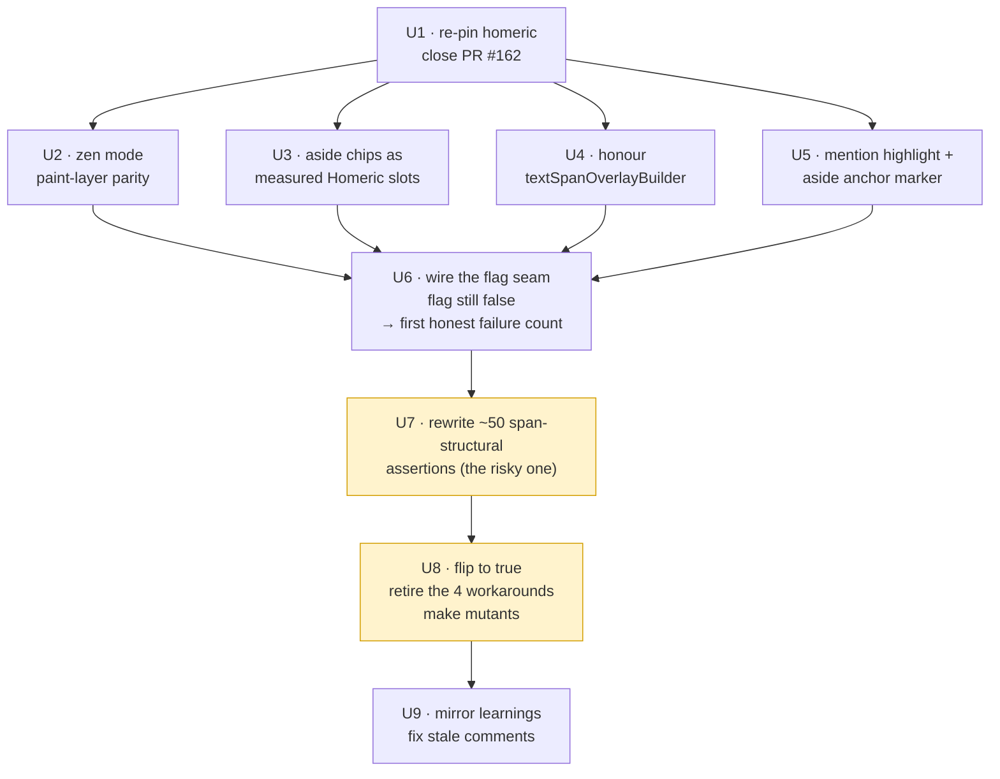

**Target repos:** most units land in `arodriguez47/nexus`; U9 touches both. Every unit below is
tagged with its repo. Paths are repo-relative to the tagged repo.

# feat: Phase 2 exit gate — reconcile the Nexus divergence and flip the Homeric flag

## Summary

Homeric's Phase 2 is code-complete (HOM-4's plan is `status: completed`, PR #2 and #3 merged), but
its exit gate has not fired: the Nexus journal still renders every paragraph through AppFlowy.
This plan reconciles a duplicated, divergent Nexus integration, wires and flips the
`useHomericParagraph` flag, takes the four workarounds off the paragraph path, and closes
HOM-11 / HOM-12 / HOM-14 so Phase 3 (HOM-5) can start against a real consumer.

> **Status 2026-08-11: U1–U7 landed** (nexus #166, #170–#175). U8 was rewritten after measuring —
> **nothing is deleted**, the workarounds are gated to non-paragraph blocks and die with AppFlowy in
> Phase 5. Four of this plan's assumptions inverted when checked: the homeric pin, "the flip is a
> one-liner", "the 51 are one class of work", and the workaround retirement. Each correction is
> recorded in the unit it belongs to.

---

## Problem Frame

`docs/ROADMAP.md` checkpoint #2 is the sharpest one in the project: *"Phase 2 does not land in
Nexus. The single most important signal. A Phase 2 that ends without the journal rendering
paragraphs through Homeric has reproduced the failure this plan was designed against."* That
checkpoint has not fired, and the reason is not technical difficulty — it is a coordination
failure discovered while reviewing HOM-11/HOM-12 status.

**U1–U5 of the Nexus companion plan were implemented twice, in parallel, and the wrong one merged.**

| | `feat/homeric-paragraph-integration` | `feat/homeric-paragraph-integration-plan` |
|---|---|---|
| PR | **#163 — MERGED** 2026-08-09 23:59Z (squash `6989b63`) | #162 — OPEN, `DIRTY`, 2× COMMENTED, 0 approvals |
| Location | on `origin/main` | worktree `~/conductor/workspaces/nexus/bilbao` @ `207e3b6` |
| Work window | Aug 9, 18:31–19:56 EDT | Aug 9, 20:13 EDT → Aug 10, 12:04 EDT |

Both forked from the same plan-doc commit `c74b85f`, then wrote their own U1–U5. Same class names,
divergent code. Two-dot diff `origin/main → bilbao`: 27 files, +4104 / −2765.

Consequences that shape this plan:

1. **The four features HOM-12 lists as "closed behind the flag" are not on `main`.** `main`'s
   `lib/widgets/homeric_rich_text.dart` contains zero occurrences of `textSpanOverlayBuilder`,
   `Stack`, or `mention`. Those features exist only on the bilbao branch.
2. **Merging bilbao as-is would revert PR #164** (whisper AI-vs-dumb tint) and delete
   `test/services/whisper_provenance_test.dart`, `test/theme/whisper_tint_test.dart`, and
   `test/widgets/homeric_dependency_smoke_test.dart`.
3. **HOM-12's measurements are unusable.** "3072 tests green", "flip produces 86 → ~50", and the
   `Node.notify()` non-reproduction were all measured on bilbao — a different codebase from the one
   that shipped. `main`'s equivalent fix landed as `138eef4`, which is exactly the 166-failure
   incident already written up in `LEARNINGS.md:37–39`.
4. **Nexus `main` pins a homeric SHA that is not an ancestor of homeric `main`.** `pubspec.yaml`
   holds `ref: 2cb1e836…`, which resolves only because `refs/heads/feature/hom-11` still exists on
   the homeric remote. Homeric PR #3 merged as `aa018a4`. Deleting that stale branch breaks every
   Nexus checkout and CI run.

What survives from HOM-12 unchanged is its core finding, which I re-counted and confirmed: **~50
tests across 8 files assert on AppFlowy's `TextSpan` tree** (`renderedSpans` / `TextSpan` /
`RichText` refs: 14 / 14 / 9 / 8 / 7 / 6 / 5 / 3). The Homeric path is span-free by design and
renders through its own RenderBox, so those assertions cannot pass on it regardless of correctness.
They are not defects, and rewriting them edits the safety net protecting the AppFlowy path that is
in production today. That risk is why the flip is staged behind a test-rewrite unit rather than
bundled with it.

---

## Requirements

- **R1.** Nexus `main` pins a homeric SHA reachable from homeric `main`, so no checkout depends on
  an undeleted feature branch. *(HOM-14 item 1)*
- **R2.** The four Homeric-path features that exist only on the bilbao branch are present on Nexus
  `main`, implemented against `main`'s U1–U5 rather than merged from bilbao. *(unblocks HOM-12)*
- **R3.** `lib/views/journal_view.dart` carries a real flag seam so the Homeric path is reachable
  from the journal, not only from tests. *(HOM-11 criterion 2, precondition)*
- **R4.** The ~50 span-structural test assertions are rewritten onto behavioral or geometry
  assertions that still fail if the AppFlowy path regresses. *(HOM-12 core)*
- **R5.** The flag defaults to `true`, the full Nexus suite is green, and `make mutants` is green on
  the changed lines. *(HOM-12 "Done when")*
- **R6.** The paragraph path stops using every workaround — each gated to the block types that stay
  on AppFlowy. **Nothing is deleted here**; deletion is Phase 5 (HOM-7), when AppFlowy goes.
  *(HOM-4 Nexus deliverable, HOM-12 "Done when" — both originally said "removed", which was measured
  wrong; see U8)*
- **R7.** The three Phase 2 learnings are mirrored into Nexus's `LEARNINGS.md` and the stale
  differential-test comments are corrected. *(HOM-14 items 2 and 3, AGENTS.md compounding rule)*
- **R8.** ROADMAP checkpoint #2 fires: the journal renders paragraphs through `HomericParagraph`,
  verified by hand per HOM-4's manual check. *(closes HOM-11, unblocks HOM-5)*

**Origin issues:** HOM-11 (exit gate), HOM-12 (span-tree rewire), HOM-14 (cleanup chores),
HOM-4 (Phase 2 parent), HOM-5 (Phase 3, blocked by this).

---

## Scope Boundaries

- **No Phase 3 work.** No `DeltaTextInputClient`, IME, hardware keyboard, or selection gestures.
  Homeric stays read-only in the journal; AppFlowy's editor-level input keeps driving it.
- **Paragraph blocks only.** Headings, lists, quotes, tables, and the comment-line wrapper stay on
  AppFlowy components. Mixed-component documents are the design, not a defect.
- **No AppFlowy removal.** That is Phase 5 (HOM-7). Both paths stay mounted.
- **No homeric-repo feature work.** Homeric's Phase 2 API is frozen for this plan; a genuine API
  gap found during the flip is a re-plan trigger, not an in-flight change.
- **No re-litigating the divergence.** bilbao's U1–U5 is read as reference and then abandoned.

### Deferred to Follow-Up Work

- **HOM-13** — AppFlowy's end-of-text caret half-leading discrepancy. Documented in
  `LEARNINGS.md:35` as the other renderer's bug. Not a blocker; the differential test already
  handles it.
- **HOM-9** — block-id generation contract (Phase 1 debt).
- **HOM-10** — `Transaction.inverting` mirror-pair re-registration; undo corrupts moved-block
  anchors. Real correctness bug, but it does not gate the flip.
- **HOM-5 (Phase 3)** — starts after R8 fires.

---

## Context & Research

### Relevant Code and Patterns

**Nexus (`origin/main` @ `5e67d59`)**

- `lib/utils/editor_config.dart` — `tightBlockComponentBuilders()` is the single editor-construction
  seam; `useHomericParagraph` (default `false`) swaps only the `ParagraphBlockKeys.type` entry. The
  in-file comment already explains why the flag lives here: it is what lets both render paths exist
  in the same process for the differential test.
- `lib/views/journal_view.dart:3789` — the journal's sole `AppFlowyEditor(` mount, calling
  `tightBlockComponentBuilders()` with **no arguments**. There is no `_useHomericParagraph` constant
  on `main`; the file has zero Homeric references. This is why criterion 2 has not fired.
- `lib/widgets/homeric_rich_text.dart` (464 lines) — the leaf selectable. Already clamps against
  `geometry.docLength` at line 247, per the consumer rule in homeric `LEARNINGS.md:39`. One
  remaining clamp at lines 184–185 uses `text.length` and needs an audit.
- `lib/widgets/homeric_paragraph_block_component.dart` (293 lines), `lib/utils/homeric_projection.dart`
  (374 lines), `lib/utils/homeric_paint_layers.dart` (95 lines) — the rest of merged U1–U5.
- `test/widgets/homeric_paragraph_differential_test.dart` — the parity instrument that makes the
  U8 deletions safe. `_verticalParityBlockedOnHomeric` (`:44`) and `_fragmentMergingBlocked` (`:58`)
  are both `false`; the doc comment at `:26` still says "BLOCKED ON A HOMERIC API GAP".
- `test/widgets/homeric_dependency_smoke_test.dart` — the pin's guard test.
- The four workarounds: `lib/utils/ascend_markdown.dart` and `lib/utils/writing_surface_config.dart`
  (`hiddenMarkdownMarkerStyle`), `lib/utils/marker_reveal_controller.dart` +
  `lib/utils/writing_surface_config.dart` (`MarkerRevealController`),
  `lib/utils/writing_surface_config.dart:898` (`journalAsideTailSegments`) with consumers at
  `:1219` and `lib/views/journal_view.dart:940`, and `lib/utils/journal_layer.dart:243`
  (`journalAsideAnchorRunRangesIn`, the inline-aside geometry surgery).
- `Makefile:62` — `make mutants` (`scripts/testing/mutants.py --base $(BASE)`), mutates only
  `lib/` files the branch changed.

**Nexus (bilbao branch, reference only — `~/conductor/workspaces/nexus/bilbao`)**

- `9fdffd0` warm zen mode in the paint layers; `a5cbedc` aside chips as measured Homeric slots;
  `53eaf95` honour `textSpanOverlayBuilder`; `207e3b6` mention highlighting + aside anchor marker.
- `lib/utils/homeric_journal_styles.dart` (127 lines, new on bilbao) — the shared styler that
  `207e3b6` asserts against.

**Homeric (`main` @ `aa018a4`)**

- `AGENTS.md:18` — the compounding rule: a learning about text layout, offset mapping, selection
  geometry, or editor architecture is written to **both** repos in the same change.
- `docs/plans/2026-08-09-001-feat-phase2-homeric-paragraph-plan.md` — `status: completed`.
- `docs/ROADMAP.md:24` — checkpoint #2.

### Institutional Learnings

- `LEARNINGS.md:29–31` — *"A seam-adapter contract test proves sufficiency, never agreement."* The
  corollary is load-bearing here: **when a phase's exit criterion is "the consumer uses it", the
  consumer's differential test is the exit criterion, not the producer's contract test.**
- `LEARNINGS.md:37–39` — *"Generation-stamped geometry relocates a missed subscription into a thrown
  error."* Consumer rule: clamp incoming offsets against the geometry's own `docLength`, never
  against the live model's — between a mutation and its rebuild those two disagree by construction.
  This is the exact incident behind `main`'s `138eef4`, and it is why U6 audits the remaining clamp.
- `LEARNINGS.md:33–35` — the concrete inventory of what a second renderer disagrees about
  (`TextHeightBehavior`, box styles, fragment granularity, tie-breaks, end-of-text caret). Fragment
  merging *belongs in the consumer* — relevant to U7's rewritten selection-rect assertions.
- Nexus `AGENTS.md:57` — Quality plus one other agent must approve; **no self-approvals.** Every
  unit below lands as a reviewed PR.

---

## Key Technical Decisions

- **Port bilbao's four feature commits onto `main`'s implementation; abandon bilbao's U1–U5.**
  `main`'s version is merged and reviewed, carries the `138eef4` node-mutation fix that
  `LEARNINGS.md:39` documents, and does not revert #164. bilbao's U1–U5 is unreviewed and cannot
  self-merge under `AGENTS.md:57`. The four features are self-contained and each has a named
  mechanism in the companion plan, so they re-implement against `main`'s classes.
- **Read bilbao's commits; do not cherry-pick them.** The underlying files diverged textually
  (`homeric_rich_text.dart`: 464 vs 529 lines; `homeric_projection.dart`: 374 vs 586). A
  cherry-pick conflicts in every hunk and produces a worse result than re-implementing from the
  commit's stated mechanism.
- **Stage the flip behind the test rewrite (U7 before U8), not with it.** Rewriting ~50 assertions
  edits the safety net protecting the AppFlowy path in production, in service of a path that is
  still off. Keeping them as separate PRs means a bisect can distinguish "the rewrite broke the
  AppFlowy path" from "the flip broke the Homeric path."
- **Two of the four workarounds narrow rather than delete.** `hiddenMarkdownMarkerStyle` and
  `MarkerRevealController` are reached through the editor-wide `textSpanDecorator` and also serve
  headings, quotes, and lists, which stay on AppFlowy. Deleting them regresses those block types
  invisibly to a paragraph-scoped differential.
- **Close PR #162 as superseded rather than merging it.** Its only unique content — the plan doc —
  already landed on `main` inside #163.

---

## Open Questions

### Resolved During Planning

- *Is HOM-11 criterion 1 met?* **Yes.** `docs/plans/2026-08-09-001-feat-homeric-paragraph-integration-plan.md`
  is on Nexus `main`; it rode in on #163's file list, not #162.
- *Which implementation is canonical?* `main`'s. See Key Technical Decisions.
- *Does the `Node.notify()` bug need fixing?* No. `main` already has `138eef4`. HOM-12's
  "does not reproduce" note was true of bilbao and is simply about a different codebase.
- *Is the `~50 tests` figure still right?* The per-file span-ref counts re-verified exactly
  (14/14/9/8/7/6/5/3). The *failure* count from flipping is not, and U7 re-measures it.

### Deferred to Implementation

- **The real post-flip failure count.** HOM-12's "86 → ~50" was measured on bilbao. U6 produces the
  first honest number on `main` by flipping locally and recording it.
- **Whether U7 can be one PR or needs splitting per test file.** Depends on how many of the ~50
  assertions share a helper. If `renderedSpans` has a single definition, a shared geometry-based
  replacement may collapse most of the work; if each file rolls its own, it is eight PRs.
- **Whether `journalAsideAnchorRunRangesIn` deletes cleanly or leaves a caller on the AppFlowy
  path.** Known only once the flip is live and the aside tests are rewritten.

---

## High-Level Technical Design

> *This illustrates the intended approach and is directional guidance for review, not implementation
> specification. The implementing agent should treat it as context, not code to reproduce.*

Phase A is U1–U5 (reconcile), Phase B is U6–U8 (flip the gate), Phase C is U9 (close out).
U2–U5 are independent of each other and can land in any order or in parallel.

---

## Implementation Units

### U1. Re-pin Nexus to homeric `main`; close the superseded plan PR

**Repo:** nexus · **Requirements:** R1

**Dependencies:** None. Do this first — it is the only unit with a live breakage risk.

**Files:**
- Modify: `pubspec.yaml`, `pubspec.lock`
- Test: `test/widgets/homeric_dependency_smoke_test.dart` (existing guard, no changes expected)

**Approach:**
- Bump the `homeric` git dependency `ref:` from `2cb1e836293ac12dfae3428ba7d059bb1f73371f` to
  `aa018a49e63f224760e6732a953c0bd8ff698986` (homeric `main`, the merge of PR #3 carrying the
  `BlockParagraphSpec.textHeightBehavior` passthrough), then `flutter pub get`.
- Carry across the better pin comment from bilbao's `pubspec.yaml`, which states the bump gate
  explicitly: this pin changes only via a deliberate decision gated by the differential test, not a
  routine refresh.
- Close nexus PR #162 with a comment noting the plan doc landed via #163 and the implementation was
  superseded by `main`'s.
- Do **not** delete homeric's `feature/hom-11` branch until this lands and CI is green on it.

**Test scenarios:**
- *Integration:* `flutter pub get` on a clean pub cache resolves the homeric dependency without
  reaching any non-`main` ref.
- *Integration:* `homeric_dependency_smoke_test.dart` stays green — the pinned package still exports
  every symbol the integration imports.
- *Edge case:* after this lands, deleting homeric's `feature/hom-11` on the remote leaves
  `flutter pub get` working. Verify by resolving with that ref absent from a fresh clone before
  actually deleting it.

**Verification:** Nexus CI green on a clone that has never seen `feature/hom-11`; homeric's stale
branch is safe to delete. Closes HOM-14 item 1.

---

### U2. Paint-layer parity — deliver warm zen mode to the Homeric path

**Repo:** nexus · **Requirements:** R2 · **Dependencies:** U1

**Files:**
- Modify: `lib/utils/homeric_paint_layers.dart`
- Test: `test/utils/homeric_paint_layers_test.dart`

**Approach:**
- Reference: bilbao `9fdffd0`. Re-implement against `main`'s `homericPaintLayersFor()` (the single
  top-level entry, `lib/utils/homeric_paint_layers.dart:34`) rather than porting bilbao's file.
- Zen mode is a focus-dim variant: the warm tint must reach the Homeric paint layers with the same
  per-range animated amount the AppFlowy path applies, so a document rendered on either path dims
  identically during a zen session.

**Patterns to follow:** `main`'s existing focus-dim and annotation-wash layer construction in the
same file; homeric's `PaintLayer.spec` uses **value** equality by deliberate convention
(homeric `LEARNINGS.md:25–27`) — a freshly rebuilt spec with the same visual meaning must not
register as changed, or every animation frame repaints.

**Test scenarios:**
- *Happy path:* zen mode active at dim amount 0.6 → the layer list for a paragraph contains a wash
  layer carrying the warm zen colour, not the default focus-dim colour.
- *Happy path:* zen mode off → layer list is byte-identical to the pre-change output.
- *Edge case:* dim amount 0.0 and 1.0 → no layer emitted at 0.0; full-strength wash at 1.0.
- *Edge case:* two specs rebuilt fresh from the same zen state compare equal, so no repaint is
  triggered (guards the value-equality convention).
- *Integration:* the AppFlowy path's zen appearance is unchanged by this unit — assert against the
  existing zen-mode test on the AppFlowy path.

**Verification:** Zen mode renders identically on both paths in
`homeric_paragraph_differential_test.dart`; no new differential skips.

---

### U3. Aside chips as measured Homeric slots

**Repo:** nexus · **Requirements:** R2 · **Dependencies:** U1

**Files:**
- Modify: `lib/utils/homeric_projection.dart`, `lib/widgets/homeric_paragraph_block_component.dart`
- Test: `test/utils/homeric_projection_test.dart`

**Approach:**
- Reference: bilbao `a5cbedc`. The mechanism to carry across, stated in HOM-12: **affinity became
  slot placement.** A `widget` decoration in Homeric is a zero-length point beside a glyph that
  still renders — it is *not* a composite `WidgetSpan` that replaces the glyph, which is what
  AppFlowy's model implies. Aside chips must therefore project as measured Homeric slots
  (`addPlaceholder`, one U+FFFC view unit each, positioned from `getBoxesForPlaceholders`), with the
  anchor glyph left intact.
- This is the unit that makes the ~180-line inline-aside geometry surgery deletable in U8, because
  fragment-correct selection rects across inline embeds come free from the geometry API.

**Technical design:** *(directional)* the projection emits, per aside, a slot at the anchor's
document offset; the block component supplies the chip widget as a real RenderBox child; geometry
answers per-embed rects. No span splicing anywhere in the path.

**Patterns to follow:** homeric's slot bookkeeping contract (one U+FFFC code unit per slot,
identical to what the engine inserts) — Phase 2 plan R1; `main`'s existing projection of decorations
in `homeric_projection.dart`.

**Test scenarios:**
- *Happy path:* a paragraph with one anchored aside projects one slot at the anchor offset, and the
  anchor glyph still appears in the derived view text.
- *Happy path:* the chip renders with its measured size and sits beside the anchor, not in place of it.
- *Edge case:* two asides anchored at the same offset → two slots, stable order.
- *Edge case:* an anchor-less (tail) aside → placed at block end without disturbing prose offsets.
- *Edge case:* aside at document offset 0 and at the final offset.
- *Error path:* an aside whose anchor id has no matching run → projection degrades (no slot) rather
  than throwing.
- *Integration:* selection rects across a paragraph containing an aside are fragment-correct — a
  range spanning the chip returns rects covering the glyphs on both sides without the splicing the
  AppFlowy path needs.

**Verification:** Aside chips render on the Homeric path with correct geometry; the differential
test's aside scenarios pass without widening epsilon.

---

### U4. Honour `EditorStyle.textSpanOverlayBuilder` on the Homeric path

**Repo:** nexus · **Requirements:** R2 · **Dependencies:** U1

**Files:**
- Modify: `lib/widgets/homeric_rich_text.dart`
- Test: `test/widgets/homeric_rich_text_selectable_test.dart`

**Approach:**
- Reference: bilbao `53eaf95`. This is the smallest of the four and the highest-leverage: footnote
  markers, mention hover targets, annotation tap targets, and aside chips are **already** positioned
  overlays computed from `getRectsInSelection` on the block's delegate. They do not read span
  structure. AppFlowy delivers them through `EditorStyle.textSpanOverlayBuilder`, which
  `AppFlowyRichText` mounts in a `Stack` over its text. `main`'s `HomericRichText` never calls that
  hook, so all four vanish silently with no error.
- Mount a `Stack` over the paragraph, pass `this` as the delegate, and guard on no-geometry-yet,
  mirroring the AppFlowy fork's own `textKey.currentContext == null` check.
- Thread the builder through from `homeric_paragraph_block_component.dart` via
  `editorState.editorStyle.textSpanOverlayBuilder`.
- `lib/views/journal_view.dart` needs **no changes** — the hook is already wired there at `:3759`.

**Patterns to follow:** the AppFlowy fork's `appflowy_rich_text.dart` `Stack` + null-context guard;
`main`'s existing `journal_view.dart:3759` overlay builder, which stays untouched.

**Test scenarios:**
- *Happy path:* a paragraph with a footnote marker on the Homeric path mounts the overlay widget
  above the text.
- *Happy path:* overlays receive rects consistent with `getRectsInSelection` on the Homeric delegate.
- *Edge case:* first frame, before geometry exists → the guard suppresses the overlay and no
  exception escapes; a later frame mounts it.
- *Edge case:* `textSpanOverlayBuilder` is null → renders the bare paragraph, no `Stack` overhead.
- *Integration:* the 23 footnote tests pass on the Homeric path with no changes to their assertions
  (HOM-12 recorded exactly this outcome on bilbao — treat it as the expected result, and
  investigate rather than adjust the tests if it does not reproduce).

**Verification:** Footnote, mention-hover, annotation-tap, and aside overlays all appear on the
Homeric path; the footnote suite is green on both paths.

---

### U5. Mention highlighting and the aside anchor marker

**Repo:** nexus · **Requirements:** R2 · **Dependencies:** U1

**Files:**
- Create: `lib/utils/homeric_journal_styles.dart`
- Modify: `lib/utils/homeric_projection.dart`
- Test: `test/utils/homeric_projection_test.dart`

**Approach:**
- Reference: bilbao `207e3b6`. The mechanism to carry across: **mentions are a projection *input*,
  not a delta attribute.** A mention is a value-label match coloured from `AppState` — nothing in
  the AppFlowy `Delta` marks it — so the projection must accept the resolved mention set alongside
  the node and emit styled runs for it. Same for the aside anchor marker.
- Extract the shared stylers (`nodeMentionStyle`, `journalAsideAnchorTextStyle`) into
  `homeric_journal_styles.dart` so both paths read one definition and a wiring break is detectable.
- Styles resolve **per build**, never captured at registration — homeric Phase 2 plan R7. Nexus
  resolves theme and font at call time.

**Execution note:** HOM-12 flagged a real weakness in bilbao's version of this unit, and it should
be fixed rather than inherited. bilbao verified mentions by asserting the run styler produces what
the shared styler produces — which catches a wiring break but is tautological about correctness: if
implementation and test share the same misunderstanding, neither fails. Add at least one assertion
per feature that pins the *observable* outcome (resolved colour value, run boundary offsets) rather
than only agreement with the shared helper.

**Test scenarios:**
- *Happy path:* a paragraph containing a known value label projects a styled run over exactly that
  label's offsets, carrying the mention colour resolved from `AppState`.
- *Happy path:* an aside anchor projects the anchor marker style over the anchor run.
- *Edge case:* label appears twice in one paragraph → two styled runs, both correct.
- *Edge case:* label at offset 0 and at the final offset.
- *Edge case:* a substring that looks like a label but is not in `AppState` → no styled run.
- *Edge case:* overlapping mention and aside anchor at the same offsets → deterministic, documented
  precedence.
- *Error path:* `AppState` has no mentions loaded → projection emits prose with no mention runs and
  does not throw.
- *Integration:* the same document rendered on both paths produces the same mention colour at the
  same offsets (differential, not styler-agreement).

**Verification:** Mentions and aside anchor markers render on the Homeric path with colours matching
the AppFlowy path in the differential test.

---

### U6. Wire the flag seam into the journal; audit the remaining clamp

**Repo:** nexus · **Requirements:** R3 · **Dependencies:** U2, U3, U4, U5

**Files:**
- Modify: `lib/views/journal_view.dart`, `lib/widgets/homeric_rich_text.dart`
- Test: `test/utils/editor_config_test.dart`

**Approach:**
- Add a `static const bool _useHomericParagraph = false;` near the top of the `JournalView` state
  and pass it to `tightBlockComponentBuilders()` at the sole `AppFlowyEditor(` mount
  (`journal_view.dart:3789`). This is bilbao's shape (`:201` / `:3867`) and it is the seam the flip
  in U8 turns over. **The flag stays `false` in this unit.**
- Audit the clamp at `homeric_rich_text.dart:184–185`, which clamps against `text.length`. Per
  homeric `LEARNINGS.md:39`, a consumer must clamp against the geometry's own `docLength`, never the
  live model's — between a mutation and the rebuild it triggers, those disagree by construction, and
  AppFlowy's selection service is not defensive about exceptions crossing back into it. Line 247
  already does this correctly; bring `:184` in line or document why that site is genuinely
  view-space.
- **Then flip the flag locally, run the full suite, and record the failure count and per-file
  breakdown.** Do not commit the flip. This number replaces HOM-12's stale "86 → ~50" and sizes U7
  honestly. Post it to HOM-12.

**Execution note:** the local flip is a measurement, not a deliverable. Revert it before opening
the PR.

**Test scenarios:**
- *Happy path:* with the flag `false`, `tightBlockComponentBuilders()` returns AppFlowy's paragraph
  component — the journal's rendering is byte-identical to before this unit.
- *Happy path:* with the flag `true`, the builder map's `ParagraphBlockKeys.type` entry is the
  Homeric builder and **every other entry is unchanged** (extend the existing assertions at
  `homeric_rich_text_selectable_test.dart:329–348`).
- *Edge case:* a query for an offset past the geometry's `docLength` clamps and returns a rect
  rather than throwing `DocOffsetOutOfRangeError`.
- *Edge case:* a query issued between a node mutation and its rebuild — the clamp uses the
  geometry's length, so the stale-model offset degrades rather than throwing.

**Verification:** Suite green with the flag off and no behavioral change to the journal; a recorded,
sourced failure count for the flipped state posted to HOM-12.

---

### U7. Rewrite the span-structural test assertions

**Repo:** nexus · **Requirements:** R4 · **Dependencies:** U6

**Files:**
- Modify: `test/widgets/journal_aside_test.dart`, `test/widgets/journal_mention_highlight_test.dart`,
  `test/widgets/journal_annotation_test.dart`, `test/widgets/journal_comment_block_test.dart`,
  `test/widgets/journal_mention_value_toggle_test.dart`, `test/widgets/journal_mention_ignore_test.dart`,
  `test/widgets/journal_mention_hover_test.dart`, `test/widgets/journal_font_swap_test.dart`
- Modify: `test/helpers/journal_test_harness.dart` (likely — the shared `renderedSpans` helper)

**Approach:**
- These assertions walk AppFlowy's `TextSpan` tree (`renderedSpans` / `TextSpan` / `RichText`).
  The Homeric path renders through its own RenderBox and produces no span tree, so they cannot pass
  on it regardless of correctness. They are not defects.
- Replace each span-structural assertion with a path-agnostic one that asserts the same *behavior*:
  resolved style at a document offset, geometry rects for a range, or the rendered widget's
  observable output. HOM-12's representative case is exact — the aside test passes every behavioral
  assertion (chip renders, italic, muted colour) and dies only at
  `renderedSpans(tester).where((s) => s.text == 'd').single`.
- **Start with the shared helper.** If `renderedSpans` has one definition in the harness, a single
  path-agnostic replacement may collapse most of the 50. Establish that before touching individual
  files; it determines whether this is one PR or eight.

**Execution note: characterization-first, and this is the highest-risk unit in the plan.** These
tests are the safety net protecting the AppFlowy path that is in production today, and they are
being edited in service of a path that is still switched off. For each rewritten assertion, prove it
still fails when the AppFlowy path regresses — mutate the production behavior it covers, confirm
red, revert. An assertion that passes on both a working and a broken AppFlowy path has silently
deleted coverage. `make mutants` in U8 is the backstop, not the primary check.

**Test scenarios:**
- *Happy path:* each rewritten test passes on the AppFlowy path with the flag `false`.
- *Happy path:* each rewritten test passes on the Homeric path with the flag `true`.
- *Characterization:* for every rewritten assertion, a deliberate regression in the covered
  AppFlowy behavior turns it red.
- *Edge case:* tests that assert on *absence* of styling (`journal_mention_ignore_test.dart`) still
  distinguish "no mention run" from "no spans at all" — the trap case where a span-free renderer
  passes an ignore test vacuously.
- *Edge case:* `journal_font_swap_test.dart` re-reads styles after a font change; the rewritten
  assertion must still catch AppFlowy's documented "never re-reads after first build" behavior
  (noted in that file at `:197`).
- *Integration:* mixed-component documents — a heading (AppFlowy) above a paragraph (Homeric) —
  assert correctly on both block types in the same test.

**Verification:** All eight files green on both paths; zero `renderedSpans` / `TextSpan` /
`RichText` structural references remain in them; every rewritten assertion demonstrated red against
a deliberate AppFlowy-path regression.

---

### U8. Flip the flag; take the workarounds off the paragraph path

> **Rewritten 2026-08-11 after measuring. Nothing is deleted.** The original
> version of this unit said "delete two, narrow two." All four measurements came back
> the other way, and one of the four was not a workaround at all. See
> [nexus #176](https://github.com/arodriguez47/nexus/pull/176) and
> `nexus/test/widgets/journal_aside_block_type_test.dart`.

**Repo:** nexus · **Requirements:** R5, R6, R8 · **Dependencies:** U7

**What changed and why**

| Workaround | Original plan | Measured |
|---|---|---|
| `journalAsideTailSegments` | delete | **narrow** — nothing in the tail path is gated on block type |
| `journalAsideAnchorRunRangesIn` | delete | **keep, untouched** — a pure delta query, and `homeric_projection.dart:387` depends on it. Not a workaround. |
| `hiddenMarkdownMarkerStyle` | narrow | narrow ✓ |
| `MarkerRevealController` | narrow | narrow ✓ |
| `_buildInlineAsideSpan` (`journal_view.dart:1031`) | *never named* | **narrow** — this is the actual inline-aside geometry surgery |

The load-bearing measurement: typing `# ` at the start of an anchored paragraph carries **both
halves of the aside** — the anchor attribute on the delta and the aside data on the node — onto a
**heading**, which renders through AppFlowy under either flag state. So the composite stays
reachable after the flip. Deleting it would make the writer's note vanish with no error, against
this codebase's explicit degrade-never-die posture.

**Files:**
- Modify: `lib/views/journal_view.dart` (`_useHomericParagraph` → `true`; gate `_buildInlineAsideSpan`
  and the `journalAsideTailSegments` consumer at `:979` to non-paragraph blocks)
- Modify: `lib/utils/writing_surface_config.dart` (gate the tail path at `:1233` and the
  `hiddenMarkdownMarkerStyle` / `MarkerRevealController` branches on block type)
- Modify: `lib/utils/ascend_markdown.dart`, `lib/utils/marker_reveal_controller.dart` (narrow)
- **Do not touch:** `lib/utils/journal_layer.dart`'s `journalAsideAnchorRunRangesIn`
- Test: `test/utils/writing_surface_config_test.dart`,
  `test/utils/marker_reveal_controller_test.dart`,
  `test/widgets/journal_aside_block_type_test.dart`,
  `test/widgets/homeric_paragraph_differential_test.dart`

**Approach:**
- Flip first, confirm the 19 known failures, then gate — separate commits, so a bisect separates
  "the flip broke it" from "the gating broke it."
- **One gate, applied consistently:** every branch that builds aside composites, aside tails, or
  hidden-marker styling checks the block type and skips paragraphs. Paragraphs are the only block
  type Homeric renders, so that single condition is the whole retirement.
- The 19 known flag-on failures resolve as: 13 aside composite assertions move to the non-paragraph
  gate or delete with it, 5 intended divergences get re-pointed (annotations render as **paint
  layers** on the Homeric path — an assertion reading `style.decoration` is on the wrong layer, and
  `homericPaintLayersFor` is where the parity lives), and 1 is `homeric_flag_seam_test`'s own guard,
  which inverts to assert the flag is on.
- Run `make mutants` (`Makefile:62`).

**Deletion is Phase 5 (HOM-7), not here.** All of this machinery dies when AppFlowy does. Until then
it is the live render path for headings, lists, quotes and comment-line wrappers.

**Execution note:** if the flip surfaces a genuine homeric API gap, stop and re-plan rather than
reaching into Phase 3. That boundary is the companion plan's risk R-1 and it still holds:
`HomericParagraph` is read-only because AppFlowy's input and IME live at the *editor* level, not the
block level.

**Test scenarios:**
- *Happy path:* full Nexus suite green with `_useHomericParagraph = true`.
- *Happy path:* `homeric_paragraph_differential_test.dart` green with no active skips —
  `_verticalParityBlockedOnHomeric` and `_fragmentMergingBlocked` both `false` and unused.
- *Integration:* a mixed journal entry — heading, paragraph, list, quote, comment-line, aside,
  footnote, mention, annotation — renders correctly with paragraphs on Homeric and everything else
  on AppFlowy.
- *Integration:* headings, quotes, and lists still hide and reveal their markdown delimiters at the
  caret after the narrowing (guards against the invisible regression).
- *Edge case:* an empty paragraph, a paragraph of only an aside, and a paragraph ending in an aside.
- *Error path:* typing into a Homeric paragraph does not raise `DocOffsetOutOfRangeError` — the
  clamp from U6 holds under live mutation.
- *Regression:* `make mutants` green on the changed lines; any surviving mutant names an assertion
  that never fires and must be fixed, not waived.

**Verification:** Flag defaults `true`, suite green, `make mutants` green, all four workarounds
retired. **Manual check per HOM-4:** open the journal, confirm paragraphs render through
`HomericParagraph`, and confirm VoiceOver reads prose without asterisks. This fires ROADMAP
checkpoint #2 and closes HOM-11 and HOM-12.

---

### U9. Mirror the learnings; correct the stale differential-test comments

**Repos:** homeric **and** nexus · **Requirements:** R7 · **Dependencies:** U8

**Files:**
- Modify (nexus): `LEARNINGS.md`
- Modify (nexus): `test/widgets/homeric_paragraph_differential_test.dart` (comments at `:26`, `:44`, `:58`)
- Modify (homeric): `LEARNINGS.md` — add the Phase 2 exit-gate lesson
- Modify (homeric): `docs/ROADMAP.md` if checkpoint #2's status is worth recording

**Approach:**
- Mirror the three homeric Phase 2 entries (`LEARNINGS.md:29`, `:33`, `:37`) into Nexus's
  `LEARNINGS.md` under `homeric/`, per the reciprocal clause in homeric `AGENTS.md:18` and nexus
  `AGENTS.md:75–82`. HOM-14 notes this was deliberately skipped because another agent was editing
  that repo concurrently; that contention is over.
- Rewrite the stale comments in `homeric_paragraph_differential_test.dart` as history. The `:26`
  comment still reads "BLOCKED ON A HOMERIC API GAP" while both constants are `false` — this is the
  first file whoever picks up the Homeric path will read.
- **Add a new mirrored learning from this plan's own root cause**, which is squarely an
  editor-architecture lesson and therefore in scope for the compounding rule: two agents forked the
  same companion plan and implemented U1–U5 independently 17 minutes apart, and the merged branch
  was not the more advanced one. The reusable rule is worth stating plainly — a cross-repo companion
  plan needs a single named owning branch recorded in the plan doc itself, because the plan document
  landing in `docs/plans/` is not a claim on the implementation.

**Test scenarios:** *Test expectation: none — documentation and comment changes only.*

**Verification:** Both `LEARNINGS.md` files carry the same three Phase 2 entries plus the new one;
no comment in the differential test describes a resolved blocker as live. Closes HOM-14.

---

## System-Wide Impact

- **Interaction graph:** the flip changes which component `tightBlockComponentBuilders()` returns for
  `ParagraphBlockKeys.type` — one map entry. Everything downstream of it (the journal-layer slice
  override, block selection container, action wrapper, nesting) is untouched by construction, and
  `editor_config.dart`'s own comment asserts this. `textSpanOverlayBuilder` (U4) is the one place a
  previously-dead hook comes alive.
- **Error propagation:** homeric geometry throws `DocOffsetOutOfRangeError` on invalid document
  offsets by design. AppFlowy's selection service is not defensive about exceptions crossing back
  into it, so every consumer-side query must clamp against `geometry.docLength` (U6). A missed
  subscription surfaces as a throw, not stale pixels — that is the documented feature, and the
  166-failure incident in `LEARNINGS.md:39` is what it looks like when a consumer ignores it.
- **State lifecycle risks:** paragraph disposal and layout-generation staleness are guarded on the
  homeric side. On the Nexus side the risk is the mutation-to-rebuild window, covered by U6.
- **API surface parity:** Notes and longform (Phase 6, HOM-8) mount the same editor config. They
  stay on AppFlowy paragraphs after this plan — confirm the flag is journal-scoped and does not leak
  into other surfaces via `writing_surface_config.dart`.
- **Integration coverage:** `homeric_paragraph_differential_test.dart` is the only instrument that
  proves agreement rather than sufficiency (homeric `LEARNINGS.md:29–31`). Mixed-component documents
  are the scenario mocks cannot give.
- **Unchanged invariants:** AppFlowy stays mounted and remains the path for headings, lists, quotes,
  tables, and comment-lines. `HomericParagraph` stays read-only. No homeric public API changes.

---

## Risk Analysis & Mitigation

| Risk | Likelihood | Impact | Mitigation |
|------|-----------|--------|------------|
| U7's rewrite silently deletes coverage protecting the production AppFlowy path | **High** | **High** | Characterization discipline: every rewritten assertion must be demonstrated red against a deliberate AppFlowy-path regression. `make mutants` in U8 as backstop. U7 lands as its own reviewed PR, separate from the flip. |
| Re-implementing U2–U5 reintroduces bugs bilbao already fixed | Med | Med | Read each bilbao commit and its message as the spec — every one states its mechanism (affinity→slot placement, mentions as projection input, the `textKey.currentContext` guard shape). Do not cherry-pick; the files diverged too far. |
| The flip surfaces a genuine homeric API gap and pulls Phase 3 work forward | Med | High | U8's execution note makes this a stop-and-re-plan trigger. Companion-plan risk R-1 holds: input and IME live at the editor level, not the block level, verified against the pinned fork. |
| A third parallel implementation starts while this plan runs | Med | High | U9 records the lesson; the plan names one owning branch per unit and every unit lands as a reviewed PR under nexus `AGENTS.md:57`. Close PR #162 in U1 so no stale branch invites resumption. |
| Narrowing `hiddenMarkdownMarkerStyle` / `MarkerRevealController` regresses headings, quotes, lists invisibly | Med | High | Explicit integration scenario in U8 covering delimiter hide/reveal on each non-paragraph block type. A paragraph-scoped differential cannot see this class of break. |
| Homeric's `feature/hom-11` branch is deleted before U1 lands | Low | High | U1 is first and standalone. Do not delete the branch until U1 is green. |
| U7 is larger than "a full day, mostly mechanical" | Med | Med | U6 produces a real failure count before U7 starts. If the shared `renderedSpans` helper does not collapse the work, split U7 per test file. |

---

## Phased Delivery

**Phase A — Reconcile (U1–U5).** Unbreak the pin, then bring `main` up to the feature level bilbao
reached. Ends with `main` carrying all four features, flag still off, suite green. U2–U5 are mutually
independent.

**Phase B — Flip the gate (U6–U8).** Wire the seam, measure honestly, rewrite the test safety net,
then flip and delete. This is where the risk is concentrated and where the ROADMAP checkpoint fires.

**Phase C — Close out (U9).** Mirror the learnings, correct the stale comments, and record the
duplicate-implementation lesson.

**After this plan:** HOM-5 (Phase 3 — input and editing) is unblocked and is the long pole at 8–12
weeks. The standing debts HOM-9, HOM-10, and HOM-13 remain independently schedulable; HOM-10
(undo corrupts moved-block anchors) is the only one that is a genuine correctness bug.

---

## Sources & References

- **Origin issues:** [HOM-11](https://linear.app/xana-studios/issue/HOM-11), [HOM-12](https://linear.app/xana-studios/issue/HOM-12),
  [HOM-14](https://linear.app/xana-studios/issue/HOM-14), parent [HOM-4](https://linear.app/xana-studios/issue/HOM-4),
  blocked [HOM-5](https://linear.app/xana-studios/issue/HOM-5)
- Homeric Phase 2 plan: `docs/plans/2026-08-09-001-feat-phase2-homeric-paragraph-plan.md` (completed)
- Nexus companion plan: `docs/plans/2026-08-09-001-feat-homeric-paragraph-integration-plan.md` (on nexus `main`)
- Conventions: homeric `AGENTS.md:18` (compounding rule), nexus `AGENTS.md:57` (no self-approvals),
  nexus `AGENTS.md:75–82` (cross-repo clause)
- Learnings: homeric `LEARNINGS.md:29–31`, `:33–35`, `:37–39`
- Roadmap checkpoint #2: `docs/ROADMAP.md:24`
- PRs: nexus #163 (merged, canonical), nexus #162 (open, to close), nexus #164 (merged, must not be
  reverted), homeric #3 (merged as `aa018a4`)
- Reference branch (read, do not merge): `feat/homeric-paragraph-integration-plan` @ `207e3b6`,
  worktree `~/conductor/workspaces/nexus/bilbao`
