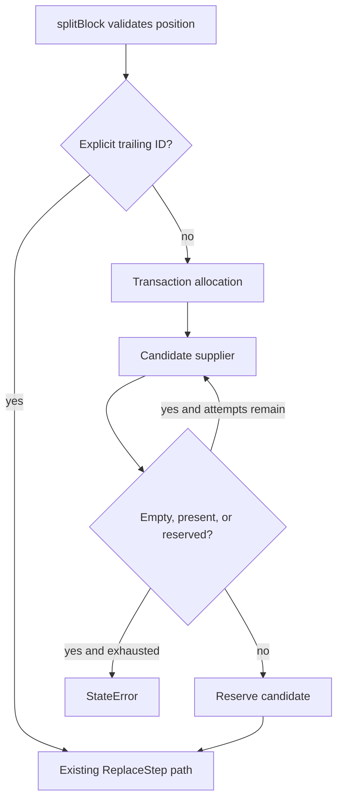

# Scoped Block ID Generation - Plan

## Goal Capsule

- **Objective:** Production block splits create stable IDs without process-global ordering or predictable namespace reuse, while injected suppliers enable deterministic tests under a caller-owned lifecycle.
- **Means:** Put candidate generation and reservation on each `Transaction`, with a UUID-v4 production default and an injectable deterministic supplier (KTD1, KTD2).
- **Authority:** Linear HOM-9 defines the scope. The Phase 1 core plan defines stable block identity and seeded replay constraints. Current model and transform invariants remain authoritative for compatibility.
- **Execution profile:** Local implementation and verification only. Do not push, merge, deploy, or run GitHub Actions.
- **Stop conditions:** Stop if the design would rewrite consumer metadata, require a document/history registry, or change explicit `trailingBlockId` behavior.
- **Tail ownership:** The implementing agent updates the local branch, durable learning, and Linear evidence after local verification.

## Product Contract

### Summary

Replace the process-global split counter with a transaction-scoped ID allocation contract. Keep existing `Transaction(doc)` and explicit split-ID call sites source-compatible.

### Problem Frame

`TransactionBuilders.splitBlock` currently derives implicit IDs from a process-global `block-N` counter. The result depends on unrelated work in other documents and can reuse a consumer-looking or undo-restored namespace. Seeded tests avoid the path by supplying explicit IDs, so the default contract is not covered.

### Requirements

**Generation and uniqueness**

- R1. An implicit split that uses the production default must not depend on edits performed in another transaction or document; injected supplier sequencing remains caller-owned.
- R2. The production default must return an opaque canonical lowercase `block-<UUID-v4>` ID.
- R3. Allocation must reject candidates that are empty, already present in the current document, or already reserved by the current transaction.
- R4. Allocation must stop after 32 rejected candidates and throw `StateError`; an exception thrown by the supplier propagates immediately.

**Injection and compatibility**

- R5. `Transaction` must accept an optional zero-argument block-ID supplier while all existing `Transaction(doc)` calls remain valid.
- R6. `splitBlock` must validate its position before lazy allocation and use an explicit `trailingBlockId` without invoking the supplier.
- R7. Explicit IDs must retain the current duplicate-check and failure behavior in `ReplaceStep` and `Transaction.step`.

**Identity boundaries**

- R8. The allocator guarantees uniqueness against the current document and the transaction reservation set; cross-transaction and historical uniqueness remains probabilistic for the UUID default and caller-owned for injected suppliers.
- R9. Allocation changes only Homeric `Block.id`; the split block's opaque attributes, including nested Nexus metadata, remain shared and untranslated.
- R10. Seeded property replay must keep using explicit split IDs and remain byte-for-byte reproducible.

### Acceptance Examples

- AE1. Given a transaction with the default supplier, when a valid block is split, then the trailing block receives a canonical lowercase UUID-v4 ID with the `block-` prefix.
- AE2. Given an injected sequence containing an empty candidate, a current-document collision, a reserved collision, and then a fresh ID, when allocation runs, then it returns and reserves only the fresh ID.
- AE3. Given an explicit `trailingBlockId`, when a valid block is split, then the supplier is not called and existing duplicate validation remains in force.
- AE4. Given a split that is inverted and its original IDs restored, when a later transaction allocates, then current restored IDs are rejected; a reset injected supplier may reuse an ID that is no longer present.

### Scope Boundaries

In scope:

- The transaction allocation API, production default, split-builder integration, tests, dependency declaration, and durable learning.

Out of scope:

- A document-wide tombstone registry or absolute historical uniqueness guarantee.
- Changes to undo/inversion, `Document`, `Block` identity semantics, Nexus metadata, or seeded property-operation serialization.
- Nexus code changes; current Nexus sources do not call Homeric `Transaction` or `splitBlock`.

## Planning Contract

### Key Technical Decisions

- KTD1. **Transaction owns allocation.** Add a public zero-argument supplier type, optional constructor injection, and a public allocation method. The method owns validation and reservation so custom suppliers cannot bypass transaction-local uniqueness.
- KTD2. **Use the maintained UUID package for the default.** Add the current Dart-compatible `uuid` dependency and produce `block-<UUID-v4>`. This avoids hand-rolling version and variant bits while supporting Flutter, Dart, and web with strong randomness.
- KTD3. **Reserve before insertion.** A successful allocation enters a transaction-local set immediately, so two allocations before either ID reaches the document cannot return the same value.
- KTD4. **Bound broken suppliers.** Empty and colliding candidates consume the 32-attempt budget. Supplier exceptions propagate. Exhaustion produces a stable `StateError` diagnostic instead of hanging.
- KTD5. **Keep explicit IDs outside allocation.** `trailingBlockId` continues directly to the existing structural replacement path, preserving its current validation and error surface.

### High-Level Technical Design

The allocation flow centralizes every implicit-ID guarantee in `Transaction`:

API ownership is intentionally narrow:

| Surface | Owner | Contract |
|---|---|---|
| Candidate entropy and format | Default or injected supplier | Return one opaque candidate per call |
| Validation and retry budget | `Transaction` allocation | Reject empty, current, and reserved candidates |
| Explicit-ID behavior | `splitBlock` and `ReplaceStep` | Bypass allocation and preserve current failures |
| Stable identity after insertion | `Block`, `Document`, `ChangeList` | Unchanged |

### Risks and Dependencies

- The `uuid` package adds runtime dependencies to a package that currently depends only on Flutter. Keep it isolated to generation and pin the compatible version resolved during implementation.
- A deterministic supplier can intentionally reuse IDs across fresh transactions. Documentation and tests must not claim stronger guarantees than R8.
- A public allocation method could be called without inserting a block. Reservation is therefore required and intentionally lasts for the transaction lifetime.
- Changing the generated format is observable because `splitBlock` returns the new ID. Tests pin the version and variant but consumers must continue treating IDs as opaque.

### Sources and Research

- `packages/homeric/lib/src/transform/builders.dart` contains the global counter and implicit split path.
- `packages/homeric/lib/src/transform/transaction.dart` is the source-compatible injection seam.
- `packages/homeric/lib/src/transform/replace_step.dart` provides duplicate-ID defense in depth.
- `docs/plans/2026-08-08-001-feat-phase1-editor-core-plan.md` requires stable IDs, exact inversion, and seeded reproducibility.
- [Dart `Random.secure`](https://api.dart.dev/dart-math/Random/Random.secure.html) can be unavailable and would require hand-built UUID formatting.
- [Dart `uuid` 4.6.0](https://pub.dev/packages/uuid) supports Dart, Flutter, and web and provides UUID-v4 generation with strong randomness.

## Implementation Units

### U1. Transaction-scoped allocation contract

- **Goal:** Add a source-compatible injectable allocator with a collision-resistant default and bounded transaction-local reservations.
- **Requirements:** R1-R5, R8
- **Dependencies:** None
- **Files:** `packages/homeric/pubspec.yaml`, `packages/homeric/lib/src/transform/transaction.dart`, `packages/homeric/test/transform/transaction_test.dart`
- **Approach:** Add the supplier type and optional constructor parameter. Keep default creation lazy. Centralize candidate validation, the 32-attempt limit, reservation, and the exhaustion diagnostic in the transaction allocation method (KTD1-KTD4).
- **Execution note:** Add failing allocator contract tests before replacing the global counter.
- **Patterns to follow:** `Transaction.stepPairMirrored` owns atomic transform invariants; `Document.indexOfBlockId` remains the current-document authority.
- **Test scenarios:**
  - Covers AE2. A scripted supplier retries empty, current-document, and reserved candidates before returning a fresh ID.
  - Two allocations before insertion return different IDs because the first remains reserved.
  - The 32nd rejected candidate exhausts the budget and throws `StateError` with the pinned diagnostic.
  - A supplier exception propagates unchanged and does not become retry exhaustion.
  - Separate transactions with separate scripted suppliers produce the same deterministic sequence without sharing reservation state.
  - The default candidate matches the canonical lowercase prefixed UUID-v4 version and variant shape.
- **Verification:** The allocator tests prove every branch without relying on random-value equality or timing.

### U2. Split integration and identity compatibility

- **Goal:** Route only implicit valid splits through transaction allocation while preserving structural identity and explicit-ID behavior.
- **Requirements:** R6-R10
- **Dependencies:** U1
- **Files:** `packages/homeric/lib/src/transform/builders.dart`, `packages/homeric/test/transform/builders_test.dart`, `packages/homeric/examples/playground/lib/view_models/document_view_model.dart`
- **Approach:** Remove the file-global counter and helper. Call transaction allocation only after position validation and only when `trailingBlockId` is absent (KTD5). Keep property generators unchanged because they already serialize explicit IDs.
- **Execution note:** Characterize supplier call counts and existing error types before changing the builder.
- **Patterns to follow:** Existing split tests pin the leading ID, shared attribute bag, returned trailing ID, and `BlockSplit.trailingId`.
- **Test scenarios:**
  - Covers AE1. An implicit valid split uses and returns the default-format ID and records it in `BlockSplit.trailingId`.
  - Covers AE3. An explicit ID bypasses the supplier; a duplicate explicit ID still fails through the existing structural replacement path.
  - Invalid split positions fail before supplier invocation.
  - Repeated implicit splits in one transaction cannot reuse a generated ID.
  - Covers AE4. Inversion restores original IDs, and a later allocation retries any candidate present in that restored document.
  - Split attribute identity remains unchanged, including a nested Nexus metadata fixture.
  - The playground's ordinary split path remains source-compatible with no caller changes.
- **Verification:** Focused transform tests pass, the existing seeded property suite remains deterministic, and no Nexus edit is needed.

### U3. Durable contract documentation

- **Goal:** Record the uniqueness boundary and the reason global counters are unsafe for stable editor identity.
- **Requirements:** R2, R8-R10
- **Dependencies:** U1, U2
- **Files:** `LEARNINGS.md`
- **Approach:** Add one concise entry that distinguishes current-document and transaction guarantees from probabilistic history-wide UUID uniqueness and injected-supplier responsibility.
- **Test expectation:** None -- this unit documents the verified public contract after behavior is proven.
- **Verification:** The learning names the allocator owner, explicit-ID exception, uniqueness domain, and seeded-test rule without implying a history registry.

## Verification Contract

| Gate | Scope | Done signal |
|---|---|---|
| Focused transform tests | `transaction_test.dart`, `builders_test.dart` | Allocation and split scenarios pass without randomness-based flakiness |
| Property tests | Existing property suite | Seeded replay remains reproducible and unchanged |
| Package analysis | Homeric workspace | No analyzer findings or public API documentation gaps |
| Full local suite | Homeric workspace | All local unit and widget tests pass |
| Format check | Homeric workspace | No formatting drift |
| Diff review | Local branch | No unrelated production, Nexus, workflow, or generated-file changes |

GitHub Actions are not part of this verification contract.

## Definition of Done

- U1 proves a deterministic, bounded, transaction-scoped allocation contract with a canonical UUID-v4 default.
- U2 removes all process-global block-ID state while preserving explicit IDs, structural identity, inversion, metadata, and existing callers.
- U3 records the exact uniqueness boundary and testing convention.
- The focused, property, full-suite, analysis, and format gates pass locally.
- Abandoned experiments and unrelated changes are absent from the diff.
- The work is committed only to the local HOM-9 branch and Linear receives local evidence; nothing is pushed, merged, deployed, or dispatched through GitHub Actions.
