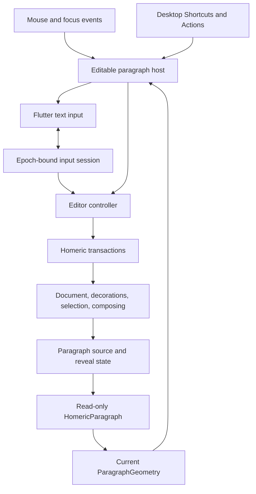
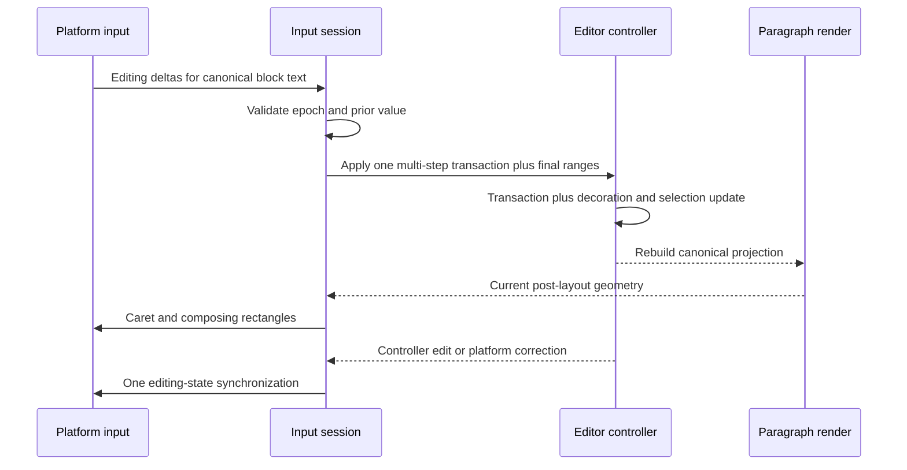
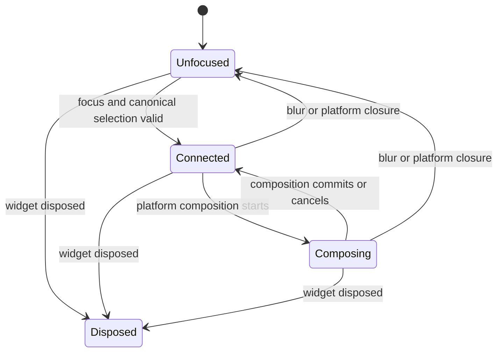

# macOS-First Single-Paragraph Editing Foundation - Plan

## Goal Capsule

- **Objective:** A writer can focus one active Homeric paragraph and edit it with a keyboard and mouse in the macOS playground while selection, composing state, decorations, and caret geometry stay correct.
- **Means:** Add one editor-level controller, a platform text-input session over canonical block text, visual caret-navigation primitives, and a reusable editable paragraph host. (KTD1-KTD8)
- **Authority:** The HOM-5 Linear issue and Homeric architecture decisions govern product scope. This plan governs a macOS-first, dogfoodable technical foundation; it is not a certified cross-platform desktop release.
- **Execution profile:** Local Homeric implementation and verification only, plus the required Nexus learning mirror. Do not run GitHub Actions, push, publish, or flip Nexus defaults.
- **Stop conditions:** Stop and re-plan if the platform input value would need projected view text, if one paragraph must own editor-wide state, or if the slice requires cross-block selection.
- **Tail ownership:** HOM-6 owns multi-block editing, HOM-19 owns desktop clipboard/history parity, HOM-20 owns touch selection, HOM-21 owns platform IME certification, and HOM-7 owns Nexus parity and the eventual default switch.

---

## Product Contract

### Summary

This plan makes one active Homeric paragraph directly editable in the macOS playground through a reusable editor-level input layer. It includes focus, pointer selection, a visible caret and selection, canonical text insertion and replacement, grapheme-safe deletion, four-direction keyboard navigation, Shift extension, and basic composing-state support. Windows and Linux certification remain follow-up work.

### Problem Frame

Homeric can render a paragraph, hit-test document offsets, and paint geometry-derived overlays, but it cannot yet accept real text input. The playground has a nullable display-only caret and button-driven transaction commands. Extending that stub would leave selection direction, focus, platform input, composing ranges, and undo behavior split across unrelated paths.

The highest-risk boundary is coordinate ownership. The platform must edit canonical block text, including syntax that may be hidden by the render projection. Geometry must continue to operate through the paragraph's document-to-view map. Mixing those two spaces would corrupt selections and composing ranges.

### Key Decisions

- **Use Flutter text input in the first desktop slice.** (session-settled: user-approved — chosen over printable-character key handling: the latter would fail for keyboard layouts, dead keys, and later IME work.) Governs R2, R6, R7, R9.
- **Prove a macOS-first desktop foundation before touch and full platform polish.** This follows HOM-5's sequence and keeps the first slice locally verifiable without claiming Windows or Linux parity. Governs R3-R6, R12.

### Requirements

#### State and coordinate ownership

- R1. One directional selection value stores anchor and head as global canonical document positions, preserves reverse selection, validates both endpoints, and maps through transactions without losing direction. The active head also carries visual caret affinity; vertical navigation state separately retains preferred x until a horizontal move or pointer placement resets it.
- R2. The active platform editing value contains one block's canonical raw text, with selection and composing offsets in that same block-local UTF-16 space; it never contains projected view text.
- R3. One editor-level controller atomically owns document, decorations, selection, composing state, transaction application, notification, and undo grouping; paragraph render objects remain read-only.

#### Desktop interaction

- R4. Primary mouse press requests focus and places a caret from current paragraph geometry; dragging in either direction preserves a fixed anchor and updates the head across wraps.
- R5. Left, Right, Up, and Down move between valid visual caret stops with an explicit affinity at wrap and bidi boundaries; Shift keeps the anchor fixed and moves the head, and repeated vertical movement preserves a preferred horizontal position.
- R6. Backspace and Delete remove a selected range or one canonical user-perceived character in the requested direction, never half of a surrogate pair or combining sequence. Canonical grapheme boundaries own deletion; projected geometry does not choose mutation ranges.
- R7. One platform delta callback is replayed as an ordered batch against a shadow canonical editing value, then commits as one controller transition, one notification, and one undo unit. Accepted platform-originated values are not echoed; controller-originated edits and rejected or corrected platform values synchronize once.
- R8. Enter and newline-bearing platform updates are rejected in this slice, leave block text newline-free, and restore the canonical platform value. Tab and Shift-Tab traverse focus out of the editable host and never insert a tab character.

#### Presentation and integration

- R9. A focused collapsed selection paints one static caret; an expanded selection paints fragment-correct selection rectangles; an active composing range paints a distinct underline. Blur commits visible provisional composition text, clears composing state, hides caret, selection, and composing paint, and preserves logical selection. An empty paragraph retains a line-height hit target and offset-zero caret.
- R10. Editing remains correct when replace decorations hide canonical text: platform input and editable semantics retain canonical raw text, and any hidden run touching the active selection, composing range, accessibility selection, or pending canonical deletion target is revealed before mutation. Pointer and paint queries run only against current layout geometry.
- R11. The playground uses the public editable primitive and controller rather than a parallel input implementation, while its transaction/debug controls remain available through the same controller.
- R12. The new public surface remains compatible with Homeric's Flutter 3.24 minimum and uses no AppFlowy, Super Editor, or hidden EditableText renderer.
- R13. The editable surface exposes text-field, focus, value, and selection semantics without changing the semantics of a read-only HomericParagraph.

### Success Criteria

- A writer can click, type, replace a selection, drag-select in either direction, use all four arrow keys with and without Shift, and delete emoji or combined characters as one unit in the macOS playground.
- Hidden delimiters remain canonical input content while the painted paragraph can hide them without offset corruption.
- One accepted platform batch creates one document transition and one selection transition without an echo. One controller-originated edit or rejected platform value creates exactly one outward synchronization.
- Existing rendering, geometry, overlay, transaction, mapping, decoration, and purity suites remain green.

### Key Flows

- F1. **Focus and attach**
  - **Trigger:** The writer presses inside an unfocused editable paragraph.
  - **Steps:** The editor hit-tests the geometry already mounted for the pressed paragraph, sets a collapsed selection with pointer-derived affinity, requests focus, and immediately opens a platform connection for the canonical value. Caret and composing rectangles publish after that selection's layout generation is current; text input does not pause while later geometry catches up.
  - **Outcome:** The paragraph is ready for platform text input without remounting its document state.
  - **Covered by:** R2-R4, R9, R13
- F2. **Platform text update**
  - **Trigger:** The platform supplies insertion, replacement, selection, or composing deltas.
  - **Steps:** A per-connection adapter validates its immutable epoch, replays the ordered delta list against a shadow canonical value, converts the final block-local offsets to global document positions, and commits one multi-step controller transaction. Accepted remote state is not echoed; corrected or rejected state is synchronized once.
  - **Outcome:** Document, decorations, selection, composing state, and platform state agree.
  - **Covered by:** R1-R3, R7, R10
- F3. **Desktop navigation and deletion**
  - **Trigger:** The writer presses an arrow, Shift-arrow, Backspace, Delete, or a matching native macOS selector.
  - **Steps:** An action requests visual movement from geometry or a deletion range from canonical grapheme boundaries, the controller updates selection or content once, and the input session synchronizes the platform once.
  - **Outcome:** Movement is visual and deletion is grapheme-safe without a duplicate platform mutation.
  - **Covered by:** R5-R8
- F4. **Blur or connection loss**
  - **Trigger:** Focus leaves, the platform closes the connection, or the widget disposes.
  - **Steps:** The controller commits currently visible provisional composition text as one undo group, clears composing state, invalidates the connection epoch, closes once, cancels queued geometry work, and hides active presentation.
  - **Outcome:** Logical selection survives ordinary blur, provisional text is not stranded, and stale callbacks cannot mutate the document.
  - **Covered by:** R3, R7, R9
- F5. **Switch the active paragraph**
  - **Trigger:** The writer presses another editable paragraph in the playground.
  - **Steps:** The controller commits any visible composition in the old block, closes the old epoch, uses the new paragraph's current geometry to place a caret, then opens a new connection over that block's canonical text. Only the active block paints editing overlays.
  - **Outcome:** Every paragraph is an editing entry point, but exactly one block is active and no cross-block selection is created.
  - **Covered by:** R1-R4, R7, R9, R11

### Acceptance Examples

- AE1. **Canonical text under a hidden projection** — Given canonical text `**bold**` with delimiters hidden, when the writer focuses and types at a revealed delimiter position, then the platform value still contains both delimiter pairs and the resulting document position is correct. Covers R2, R7, R10.
- AE2. **Reverse drag** — Given a wrapped paragraph, when the writer drags from a later glyph to an earlier glyph and crosses the original anchor, then anchor stays fixed, head crosses it, and the painted fragments match the normalized range. Covers R1, R4, R9.
- AE3. **Grapheme deletion** — Given a caret beside a family emoji or a base letter plus combining mark, when Backspace or Delete runs, then the entire grapheme is removed in one transition. Covers R6, R7.
- AE4. **Vertical preferred position** — Given unequal wrapped lines, when the writer presses Down twice and then Up, then the caret targets the closest valid stop to the original horizontal position and clamps at paragraph edges. Covers R5.
- AE5. **Composing replacement** — Given an active composing range, when the platform replaces it and then commits, then intermediate text is visible, one undo group represents the composition, the composing underline clears on commit, and no echo creates a second edit. Covers R3, R7, R9.
- AE6. **Stale connection** — Given an old connection callback after blur and refocus, when it delivers an editing value, then the active document is unchanged and the current connection is synchronized. Covers R3, R7.
- AE7. **Empty paragraph** — Given an empty paragraph, when the writer presses anywhere in its line-height hit area and types the first character, then offset zero receives a visible caret, canonical text updates once, and empty-to-nonempty semantics remain valid. Covers R2-R4, R9, R13.
- AE8. **Ordered delta batch** — Given one callback containing replacement, selection, and composing deltas, when the session accepts it, then each delta observes the preceding shadow value and the final canonical state commits with one notification and one undo boundary. Covers R3, R7.
- AE9. **Active paragraph switch** — Given composition in paragraph A, when the writer presses paragraph B, then A's visible text commits and its connection closes, B receives a pointer-derived caret and a new epoch, and only B paints editing overlays. Covers R3-R4, R7, R9, R11.
- AE10. **Focus traversal** — Given a focused paragraph, when the writer presses Tab or Shift-Tab, then focus moves to the next or previous playground control, the connection closes under the blur policy, and returning to the paragraph restores its logical selection without inserting a tab. Covers R8-R9, R13.
- AE11. **Deletion at hidden syntax** — Given a collapsed caret touching a hidden delimiter run, when Backspace or Delete targets that canonical run, then the run is revealed before mutation and exactly one visible canonical grapheme is removed. Covers R6-R7, R10.

### Scope Boundaries

This slice edits exactly one active block at a time. Every playground paragraph can become active, but the slice does not create cross-block selection or structural editing and does not pretend that one-block behavior is complete Phase 3.

#### Deferred to Follow-Up Work

- HOM-6: multi-block selection, Enter-to-split, boundary Backspace/Delete joins, cross-block drag, autoscroll, and virtualization integration.
- HOM-19: double-click word selection, triple-click paragraph selection, modifier-word navigation, clipboard, context menus, full undo/redo shortcuts, and spell-check affordances.
- HOM-19: caret blinking, blink suspension, reduced-motion timing, inactive-selection tinting, and pointer-cancel polish. The foundation intentionally uses a static focused caret and hides inactive selection paint.
- HOM-20: touch handles, long-press selection, magnifier, floating cursor, Scribble, and mobile gesture work.
- HOM-21: full composing, autocorrect, candidate, and marked-text certification on macOS, Windows, Linux, Android, web, and iOS. This slice performs a macOS manual check and keeps basic composing state structurally valid.
- HOM-7: Nexus journal mounting, parity, and any flag change. AppFlowy remains mounted until the platform-specific path is proven.

### Sources

- [HOM-5](https://linear.app/xana-studios/issue/HOM-5/phase-3-input-and-editing-ime-keyboard-gestures) defines Phase 3's sequence, document-space IME invariant, and platform verification boundary.
- `docs/ARCHITECTURE_DECISION.md` assigns selection, input wiring, and hit testing to Homeric while retaining `dart:ui` shaping.
- `docs/plans/2026-08-09-001-feat-phase2-homeric-paragraph-plan.md` defines HomericParagraph as a read-only render and geometry primitive.
- `LEARNINGS.md` records typed coordinate boundaries, current-layout geometry, and producer/consumer differential responsibilities.
- Flutter 3.24+ public contracts: `TextInputClient`, `DeltaTextInputClient`, `TextInputConnection`, `TextEditingValue`, `CharacterBoundary`, `DefaultTextEditingShortcuts`, and `FocusNode` lifecycle.

---

## Planning Contract

### Key Technical Decisions

- KTD1. **Editor-level state owner.** A reusable controller owns canonical editor state and applies transactions. Editable paragraph widgets translate events into intents; HomericParagraph stays a stateless read-only projection of controller data.
- KTD2. **Delta platform input over canonical block text.** Use Flutter's delta input model required by HOM-5, with a block-local canonical editing value and explicit conversion to global positions. Replay each callback's deltas sequentially against a shadow value before committing once. (session-settled: user-approved — Flutter text input was chosen over raw hardware-character insertion because it preserves layouts, dead keys, and the path to IME; HOM-5 supplies the delta-model constraint.)
- KTD3. **Single mutation owner per event.** Platform editing-value updates own inserted and composed text. Actions own navigation and non-composing deletion. Active composition defers composition-sensitive commands to the platform so one physical key cannot mutate twice.
- KTD4. **Visual navigation and canonical deletion have separate boundaries.** Paragraph geometry returns a document position plus affinity for Left, Right, Up, and Down across bidi, folds, slots, and wraps. The controller uses canonical `CharacterBoundary` rules for collapsed Backspace and Delete. Raw UTF-16 arithmetic is forbidden in both paths.
- KTD5. **Atomic callback-level commit.** A platform callback may contain several sequential deltas. Replay them against a shadow value, then emit one multi-step Homeric transaction, one selection/composing update, one notification, and one undo unit. Selection-only callbacks update controller state without a document transaction.
- KTD6. **Epoch-bound input connection independent of geometry.** A distinct client adapter captures an immutable epoch for each connection. Attach as soon as focus and canonical selection are valid; accept text while geometry refreshes; publish or query geometry only when the overlay snapshot matches the current document generation. Blur, platform closure, active-block switch, external block replacement, and disposal invalidate the epoch before cleanup.
- KTD7. **Current geometry through ParagraphOverlay.** Caret, selection, composing paint, pointer hit testing, and platform caret/composing rectangles use a current overlay geometry snapshot and validate against that snapshot's document length.
- KTD8. **Experimental minimum-version discipline.** The new editing exports are explicitly experimental until a Nexus integration child validates them. Use only public Flutter APIs proven by a clean Flutter 3.24 compatibility gate; any newer API requires a separate minimum-version decision.

### Keyboard selection behavior

| Starting state | Left or Right | Up or Down | Shift variant |
|---|---|---|---|
| Collapsed | Move one visual stop and update affinity; reset preferred x after horizontal movement. | Move from the head to the closest stop on the adjacent line; retain preferred x across repeated vertical moves. | Keep anchor fixed and move head by the corresponding rule. |
| Expanded, either direction | Left collapses to the normalized start; Right collapses to the normalized end. | Collapse to the active head, then move vertically using that head's x. | Keep anchor fixed and move head; reverse selection remains representable when the head crosses the anchor. |
| Paragraph edge | Clamp without creating an invalid or cross-block position. | Clamp to the first or last visual line. | Keep anchor fixed and clamp head. |

### Composition interruption policy

| Event | Canonical text | Composing range | Undo group | Platform response |
|---|---|---|---|---|
| Accepted provisional update | Apply visible provisional text. | Use the callback's final valid range. | Open or extend one composition group. | No editing-state echo; publish fresh geometry when available. |
| Clean commit or platform-supplied cancellation value | Accept the platform's final value. | Clear. | Close the composition group as one undo unit. | No echo unless the value required correction. |
| Blur, platform close, or disposal | Keep currently visible provisional text. | Clear. | Close the composition group as one undo unit. | Close once; no post-close sync. |
| Pointer relocation or active-block switch | Commit currently visible provisional text before moving. | Clear. | Close the old group before changing selection or block. | Synchronize or open the resulting active value once. |
| Selection-only update in the same connection | Keep text unchanged. | Accept the final valid composing range. | Keep the current composition group open. | No echo. |
| Controller-originated external block replacement | Commit the visible composition first, then apply the external transaction. | Clear. | Close the composition group before the external undo unit. | Synchronize the new canonical value once. |
| Stale epoch callback | Ignore the callback. | Keep current-session state unchanged. | Keep current-session grouping unchanged. | Resynchronize only the current live connection. |

### High-Level Technical Design

The diagrams are authoritative for component ownership and event direction. Exact class signatures remain an implementation detail.

#### Component topology

#### Input update protocol

#### Input lifecycle

Geometry readiness is an independent layout-generation check, not an input lifecycle state. A connected session keeps accepting canonical editing values while caret/composing rectangle publication waits for matching geometry.

### Sequencing

The selection/controller contract lands before event adapters. Canonical grapheme deletion and geometry navigation land before their actions. The input session lands before the editable widget integrates platform events. After the first vertical thread exists, an early smoke checkpoint must prove focus, canonical typing, click placement, selection replacement, and Backspace in a plain paragraph before advanced navigation, composition, styling, or accessibility work continues. Playground migration is last so it exercises only experimental public APIs.

### System-Wide Impact

- The package gains its first editor-state and input layers, while model, transform, view, and render responsibilities remain separate.
- The experimental public API grows around selection, controller intents, and an editable paragraph host. These types must avoid assumptions that block later multi-block composition without claiming multi-block behavior now.
- Existing read-only consumers remain valid. Nexus runtime code does not change in this slice; only the required architecture learning is mirrored.
- Editing raw canonical text can cause replace decorations to re-derive during provisional composition. That is expected; composition history must still group into one undo unit.

### Risks and Mitigations

| Risk | Impact | Mitigation |
|---|---|---|
| Platform and projected offsets are mixed | Corrupted text, selection, or composing ranges | R2 and KTD2 isolate canonical platform state; hidden-projection tests mutate every conversion boundary. |
| A key is handled by both Actions and the platform | Duplicate deletion or insertion | KTD3 assigns one owner and requires echo-loop tests. |
| Geometry lags a document or reveal update | Out-of-range queries or misplaced caret | KTD6-KTD7 keep input live but defer geometry publication and pointer queries until the overlay generation is current. |
| UTF-16 arithmetic splits a grapheme | Corrupted emoji or combining text | KTD4 keeps canonical grapheme deletion in the controller and uses non-BMP and combining fixtures. |
| Bidi or wrapping makes visual arrows wrong | Desktop behavior feels broken | Geometry tests cover mixed-direction lines and vertical preferred-x behavior before shortcuts are wired. |
| Provisional composition pollutes undo | One IME commit requires several undos | U1 owns a composition undo group from first provisional update through commit or cancel. |
| Current Flutter SDK hides use of a newer API | Consumers on 3.24 fail to build | KTD8 requires a clean Flutter 3.24 compatibility run, not inspection of the developer's newer SDK alone. |

---

## Implementation Units

### U1. Directional selection and atomic editor controller

- **Goal:** Establish one authoritative canonical editing state and semantic edit pipeline.
- **Requirements:** R1-R3, R6-R7
- **Dependencies:** None.
- **Files:** `packages/homeric/lib/src/model/selection.dart`; `packages/homeric/lib/src/editing/editor_controller.dart`; `packages/homeric/lib/homeric.dart`; `packages/homeric/test/model/selection_test.dart`; `packages/homeric/test/editing/editor_controller_test.dart`.
- **Approach:** Add a pure directional selection with explicit normalized range, active-head affinity, and transaction mapping. Promote the playground's one-transaction document/decorations/undo pattern into an experimental public controller. Add atomic replace-selection and canonical grapheme-delete intents, block-local/global conversion, deterministic typing-attribute inheritance, preferred-x state, and the explicit composition interruption policy per KTD1, KTD4, and KTD5.
- **Test scenarios:**
  - Forward, reverse, and collapsed selections preserve anchor and head through insertions, deletions, and moves.
  - Replacing a reverse range deletes the normalized range, inserts once with inherited attributes, and collapses at the inserted text's end.
  - Backspace and Delete over an expanded range produce one transaction and one notification.
  - Collapsed Backspace and Delete use canonical grapheme boundaries at visible text, hidden-delimiter, surrogate-pair, and combining-mark edges.
  - Composition updates share one undo snapshot; commit followed by undo restores the exact original document, decorations, and selection.
  - Commit, cancellation, blur, platform close, pointer relocation, block switch, selection-only update, external block replacement, stale epoch, and disposal follow the interruption table without stranded provisional text.
  - End-of-block deletion and invalid cross-block selection are no-ops or explicit failures without partial state.
- **Verification:** Model and controller tests prove exact documents, mappings, selection direction, notification counts, and undo snapshots.

### U2. Visual caret-stop and vertical navigation geometry

- **Goal:** Provide the geometry operations desktop navigation needs without raw offset arithmetic.
- **Requirements:** R5-R6, R10
- **Dependencies:** U1 supplies the selection affinity and preferred-x contracts consumed by navigation results.
- **Files:** `packages/homeric/lib/src/render/paragraph_geometry.dart`; `packages/homeric/test/render/geometry_test.dart`; `packages/homeric/test/render/differential_test.dart`.
- **Approach:** Extend document-coordinate geometry with adjacent visual caret stops that return document position plus affinity, and with vertical movement that consumes and returns preferred x. Resolve bidi, wrap, hidden-run, and slot placement inside geometry per KTD4; canonical deletion boundaries remain in the controller. Keep every public offset typed as document-space.
- **Test scenarios:**
  - Left and Right traverse canonical grapheme stops, mixed bidi runs, hidden delimiters, and slot boundaries without producing a phantom caret; coincident positions return the expected affinity.
  - Up and Down traverse wrapped lines with unequal metrics, preserve preferred x across repeats, and clamp at the first and last line.
  - A horizontal move or pointer placement resets preferred x.
  - Decorated results match an identity-view baseline at the mapped caret stop; a perturbed map fails the differential.
  - Width changes invalidate the prior movement geometry and use the new layout generation.
- **Verification:** Exact document positions and caret rectangles are pinned across the decorated corpus and controls.

### U3. Epoch-bound Flutter text-input session

- **Goal:** Connect one focused block to Flutter's platform input without contaminating document coordinates.
- **Requirements:** R2-R3, R7-R8, R12
- **Dependencies:** U1 supplies canonical controller mutations, selection, composition grouping, and undo boundaries.
- **Files:** `packages/homeric/lib/src/input/text_input_session.dart`; `packages/homeric/lib/homeric.dart`; `packages/homeric/test/input/text_input_session_test.dart`.
- **Approach:** Implement a delta input client over canonical block text per KTD2, KTD3, KTD6, and KTD8. Create a distinct client adapter with an immutable epoch for each connection; attach as soon as focus and canonical selection are valid. Replay validated ordered delta batches against a shadow value and commit them through controller intents. Suppress echoes for accepted remote values, synchronize controller-originated or corrected values once, and publish transforms and caret/composing rectangles only from current geometry. Reject newline-bearing input and restore the canonical value; do not introduce a structural-edit intent yet.
- **Test scenarios:**
  - Insertion, deletion, replacement, selection-only, and composing-only deltas produce exact canonical state; accepted remote state has zero echoes and corrected or controller-originated state has one synchronization.
  - A mixed replacement, selection, and composing batch replays sequentially against its shadow value and commits one notification and one undo boundary.
  - A stale old value, superseded epoch, post-blur callback, and post-dispose callback cannot mutate the document.
  - Focus attaches once; repeat pointer placement reuses the connection; blur, platform closure, and dispose close once.
  - Input opens before a pending relayout completes, accepts canonical editing values during that interval, and refreshes editable transform, caret rect, and composing rect only after matching geometry arrives.
  - Platform newline and perform-action paths leave block text newline-free and restore the canonical platform value without emitting a structural intent.
  - The implementation compiles and its focused tests run against a clean Flutter 3.24 SDK, or the plan stops for an explicit version decision.
- **Verification:** Flutter test-input channel logs prove attach/config/state/geometry/show/close ordering and absence of echo loops.

### U4. Editable paragraph gestures, actions, paint, and semantics

- **Goal:** Make the public one-paragraph surface usable with mouse and desktop keyboard.
- **Requirements:** R4-R10, R13
- **Dependencies:** U1-U3 provide state, visual navigation, and the platform session.
- **Files:** `packages/homeric/lib/src/editing/editable_paragraph.dart`; `packages/homeric/lib/src/render/paint_layers.dart`; `packages/homeric/lib/homeric.dart`; `packages/homeric/test/editing/editable_paragraph_test.dart`; existing overlay and semantics test files.
- **Approach:** Compose persistent focus, current ParagraphOverlay geometry, pointer selection, Shortcuts/Actions, semantics, and configurable caret/selection/composing overlays around the read-only paragraph per KTD3 and KTD7. The host consumes controller state and never stores a second selection. Paint order is existing underlays, selection wash, glyphs, existing overlay/annotation marks, composing underline, then caret. Playground defaults must remain visibly distinct in light and dark themes.
- **Test scenarios:**
  - Clicking the leading and trailing half of a glyph requests focus and places the exact caret without remounting controller state.
  - Forward and reverse drags cross a wrap and the original anchor; leaving paragraph bounds clamps to a valid edge.
  - Left/Right/Up/Down and Shift variants move or extend exactly once; a non-Shift arrow collapses an expanded selection to the expected edge.
  - The navigation table is pinned for forward/reverse expansion, boundary clamping, affinity, and preferred-x reset.
  - Active composition prevents a competing destructive action path.
  - Collapsed focus paints one static caret; expansion paints exact geometry fragments; composition paints a distinct underline above existing marks; blur hides active paint while retaining logical selection.
  - A reveal or width change during drag never consumes stale geometry.
  - An empty paragraph has a line-height pointer target, paints an offset-zero caret, accepts its first insertion, and exposes empty text-field semantics.
  - Tab and Shift-Tab traverse out without text insertion; returning focus restores the retained logical selection.
  - Editable semantics expose canonical value, focus, selection offsets, and set-text actions; accessibility selection into hidden syntax reveals it, while read-only HomericParagraph semantics remain unchanged.
- **Verification:** Mounted interaction tests use real pointer and key events and assert controller state plus rendered geometry.

### U5. Playground migration, documentation, and macOS acceptance

- **Goal:** Prove the new primitive in the repository's real consumer and record the next Phase 3 boundaries.
- **Requirements:** R11-R12
- **Dependencies:** U1-U4 are complete and the early vertical smoke is green.
- **Files:** `packages/homeric/examples/playground/lib/views/editor_page.dart`; `packages/homeric/examples/playground/lib/view_models/document_view_model.dart`; `packages/homeric/examples/playground/test/document_view_model_test.dart`; `README.md`; `docs/ROADMAP.md`; `LEARNINGS.md`; mirrored Nexus `LEARNINGS.md`.
- **Approach:** Replace the caret stub with the experimental public controller and editable paragraph host. Make every paragraph an entry point while keeping one active block, and commit composition before a block switch. Preserve debug transaction controls by routing them through the controller. Update status documentation and add follow-up issue links for the deferred Phase 3 slices.
- **Test scenarios:**
  - The playground types, selects, replaces, deletes, composes, and undoes through public Homeric APIs only.
  - Theme, width, hide-delimiter, and decoration changes preserve focus and selection.
  - Switching paragraphs closes the old epoch, commits visible composition, places the new pointer caret, and paints overlays only for the new active block.
  - Debug transaction controls and keyboard input share one document, decoration, selection, notification, and undo pipeline.
  - Existing playground rendering and overlay behaviors remain green.
  - Manual macOS: ordinary typing, accent/dead-key composition, emoji, mouse drag, arrow movement, focus cycling, active-paragraph switching, and candidate/accent-menu placement all behave correctly. Clipboard behavior remains deferred.
- **Verification:** Playground tests, full package gates, mirrored learning, and a recorded macOS manual result complete this unit; other platforms remain explicitly unverified.

---

## Verification Contract

| Gate | Scope | Done signal |
|---|---|---|
| Focused model tests | Selection, controller, atomic edits, undo grouping | Exact canonical state and notification counts pass. |
| Early vertical smoke | One plain editable paragraph | Focus, canonical typing, click placement, selection replacement, and Backspace pass before advanced work continues. |
| Focused geometry tests | Caret stops, bidi, folds, slots, wraps, preferred x | Exact positions and rects pass; perturbed mapping fails. |
| Focused input/widget tests | Platform channel, lifecycle, gestures, actions, paint, semantics | Event ordering and mounted output pass without exceptions or leaks. |
| `melos run analyze` | Workspace static analysis | No issues. |
| `melos run test` | Homeric package regression suite | All non-intentionally-skipped tests pass. |
| Playground test suite | Public integration surface | All tests pass through public Homeric APIs. |
| macOS manual acceptance | Real desktop input behavior | The U5 scenario is recorded with any remaining platform limitations. |
| Diff hygiene | Local worktree only | Formatting is clean; no GitHub Actions, pushes, generated junk, or unrelated edits. |

---

## Definition of Done

- R1-R13 are proven by the named automated or manual evidence.
- U1-U5 are complete in dependency order, and every feature-bearing unit's scenarios pass.
- A real macOS playground session supports focus, typing, selection, deletion, navigation, composition, and correct caret/selection presentation.
- Platform input always uses canonical raw block text; view mapping appears only in render geometry.
- The reusable controller and editable host replace the playground caret stub without changing read-only paragraph behavior.
- New editing exports remain marked experimental until the Nexus integration child validates the consumer boundary.
- Existing Homeric regressions pass, and Nexus remains unchanged except for the required mirrored learning.
- Deferred Phase 3 work is represented by linked Linear child issues rather than hidden in comments or implied by this slice.
- Abandoned experiments, debug-only branches, temporary compatibility shims, and stale documentation are removed from the final local diff.
