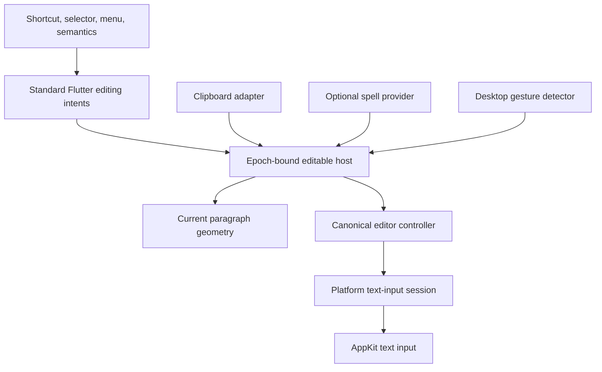
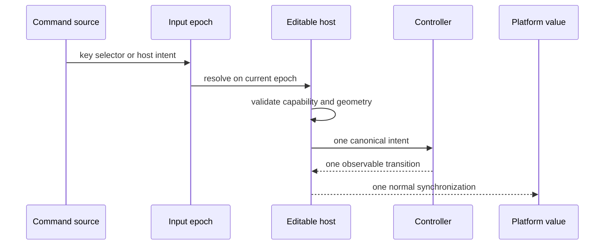
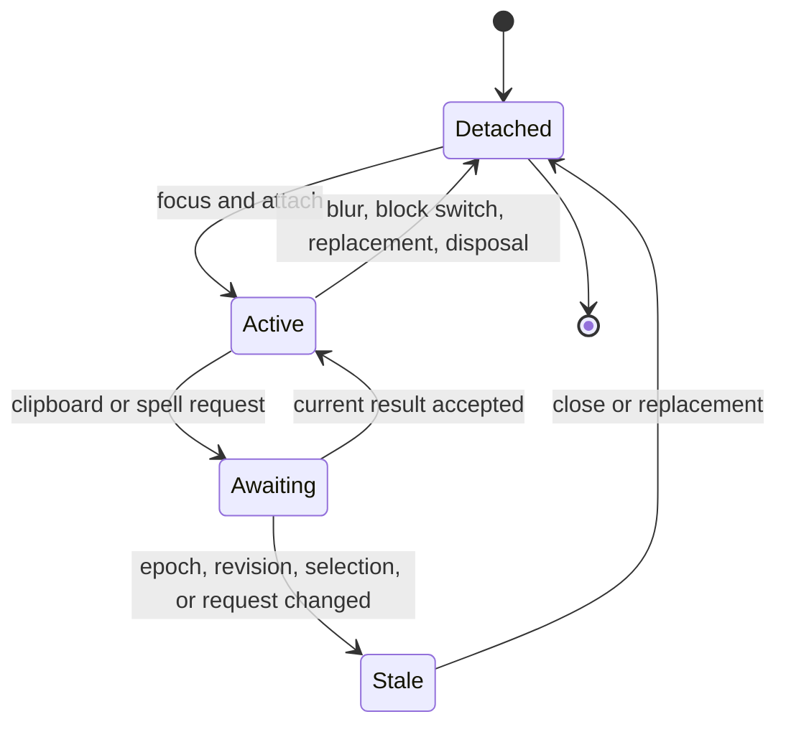

# Desktop Editing Parity - Plan

## Goal Capsule

- **Objective:** A writer can use one active Homeric paragraph with the expected macOS clipboard, history, word, pointer, menu, spelling, and caret behavior without duplicate mutations or projected-coordinate corruption.
- **Means:** Extend the HOM-18 controller, geometry, epoch-bound input session, and editable host through Flutter's standard editing intents and platform-adaptive desktop surfaces. (KTD1-KTD8)
- **Authority:** HOM-19 defines the feature scope. The HOM-18 plan defines canonical coordinate ownership, composition, and one-active-block boundaries.
- **Execution profile:** Implement and verify locally. Do not run GitHub Actions, push, publish, deploy, or change the Nexus dependency.
- **Stop conditions:** Stop and re-plan if a command needs a second mutation owner, projected text must become canonical editor input or a platform text-input value, an AppKit plugin becomes necessary for the accepted scope, or behavior requires cross-block editing. Visible projected text may leave through the explicitly read-only clipboard and spell-provider output boundaries.
- **Tail ownership:** HOM-6 owns multi-block editing, HOM-20 owns touch selection, HOM-21 owns cross-platform IME certification, and HOM-7 owns Nexus journal parity and the default renderer switch.

---

## Product Contract

### Summary

This plan completes the desktop behaviors deferred from the macOS-first single-paragraph foundation. It adds plain-text clipboard commands, canonical undo and redo, desktop word gestures, multi-click selection, a macOS-adaptive context menu, injectable spelling affordances, caret blinking, inactive selection, and cancellation polish.

### Problem Frame

HOM-18 proved canonical single-paragraph input, visual caret navigation, composition grouping, and a shared input session. It intentionally left common desktop commands and presentation unfinished. Adding those behaviors through independent key handlers, menu state, clipboard callbacks, or a second history stack would split ownership and allow one physical command to mutate twice.

The current editable host also reads Flutter's debug-only layout state during runtime geometry checks. That can fail in release builds even when widget tests pass, so release-safe geometry is a prerequisite for desktop parity.

### Key Decisions

- **Use a macOS-adaptive Flutter context menu.** Flutter's true system context menu is iOS-only; an AppKit `NSMenu` bridge is not part of this issue. Governs R9-R10.
- **Ship spelling affordances without claiming a desktop spell engine.** Flutter's default spell service supports Android and iOS, so macOS accepts an injected provider and otherwise disables spelling honestly. Governs R11-R12.
- **Reject multiline paste atomically.** Structural insertion belongs to multi-block editing; this issue never strips or partially applies pasted lines. Governs R6.

### Requirements

#### Command and history ownership

- R1. Standard Flutter editing intents are the single command boundary for shortcuts, ordered macOS selectors, context-menu actions, and accessibility actions; each command reaches at most one controller mutation, and selectors from one platform callback execute in order without deduplication.
- R2. Platform deltas remain the sole owner of keyboard and IME inserted or composed text. Host actions own explicit editing commands such as Paste and remain disabled for composition-sensitive commands until composition commits or closes.
- R3. The controller owns bounded undo and redo stacks over exact document, decoration, directional selection, composing, and preferred-x snapshots; new committed mutations clear redo while selection-only changes do not.
- R4. Every accepted mutating command produces one observable controller transition, one history unit when content or decorations change, and at most one platform synchronization. Read-only commands and rejected, failed, null, or stale outcomes remain controller no-ops. A monotonic controller state revision advances on every observable state change, including selection-only changes, so mutation-then-undo and selection ABA cannot validate stale asynchronous capabilities; a separate content revision advances only when canonical text changes.

#### Clipboard and word behavior

- R5. Copy and cut place the exact visible projected selection on the plain-text system clipboard while retaining its canonical range for deletion. Cut deletes that canonical range only after clipboard write success and after its captured host, state revision, block, selection, and request generation remain current.
- R6. Paste reads plain text asynchronously, drops stale results, treats null data and empty text as no-ops, and rejects any `LF` or `CR` atomically without changing selection, history, notifications, or content. Rejection and clipboard failures emit a typed host event; the playground presents concise user-visible feedback.
- R7. Double-click selection uses the visible word's Unicode boundary mapped to a canonical range, while modifier-word movement and deletion use a distinct editor movement boundary that skips separators and always makes progress.
- R8. Word movement, selection extension, and deletion preserve direction, affinity, grapheme integrity, hidden-delimiter ownership, block edges, and the macOS reversal rule when the head crosses the anchor.

#### Pointer, menu, spelling, and presentation

- R9. A first desktop click places a caret, a second selects the word, and a third or later consecutive click selects the whole paragraph through current geometry, matching Flutter's macOS tap-count clamp. Word-drag and paragraph-drag remain clamped to the active block, and every cancel or reset clears transient anchors.
- R10. Secondary click preserves a selection when pressed inside it, otherwise selects the clicked word, then opens one accessible macOS-adaptive menu. Cut and Copy require an expanded editable selection; Select All requires remaining selectable text; Undo and Redo follow controller capability; Paste is offered for an active writable host and validates clipboard content on activation; spelling suggestions require a current result covering the clicked canonical word. The menu exposes localized semantic labels, accepts standard keyboard traversal and activation, dismisses on Escape, and restores paragraph focus without changing selection. Menu callbacks are epoch-bound capabilities and stale menus close or no-op.
- R11. An optional spell provider receives content-revision-witnessed visible projected text and returns projected suggestion ranges that the current geometry maps back to canonical ranges. Selection-only movement does not invalidate current results, stale content results are discarded, and transient spelling paint never enters controller decorations or undo history.
- R12. Applying a spelling suggestion replaces its exact canonical range through the controller once and is undoable as one history unit; absence or failure of a provider leaves editing functional.
- R13. A focused collapsed selection shows an immediate caret that blinks on a 500-millisecond half-period, resets after input or movement, and stays steadily visible when animations are disabled. The clock remains controllable for deterministic tests.
- R14. Blur hides the caret and composing paint but retains expanded logical selection with a subdued inactive tint; focus, block, dependency, pointer, menu, and disposal transitions cancel transient state safely.
- R15. Editable semantics expose canonical value and directional selection plus enabled copy, cut, paste, and select-all actions that dispatch the same standard intents without changing read-only paragraph semantics.

#### Compatibility and release safety

- R16. Runtime geometry freshness uses only release-safe public attachment, size, generation, and overlay witnesses; no `debug*` render lifecycle getter may control production behavior.
- R17. The public surface remains compatible with Flutter 3.24 and uses no hidden `EditableText`, AppFlowy, Super Editor, ProseMirror, or parallel editor state.
- R18. This issue remains one-active-block and macOS-first; it does not add Enter-to-split, cross-block selection, touch handles, a native desktop spell engine, cross-platform IME certification, or a Nexus renderer switch.

### Success Criteria

- In the macOS playground, Cmd-C/X/V/A/Z/Shift-Z, Option-arrow, Shift-Option-arrow, Option-Delete, multi-click selection, right-click menu actions, and redo all operate through one canonical command path.
- Ordinary Copy and Cut produce the visible selected text without leaking hidden syntax, while deletion and editing continue to use mapped canonical ranges.
- A release-built playground supports caret placement and navigation without reading debug-only layout state.
- Clipboard, spelling, menu, and platform callbacks from an old host epoch cannot affect the current block.

### Key Flows

- F1. **Desktop command dispatch**
  - **Trigger:** A shortcut, AppKit selector, menu item, or accessibility action targets the focused paragraph.
  - **Steps:** The active epoch resolves one standard intent, the host validates focus, block, composition, and any required geometry, and the controller handles the command once.
  - **Outcome:** The canonical document and platform value converge without duplicate mutation.
  - **Covered by:** R1-R4, R17
- F2. **Asynchronous cut or paste**
  - **Trigger:** The writer invokes Cut or Paste.
  - **Steps:** The host snapshots its capability and controller revision, performs clipboard I/O, rejects failure or stale completion, validates content, then issues at most one controller mutation.
  - **Outcome:** Old clipboard results never delete or insert into a newer editor state.
  - **Covered by:** R5-R6
- F3. **Desktop pointer selection and menu**
  - **Trigger:** The writer clicks, multi-clicks, drags, cancels, or secondary-clicks.
  - **Steps:** Current geometry maps the pointer to canonical caret or word ranges, gesture state tracks the selection mode, and the adaptive menu reuses the same commands.
  - **Outcome:** Selection matches desktop conventions without crossing a block or leaving stale gesture state.
  - **Covered by:** R7-R10, R14
- F4. **Spell result and suggestion**
  - **Trigger:** An injected provider returns results or the writer chooses a suggestion.
  - **Steps:** The host validates the checked content revision, maps the current projected ranges to canonical ranges, paints them transiently, and routes a selected replacement through the controller.
  - **Outcome:** Spelling remains optional, revision-safe, and undoable without becoming canonical editor state.
  - **Covered by:** R11-R12
- F5. **Caret lifecycle**
  - **Trigger:** Focus, selection, text, animation preference, block, or lifecycle state changes.
  - **Steps:** The host recomputes whether the caret may blink, resets it visible after interaction, suspends or cancels timing when ineligible, and paints inactive selection separately.
  - **Outcome:** Caret and selection feedback remain visible, calm, and leak-free.
  - **Covered by:** R13-R14, R16

### Acceptance Examples

- AE1. **Stale cut after selection change** — Given a pending clipboard write for selection A, when the writer moves to selection B before completion, then A may have been copied but neither A nor B is deleted. Covers R5.
- AE2. **Overlapping paste requests** — Given two pending paste reads, when the newer request completes first, then only that current request may insert and the older completion is inert. Covers R6.
- AE3. **Multiline paste** — Given a selected word and clipboard text containing `CR`, `LF`, or both, when Paste runs, then text, selection, history, notifications, and platform value remain unchanged and the playground explains that multiline insertion is not yet supported. Covers R6.
- AE4. **Hidden syntax word behavior** — Given hidden delimiters around `bold`, when the writer double-clicks or uses modifier-word commands, then the visible word drives the boundary while the canonical result includes its owned delimiters. Covers R7-R8.
- AE5. **Native selector order** — Given AppKit sends two selectors in one callback, when the session dispatches them, then both standard intents run in order and neither is deduplicated. Covers R1-R4.
- AE6. **Right-click inside selection** — Given an expanded selection, when secondary click lands inside it, then the selection remains intact and menu actions target it. Covers R9-R10.
- AE7. **Spell result after edit** — Given a spelling request for revision A, when the document advances to revision B before it resolves, then no A squiggle or suggestion can paint or mutate B. Covers R11-R12.
- AE8. **Reduced motion** — Given animations are disabled and the paragraph has a focused collapsed selection, when time advances, then the caret remains steadily visible and no recurring blink timer survives disposal. Covers R13-R14.
- AE9. **Release geometry** — Given a release-built playground, when the writer places and moves the caret through wrapped and hidden text, then geometry remains current without a debug-only lifecycle access. Covers R16.
- AE10. **Visible clipboard projection** — Given a visible word whose delimiters are hidden, when the writer copies or cuts it and pastes into an undecorated location, then the clipboard contains only the visible word while Cut deletes the mapped canonical range. Covers R5.

### Scope Boundaries

#### Deferred to Follow-Up Work

- A native AppKit `NSMenu`, macOS Look Up service, or `NSSpellChecker` bridge requires separate platform-plugin work.
- HOM-6 owns cross-block selection, structural paste, Enter-to-split, joins, autoscroll, and virtualization integration.
- HOM-20 owns touch handles, long-press selection, magnifier, floating cursor, and mobile gestures.
- HOM-21 owns platform IME, autocorrect, candidate, and marked-text certification beyond the existing macOS foundation.
- HOM-7 owns mounting the editable host in Nexus, parity testing, and the eventual default switch.

### Sources

- [HOM-19](https://linear.app/xana-studios/issue/HOM-19/desktop-editing-parity-clipboard-history-word-gestures-and-native) defines the desktop parity scope.
- `docs/plans/2026-08-19-0108-feat-desktop-single-paragraph-editing-foundation-plan.md` defines the canonical input, composition, geometry, and active-block contracts this plan extends.
- `STRATEGY.md` requires new writing features to compose on Homeric's owned primitives rather than importing another editor core.
- `LEARNINGS.md` records canonical coordinate boundaries, one-controller ownership, current-layout geometry, and cross-repo learning rules.
- Flutter 3.44.4 public source for `DefaultTextEditingShortcuts`, text-editing intents, `TextSelectionGestureDetector`, `ContextMenuController`, `AdaptiveTextSelectionToolbar`, clipboard, spell-check services, and undo support; compatibility is constrained to APIs present in Flutter 3.24.

---

## Planning Contract

### Key Technical Decisions

- KTD1. **Standard intents own desktop commands.** Let `DefaultTextEditingShortcuts` and macOS selector translation resolve public editing intents. Host Actions invoke controller behavior once; do not maintain a parallel exhaustive accelerator table or time-based deduplication.
- KTD2. **Canonical controller history gains revisioned redo.** Extend the existing snapshot history rather than wrapping the editor in Flutter `UndoHistory`. Increment a monotonic controller state revision on observable state changes so asynchronous commands cannot pass an ABA identity check after mutation and undo; maintain a distinct content revision so spelling does not churn on caret movement.
- KTD3. **Epoch-bound host capability guards asynchronous work.** Each input attachment binds one host-identity-specific command delegate; rebuilding or replacing a host for the same block supersedes the old binding. Clipboard, menu, selector, and spelling callbacks capture the host epoch, block, controller revision, selection, composition state, and operation generation they need, then fail closed after every await. Selector and toolbar callbacks resolve through that delegate, never through global primary focus.
- KTD4. **Word selection and word movement are separate geometry contracts.** Keep Unicode word selection for double-click. Add editor-style directional movement that skips separators, makes progress, and maps the result back through the view map without exposing view offsets.
- KTD5. **Flutter owns gesture arbitration.** Use `TextSelectionGestureDetector` for desktop tap counts, selection drags, secondary clicks, and cancel/reset signals. Do not layer a competing pan recognizer or private click timer over it.
- KTD6. **Menu and spelling are transient host state.** Use one adaptive context-menu controller and optional revision-bound spell results. Neither menu state nor suggestion paint enters the canonical decoration set or undo history.
- KTD7. **Caret timing is deterministic policy state.** A host-local blink controller owns visible phase, eligibility, reduced-motion behavior, and cleanup. Timing is injectable or otherwise controllable in tests; tests never use an unbounded settle loop.
- KTD8. **Geometry readiness is release-safe.** Trust current `ParagraphOverlay` geometry generation plus public render attachment and size readiness. Remove every runtime dependency on Flutter debug lifecycle state and verify the compiled release path.

### Assumptions

- Plain text is the only clipboard interchange format in this issue.
- Multiline paste is rejected rather than stripped because structural editing belongs to HOM-6.
- The accepted macOS menu is Flutter-rendered and platform-adaptive, not an AppKit `NSMenu`.
- Spelling includes an injectable provider, transient misspelling paint, suggestion menu items, and undoable replacement; the package supplies no native desktop provider.
- Double-click drag and triple-click drag are part of desktop parity but remain within one block.
- Clipboard rejection and platform failures emit a typed host event. The package remains presentation-agnostic, while the playground renders concise feedback for multiline rejection and adapter failure.

### High-Level Technical Design

#### Component ownership

#### One-command sequence

#### Transient capability lifecycle

### Sequencing

1. Make controller history and geometry release-safe before adding commands that depend on them.
2. Add word and command primitives before clipboard, gestures, menus, or spelling consume them.
3. Bind host capabilities and asynchronous guards before enabling platform toolbar callbacks.
4. Add transient interaction and presentation state after command ownership is stable.
5. Finish with playground integration, compatibility, release build, and real macOS acceptance.

### System-Wide Impact

- **Public API:** The experimental controller, geometry, input-session, and editable-host APIs expand. Existing read-only paragraph APIs remain unchanged.
- **Performance:** Blink timing, clipboard state, and spell requests add lifecycle work per active host only. Inactive paragraphs must not schedule timers or provider requests.
- **Accessibility:** The editable semantics surface gains standard selection actions and the menu uses Flutter's localized adaptive controls.
- **Platform dispatch:** Default shortcuts remain the non-Apple command path; macOS composition-sensitive navigation and deletion may arrive through ordered AppKit selectors. Both converge on the same host Actions, and neither is shadowed by a second key map.
- **Consumers:** The playground adopts the behavior first. Nexus receives only mirrored architecture learning in this issue; dependency integration remains HOM-7.

### Risks and Mitigations

- **Native event duplication:** Preserve Flutter's shortcut-to-selector routing and test every entry path for one mutation; verify one physical command manually on macOS.
- **Stale asynchronous mutation:** Require epoch, monotonic revision, selection, block, composition, and operation-generation witnesses before mutation.
- **Word-boundary mismatch:** Keep selection and movement APIs distinct and compare against Flutter 3.24 and 3.44 behavior across Unicode and punctuation fixtures.
- **Transient-state leaks:** Cancel timers, menus, gestures, clipboard operations, and spell results on every ownership transition and disposal.
- **Release-only geometry failure:** Add a source contract against runtime `debug*` probes plus an actual release build and interaction smoke.
- **Minimum-version drift:** Use public APIs present in Flutter 3.24 and run the repository's compatibility gate before completion.
- **Desktop framework limits:** Do not claim native AppKit menus, Flutter desktop spell service, or macOS `UndoManager` integration. The accepted surface is Flutter-adaptive menu chrome, injected spelling, and standard Cmd-Z/Cmd-Shift-Z intents.

---

## Implementation Units

### U1. Add revisioned undo and redo

- **Goal:** Make controller history symmetric, bounded, observable, and safe for asynchronous command witnesses.
- **Requirements:** R3-R4
- **Dependencies:** None
- **Files:** `packages/homeric/lib/src/editing/editor_controller.dart`, `packages/homeric/test/editing/editor_controller_test.dart`
- **Approach:** Add monotonic state revision and exact redo snapshots to the existing controller history owner. Preserve composition grouping, notification count, hidden-reveal callbacks, decoration mapping, and selection-only behavior.
- **Execution note:** Add controller history and ABA regressions before changing production behavior.
- **Patterns to follow:** Existing `_EditorSnapshot`, `_pushUndo`, composition interruption, external transaction, and decoration replacement tests.
- **Test scenarios:**
  - Undo pushes the exact current snapshot to redo and redo restores document, decorations, directional selection, composing state, affinity, and preferred x with one notification.
  - A new controller text, decoration, or external-transaction mutation clears redo, while selection-only movement does not.
  - Composition commits as one unit before undo or redo, and bounded history evicts the correct oldest snapshot from each direction.
  - Mutation followed by undo produces an older-looking state with a newer monotonic revision, so a captured asynchronous capability remains stale.
- **Verification:** Controller tests prove exact snapshots, revision monotonicity, stack limits, and notification counts.

### U2. Add release-safe word geometry

- **Goal:** Provide document-native desktop word operations and remove release-unsafe geometry gating.
- **Requirements:** R7-R8, R16-R17
- **Dependencies:** U1
- **Files:** `packages/homeric/lib/src/render/paragraph_geometry.dart`, `packages/homeric/lib/src/render/homeric_paragraph.dart`, `packages/homeric/lib/src/render/paragraph_overlay.dart`, `packages/homeric/lib/src/editing/editable_paragraph.dart`, `packages/homeric/test/render/geometry_test.dart`, `packages/homeric/test/render/differential_test.dart`, `packages/homeric/test/render/homeric_paragraph_test.dart`, `packages/homeric/test/render/paragraph_overlay_test.dart`, `packages/homeric/test/editing/editable_paragraph_test.dart`
- **Approach:** Keep existing word selection unchanged. Add directional movement boundaries in geometry and route current-layout checks through public attachment, size, overlay, and generation witnesses.
- **Execution note:** First pin Flutter word-movement behavior and reproduce the release-only debug getter risk with a focused contract.
- **Patterns to follow:** Current caret-movement queries, `wordBoundaryAt`, stale generation wrappers, and geometry differential tests.
- **Test scenarios:**
  - Directional movement and deletion cover empty text, block edges, repeated separators, punctuation, emoji, combining sequences, bidi runs, wraps, and positions already on a boundary.
  - Hidden delimiters are absorbed by the mapped canonical range without exposing view offsets or splitting a grapheme.
  - Forward and reverse Shift-word movement honor anchor crossing and macOS reversal semantics.
  - Stale layout generations no-op, while current geometry works without any runtime `debug*` lifecycle access.
- **Verification:** Geometry and differential suites prove document-space boundaries; a release-safe source/runtime regression fails on debug-only gating.

### U3. Bind commands and clipboard to the host epoch

- **Goal:** Route every desktop command through one intent and make clipboard operations stale-safe.
- **Requirements:** R1-R6, R15
- **Dependencies:** U1, U2
- **Files:** `packages/homeric/lib/homeric.dart`, `packages/homeric/lib/src/input/text_input_session.dart`, `packages/homeric/lib/src/editing/editable_paragraph.dart`, `packages/homeric/lib/src/editing/editor_clipboard.dart`, `packages/homeric/test/input/text_input_session_test.dart`, `packages/homeric/test/editing/editable_paragraph_test.dart`, `packages/homeric/test/editing/editor_clipboard_test.dart`
- **Approach:** Bind a command delegate to each input epoch, implement standard editing Actions, and isolate clipboard I/O behind an injectable adapter. Validate every asynchronous result against KTD3 before controller mutation.
- **Execution note:** Prove single-dispatch, stale completion, and multiline rejection before enabling the commands in the host.
- **Patterns to follow:** Immutable session epochs, canonical platform values, standard Flutter intents, and callback-level atomic controller batches.
- **Test scenarios:**
  - Shortcut, ordered macOS selectors, menu callback, and semantics action each resolve the same intent and mutate once without echo or duplicate history.
  - Forward and reverse selection copy/cut exports exact visible text while deletion uses the mapped canonical range; failed or stale cut never deletes.
  - Paste handles valid text, null and empty data, adapter errors, `CR`, `LF`, and `CRLF` with the exact atomic outcomes and typed feedback in R6.
  - Cut, paste, and word deletion clear redo exactly once; copy, rejection, failure, and stale completion leave history unchanged.
  - Delayed cut or paste after selection change, mutation-plus-undo, block switch, same-block host replacement, blur, disposal, or a newer request is inert; failed clipboard I/O leaves content and history unchanged.
  - A superseded epoch cannot invoke a selector or request a toolbar on whichever field currently has primary focus.
- **Verification:** Input-session, clipboard, and mounted host tests prove one command owner and all asynchronous stale guards.

### U4. Add desktop gestures, menu, and spelling

- **Goal:** Deliver pointer selection parity, an adaptive menu, and revision-safe optional spelling.
- **Requirements:** R9-R12, R15
- **Dependencies:** U2, U3
- **Files:** `packages/homeric/lib/homeric.dart`, `packages/homeric/lib/src/editing/editable_paragraph.dart`, `packages/homeric/lib/src/editing/spell_check.dart`, `packages/homeric/test/editing/editable_paragraph_test.dart`, `packages/homeric/test/editing/spell_check_test.dart`
- **Approach:** Replace competing tap/pan recognition with one desktop selection gesture detector. Reuse current geometry and standard Actions for menu commands. Keep spell results transient and revision-bound.
- **Execution note:** Start with mounted click-count, secondary-click, pointer-cancel, and stale-provider tests.
- **Patterns to follow:** ParagraphOverlay geometry snapshots, transient paint layers, controller replacement intents, and epoch-bound callbacks.
- **Test scenarios:**
  - Single, double, triple, fourth-and-later, word-drag, paragraph-drag, reverse drag, outside clamp, reset, and pointer cancel produce the exact click cycle and one-block selection in R9.
  - Right-click inside a selection preserves it; outside selects the clicked word before anchoring one adaptive menu.
  - Menu order, enablement, localized labels, semantics, dismissal, focus preservation, and stale callbacks are correct for macOS; menu actions dispatch the same standard intents as shortcuts and selectors.
  - Current spell ranges survive selection-only movement and paint as transient squiggles; stale-content or failed results do not paint; an accepted suggestion replaces once, clears redo, and undoes once.
  - No provider produces no request, no paint, and no editing regression.
- **Verification:** Mounted gesture/menu tests and fake spell-provider tests prove interaction and transient-state ownership.

### U5. Complete caret and selection lifecycle

- **Goal:** Make caret visibility, reduced motion, inactive selection, and cancellation feel complete and deterministic.
- **Requirements:** R13-R14
- **Dependencies:** U3, U4
- **Files:** `packages/homeric/lib/src/editing/editable_paragraph.dart`, `packages/homeric/test/editing/editable_paragraph_test.dart`
- **Approach:** Add a host-local blink policy with an immediate visible phase, deterministic half-period, interaction reset, reduced-motion mode, and full cleanup. Paint expanded inactive selection separately from focused selection.
- **Execution note:** Use exact clock advancement and disposal assertions; do not use `pumpAndSettle` around a recurring caret timer.
- **Patterns to follow:** Existing fixed editing paint bands, focus lifecycle, controller listener, and Flutter's deterministic cursor-testing concept.
- **Test scenarios:**
  - Focused collapsed caret is visible immediately, toggles at exact half-periods, and resets visible after text, keyboard, or pointer movement.
  - Expanded selection, composition, inactive block, disabled ticker, blur, and disposal stop recurring blink work.
  - Reduced motion keeps a static visible focused caret and schedules no recurring animation.
  - Blur preserves expanded selection with inactive tint but hides caret and composing underline; refocus restores active presentation.
- **Verification:** Deterministic widget tests prove timing, paint order, accessibility preference, and zero leaked timer or menu state.

### U6. Prove playground desktop parity

- **Goal:** Exercise the public feature in the real consumer and document honest support boundaries.
- **Requirements:** R1-R18
- **Dependencies:** U1-U5
- **Files:** `packages/homeric/examples/playground/lib/view_models/document_view_model.dart`, `packages/homeric/examples/playground/lib/views/transaction_panel.dart`, `packages/homeric/examples/playground/test/document_view_model_test.dart`, `tool/verify_flutter_3_24.sh`, `README.md`, `docs/ROADMAP.md`, `LEARNINGS.md`, Nexus `LEARNINGS.md`
- **Approach:** Expose controller redo, typed clipboard feedback, and a deterministic injected spelling fixture in the playground. Add a repository-owned local compatibility entry point that validates an isolated pinned Flutter 3.24 SDK before running its compile and focused-test checks. Update support claims, mirror any new editor-architecture learning, and perform debug plus release macOS acceptance.
- **Execution note:** Prefer real release-mode interaction smoke over treating debug widget tests as release evidence.
- **Patterns to follow:** The playground's thin controller adapter, shared input session, existing manual acceptance checklist, and reciprocal learning rule.
- **Test scenarios:**
  - Keyboard, platform input, debug transactions, decoration controls, cut, paste, spelling replacement, undo, and redo share one history pipeline.
  - Switching active blocks closes old transient state and leaves exactly one caret, menu owner, and input epoch.
  - Presentation rebuilds preserve controller, session, focus, selection, clipboard guards, and history identity.
  - A release-built macOS playground passes pointer, caret, word, clipboard, history, menu, spelling-fixture, reduced-motion, and block-switch smoke checks.
- **Verification:** Playground tests, local repository gates, Flutter 3.24 compatibility, release build, and the manual macOS checklist all pass.

---

## Verification Contract

| Gate | Applies to | Required evidence |
|---|---|---|
| Focused unit tests | U1-U5 | New behavior fails before production changes and passes after implementation; mutation-sensitive cases cover duplicate and stale paths. |
| `melos run format-check` | All | No formatter drift. |
| `melos run analyze` | All | No analyzer errors or warnings. |
| `melos run test` | All | Full Homeric and playground suites pass locally. |
| Flutter 3.24 compatibility | U2-U6 | Public APIs compile and focused tests pass at the declared minimum or an equivalent pinned compatibility environment. |
| Release macOS build | U2, U6 | The playground builds in release mode and the interaction smoke reaches geometry without debug-only lifecycle access. |
| Manual macOS acceptance | U3-U6 | Cmd clipboard/history/select-all, Option word commands, multi-click/drag, right-click menu, spelling fixture, caret blink, Reduce Motion, and rapid stale-operation cases behave once. |
| Scope audit | All | No hidden EditableText, second history/mutation owner, cross-block behavior, native desktop spell claim, GitHub Actions, push, publish, deploy, or Nexus dependency change entered the work. |

---

## Definition of Done

- Every non-deferred requirement R1-R18 has direct automated or manual evidence at its owning layer.
- Every implementation unit meets its verification outcome and the complete local verification contract is green.
- The release-mode geometry path is exercised and runtime code contains no debug-only layout readiness dependency.
- Clipboard, selector, menu, and spelling stale callbacks are proven inert across revision, selection, block, focus, host, and request changes.
- The macOS playground passes the manual acceptance matrix without a duplicate mutation or second state owner.
- Documentation names the adaptive-menu and injected-spell limitations accurately.
- Any durable editor-architecture lesson is mirrored in Homeric and Nexus.
- Dead-end adapters, duplicate shortcuts, experimental detectors, debug probes, and abandoned code are removed before completion.
- GitHub Actions, push, publish, deployment, and Nexus dependency integration remain untouched.
