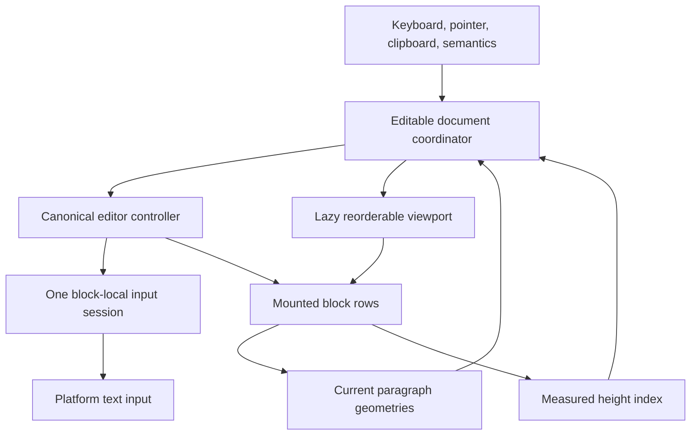
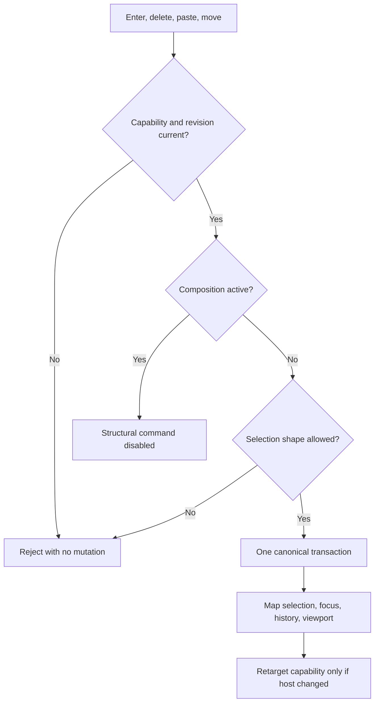
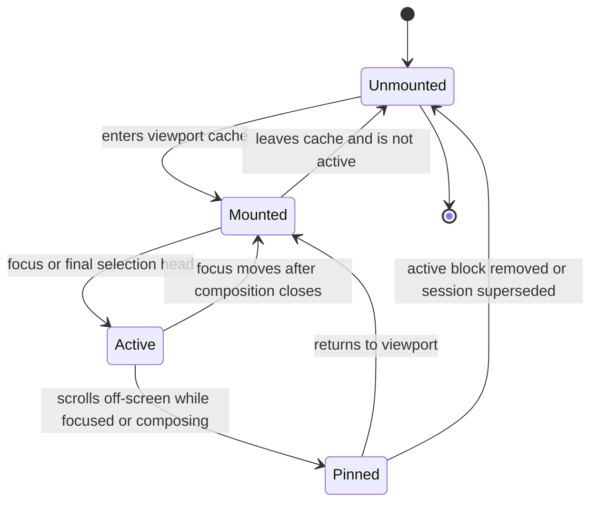
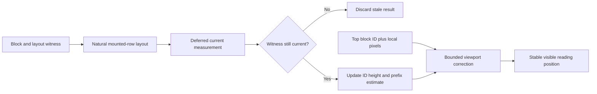
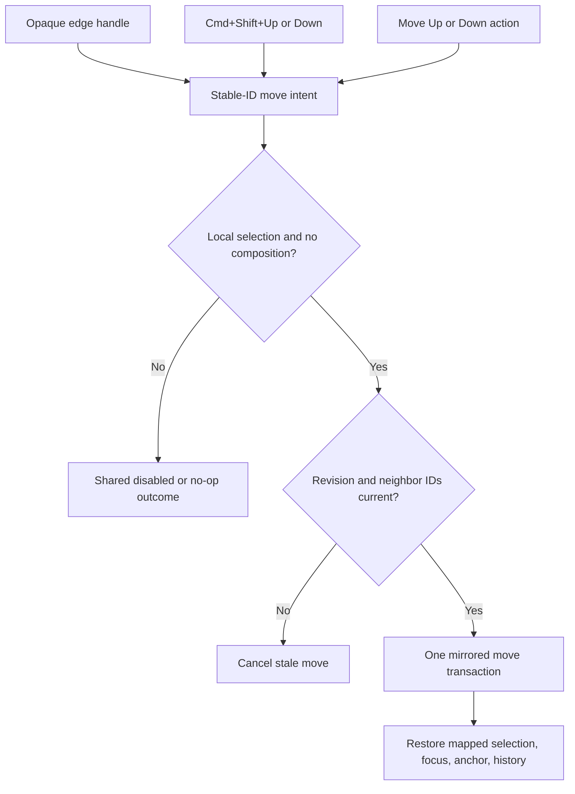

# Multi-Block Virtualized Editor - Plan

## Goal Capsule

- **Objective:** Homeric supports production-capable editing of large multi-block documents with global selection, structural editing, stable virtualized scrolling, accessible block reordering, and deterministic evidence across the 1,000- to 500,000-word corpus.
- **Means:** Extend the single canonical controller and input session with document-global structural intents, then mount block-clamped paragraph hosts inside a library-owned lazy reorderable viewport with measured-height indexing and stable-ID anchoring. (KTD1-KTD10)
- **Authority:** The confirmed HOM-6 scope and the Product Contract below govern behavior. The HOM-18 and HOM-19 plans govern canonical input, composition, desktop command dispatch, clipboard staleness, and one-controller ownership.
- **Execution profile:** Work locally on `feature/hom-6`. Local commits, tests, benchmarks, and builds are allowed. Do not run or enable GitHub Actions, push, publish, deploy, release, or change Nexus's Homeric pin.
- **Stop conditions:** Stop and re-plan if the design requires whole-document platform text input, a second document/selection/history owner, eager paragraph layout, copied editor source, a Flutter SDK floor above 3.24, or a custom render sliver before the stock lazy sliver has been measured against the accepted budgets.
- **Tail ownership:** HOM-20 retains touch selection; HOM-21 retains broader platform/IME certification; HOM-7 retains Nexus integration and the renderer default switch. GitHub workflow activation remains deferred until the overall Nexus/Homeric goal permits it.

---

## Product Contract

### Summary

HOM-6 turns the existing one-active-paragraph editing foundation into a complete multi-block editor. Writers can select and edit across recycled blocks, split and join structure, paste multiple lines as blocks, navigate across block boundaries, reorder blocks from an opaque `⋮` edge handle or macOS shortcuts, and work in documents whose paragraph layout cost stays bounded to the viewport.

### Problem Frame

Homeric already owns immutable blocks, stable IDs, global document positions, structural transactions, decoration mapping, paragraph geometry, a canonical controller, and one epoch-bound platform input session. The remaining editing layer still rejects cross-block selections and delegates focus, gestures, clipboard projection, and input attachment to individual paragraph widgets.

The playground is lazily built today, but Homeric has no reusable document viewport, no editor-owned off-screen selection lifecycle, no structural input contract, and no measured performance gate. A list wrapper alone would recycle the state that must survive, while a forced estimated-height sliver would clip or pad children because Flutter's varied-extent primitive expects exact heights rather than measuring natural content.

### Key Decisions

- **Build the full production-capable HOM-6 slice, not a demo-only viewport.** The package API, playground, structural editing, accessibility, and performance evidence land together. Governs R1-R30.
- **Make `⋮` the visible block-drag affordance.** The three vertically stacked opaque dots live in a reserved edge gutter with a full-size hit target and equivalent keyboard and semantics actions. Governs R18-R21.
- **Reserve `Cmd+Shift+Up/Down` for block movement while Homeric is focused.** These chords consume the physical command instead of extending selection to a document boundary. Governs R20-R21.
- **Preserve mapped selection, not an impossible discontiguous content set.** Reorder is disabled while composition is active or selection spans blocks; a block-local selection moves with its block through existing mirror maps. Governs R17, R21.
- **Keep performance validation local in this phase.** Restore deterministic corpus and benchmark gates without creating or enabling a GitHub workflow. Governs R27-R30.

### Requirements

#### Canonical ownership and structural editing

- R1. One `HomericEditorController` owns canonical document, decorations, directional document-global selection, composition, preferred x, undo, and redo; viewport rows and playground adapters own no parallel mutation state.
- R2. One shared `HomericTextInputSession` owns the active platform connection. Platform text remains canonical and block-local even when the controller holds a cross-block selection.
- R3. Cross-block selections are valid canonical state in either direction, including document-edge positions and empty intermediate blocks; unmounted rows retain no authoritative selection state.
- R4. Composition remains confined to one block. Selection leaving the composing block or an external active-block removal closes composition once through the existing platform policy. Split, join, multiline paste, and reorder are disabled while a non-collapsed composition is active, so IME Enter or preedit updates can never become structure accidentally.
- R5. Enter replaces any expanded selection, splits at the resulting caret, preserves the leading block ID/type/attributes, gives the trailing block a fresh collision-safe ID with inherited type/attributes, and places the caret at trailing offset zero in one history unit.
- R6. Backspace at a non-first block start joins into the previous block, whose ID/type/attributes survive; Delete at a non-last block end joins the next block into the current block, whose ID/type/attributes survive. Document-edge commands are observable no-ops.
- R7. Typing or IME insertion over a settled cross-block selection replaces the global canonical range once. The document-owned input capability retargets the existing platform connection to the surviving result block, remaps any incoming composing range, rotates its host generation, and rejects all callbacks from removed or superseded rows.
- R8. Multiline paste normalizes `CRLF` and `CR` to `LF`, preserves leading, trailing, and consecutive separators as empty blocks, retains the normalized start block's ID/type/attributes, assigns fresh IDs with inherited type/attributes to additional blocks, appends the original suffix to the last result block, and collapses after inserted content in one history unit.
- R9. Cross-block Copy and Cut export direction-independent visible projected slices joined by `LF` without laying out off-screen paragraphs. Cut mutates only after clipboard success and the existing epoch, revision, selection, focus, and request-generation witnesses remain current.
- R10. Undo and redo restore exact block identities, order, document, decorations, directional selection, preferred x, focus target, and input attachment for split, join, paste, cross-block replace, Cut, and reorder.

#### Global selection, navigation, and lifecycle

- R11. Left/Right cross adjacent block boundaries; Up/Down cross visual first/last lines while retaining preferred x; Shift extends from a stable global anchor; Home/End and document-boundary intents have document-wide outcomes; Select All selects the whole document.
- R12. Pointer selection can cross mounted blocks and autoscroll through off-screen blocks in either direction. Each scroll tick recomputes the logical head from current geometry even when the pointer does not move.
- R13. Selection autoscroll stops on pointer-up, cancellation, focus loss, document mutation, scroll boundary, dependency replacement, and disposal. Stale geometry or gesture generations cannot update the current selection.
- R14. During a cross-block drag, the platform connection does not churn through intermediate blocks. The controller selection head remains the logical active block on every drag update, but no intermediate row receives an input capability. Extending beyond the composing block closes composition once, delta acceptance is suspended while the pointer is active, and release retargets the existing connection capability to the final head before input resumes.
- R15. Mounted paragraphs derive their local selection fragment, hidden-reveal state, caret, and paint from controller state. Empty blocks fully enclosed by a global selection render a selected block fragment rather than a collapsed caret.
- R16. The focused or composing row may remain alive outside the viewport, but no other unneeded off-screen row is pinned. The active block is derived only from the controller selection head; the host may attach a capability for that block or none, never own a second active-block value. Focus, input epoch, composition, semantics focus, and logical selection survive ordinary mount/recycle transitions.
- R17. External transactions that remove the active block close composition, invalidate its connection before disposal, map selection to the declared survivor, and make late platform callbacks inert.

#### Virtualization and block reordering

- R18. `HomericEditableDocument` lazily builds only visible/nearby block rows plus at most the one pinned active row, keys rows by stable block ID, and follows IDs across inserts, deletes, splits, joins, undo/redo, and reorder.
- R19. Each row reserves an edge gutter containing an always-visible opaque `⋮` glyph in a minimum 44-by-44 pointer target. The handle uses grab/grabbing cursors, does not overlay text, and is the only drag recognizer that starts block reorder.
- R20. Pointer drag, `Cmd+Shift+Up/Down`, and accessibility move actions call one stable-ID controller reorder intent. The shortcut consumes the event at the nearest editing command boundary so no AppKit selection selector or duplicate move follows.
- R21. Reorder preserves block identity, content, attributes, decoration anchors, block-local directional selection, focus, input epoch continuity, undo/redo, and the visible viewport anchor. First/last keyboard moves, same-index drops, stale drag witnesses, composition, and cross-block selections are consistent no-ops or disabled states across all three surfaces.
- R22. Natural row heights are measured from mounted rows and indexed by stable block ID plus a compact complete layout witness covering paragraph inputs and row chrome. The cache never constrains a child to an estimate, retains no render/source/style objects, rejects unchanged measurements within tolerance, batches accepted measurements once per frame, and discards late or ABA-stale results.
- R23. Width, content, layout-affecting decorations/reveal state, style, paragraph specification, text direction, strut, text scale, inline-slot layout revision/dimensions, and system-font generation invalidate affected height entries; paint-only layers do not.
- R24. Height corrections, width-driven reflow, structural changes, reorder, and undo/redo preserve a stable visible anchor and its intra-block pixel offset within 0.5 logical pixel after settling. Deletion falls forward to the successor then backward to the predecessor; moving the anchored block prefers the nearest unaffected visible neighbor. Corrections coalesce and pause during user scroll, selection autoscroll, and reorder animation. Far jumps use measured heights plus deterministic estimates, make monotonic progress for at most eight correction passes, cancel on stale revision/user input/missing target, and return a typed not-reached outcome rather than walking the document silently.

#### Accessibility and performance

- R25. One document-level collection/command semantics owner exposes global selection state, structural actions, and announcements without posing as a second text field or concatenating the full 500,000-word document. Mounted rows expose stable semantic indices and total count, and only the active mounted row exposes editable text-field semantics.
- R26. Each `⋮` handle is a semantic button labeled with its block position and exposes enabled Move Up/Move Down actions. Pointer, keyboard, and semantics reorder share enablement, mutation, focus restoration, and concise announcements.
- R27. Corpus generation is byte-deterministic across supported Dart runtimes through a repository-owned versioned PRNG, explicit fixture seeds, committed byte hashes, and documented synthetic text; the benchmark covers 1k, 10k, 50k, 100k, and 500k words plus pathological many-small-block, one-huge-block, alternating-short/tall, systematically biased-estimate, and frequent-height-change cases.
- R28. Deterministic counters prove mounted rows, registered geometries, builds, categorized paragraph layouts, height-index work, anchor corrections, and command work do not scale with total document size for viewport-local actions. Height update, prefix query, and offset lookup are logarithmic; structural order rebuild may be linear, but ordinary text edits never rebuild the ID index. Profile/release timing uses Flutter frame timings rather than debug wall-clock thresholds.
- R29. The existing 100k-word budgets remain binding: first frame under 500 ms, cold p95 under 50 ms, scroll p50 under 16 ms, scroll p95 under 33 ms, active widgets under 500, five-second cumulative paragraph layout under 200 ms, and no accepted p95 regression above 5 percent without an explicit baseline decision.
- R30. All five standard fixtures complete locally and record machine and Flutter revision. The 500k and pathological fixtures must remain bounded and crash-free across forward, backward, alternating-direction, far-jump, deep typing, selection-autoscroll, reorder, undo, and repeated full-scroll traces; retained heights equal current document cardinality and mounted rows equal viewport/cache intersections plus at most one active row. No new hard timing promise is invented beyond the repository's accepted budgets and baseline policy.

### Success Criteria

- Writers can perform sustained desktop editing across hundreds or thousands of blocks without losing selection, focus, composition safety, or undo/redo integrity.
- Viewport-local typing, navigation, selection, and layout work remain bounded as the corpus grows from 1,000 to 500,000 words.
- Pointer, keyboard, and accessibility users can reorder the same stable block through the same controller command, with an unmistakable `⋮` edge affordance.
- The release/profile benchmark enforces the current 100k-word budget and emits reproducible evidence for every fixture without GitHub Actions.

### Key Flows

- F1. **Cross-block selection and replacement**
  - **Trigger:** The writer drags or shift-navigates beyond the active block, then types, cuts, pastes, or presses Enter.
  - **Steps:** The document coordinator owns the global range, visible rows paint local fragments, the input session keeps one block-local shadow, and one structural controller intent replaces the normalized range before the retained attachment rotates its host capability generation to the survivor.
  - **Outcome:** Canonical structure changes once and stale row callbacks cannot mutate the result.
  - **Covered by:** R1-R10, R12-R17
- F2. **Virtualized selection autoscroll**
  - **Trigger:** The pointer remains beyond the viewport edge during selection.
  - **Steps:** The editor-level drag capability advances the scroll position, receives current mounted geometry, recomputes the head, and mounts or recycles rows without moving authoritative selection into them.
  - **Outcome:** A directional selection can span off-screen blocks while row count stays bounded.
  - **Covered by:** R12-R18, R22-R24
- F3. **Block reorder**
  - **Trigger:** The writer drags `⋮`, invokes `Cmd+Shift+Up/Down`, or uses a semantic move action.
  - **Steps:** A shared predicate validates composition and selection, a stable-ID command validates the current revision and neighbors, one mirrored move transaction runs, and focus plus viewport anchor are restored.
  - **Outcome:** The block moves exactly once with identity, local selection, and history intact.
  - **Covered by:** R18-R21, R26
- F4. **Measured viewport correction**
  - **Trigger:** A row first mounts, reflows, changes projection, or is moved above the viewport.
  - **Steps:** Its natural height publishes with a full layout witness, the index accepts only a current measurement, and the viewport corrects against the stable top-block anchor.
  - **Outcome:** No estimated height clips content and the visible reading position does not jump.
  - **Covered by:** R22-R24
- F5. **Performance qualification**
  - **Trigger:** The local benchmark runs a generated fixture.
  - **Steps:** It records reproducibility metadata, structural counters, frame timings, active-row peak, and paragraph-layout time, then compares accepted metrics to absolute and baseline gates.
  - **Outcome:** A performance regression fails locally with enough evidence to locate eager building, layout churn, or linear command work.
  - **Covered by:** R27-R30

### Acceptance Examples

- AE1. **Reverse off-screen replacement:** Given a drag from block 80 offset 4 back to block 3 offset 2, when the writer types `x`, then the reverse endpoints remain exact until one structural replacement inserts `x` at the normalized start, removes the covered structure, collapses after `x`, and invalidates the old block-80 client.
- AE2. **Expanded Enter:** Given a reverse selection from block C into block A, when Enter is pressed, then the range is removed and split once; the leading ID survives, one fresh trailing ID is allocated, the caret focuses trailing offset zero, and undo restores all original blocks and direction.
- AE3. **Paste separator matrix:** Given `a\nb`, `a\r\nb`, `a\rb`, `\na`, `a\n`, or `a\n\nb`, when pasted over collapsed, local-expanded, or cross-block reverse selections, then normalization produces equivalent structure, preserves every empty line, and creates one history unit.
- AE4. **Autoscroll after recycling:** Given selection begins in A and passes through 50 blocks, when A leaves the viewport, then the selection continues from editor-owned state, no intermediate input epoch attaches, and release attaches only the final head block.
- AE5. **Handle isolation:** Given a row with a caret, when the pointer drags on `⋮`, then reorder starts without moving the caret; one pixel outside the hit target begins only text selection; crossing the gutter during an existing selection never starts reorder.
- AE6. **Shortcut collision:** Given a focused locally selected block on macOS, when `Cmd+Shift+Up` is pressed once, then the block moves once, its mapped selection and focus follow it, no select-to-document-start action occurs, and one undo restores the order.
- AE7. **Unsafe reorder state:** Given active composition or a cross-block selection, when any reorder surface is inspected or invoked, then the handle/shortcut/semantic action share a disabled or no-op result. After composition closes or selection becomes block-local, all surfaces enable together.
- AE8. **Stale drag:** Given B is being dragged, when another transaction changes document revision or target neighbors before drop, then the old drop is cancelled and B remains in place.
- AE9. **Height-cache ABA:** Given A is measured, edited, undone to identical text under another width/style generation, and the old measurement arrives late, then the old result is rejected and the viewport anchor stays fixed.
- AE10. **Virtualized semantics reorder:** Given accessibility focus on “Move block, block 12 of 700,” when Move Down is invoked, then the shared stable-ID command runs once, focus remains on that block at position 13, and the editor announces the move without materializing all 700 rows.

### Scope Boundaries

#### Deferred to Follow-Up Work

- HOM-20: touch handles, long-press selection, magnifier, floating cursor, and mobile gesture parity.
- HOM-21: Windows/Linux behavior and broader IME/autocorrect/candidate certification beyond the macOS-first input foundation.
- HOM-7: mount the document editor in Nexus, run consumer differential tests, update the Homeric pin, and switch the journal renderer default.
- A custom estimated-varied-extent render sliver is deferred unless measured evidence proves the stock lazy natural-height sliver cannot meet the accepted budgets or far-jump requirements.
- GitHub benchmark workflow creation or activation is deferred until the user lifts the no-Actions constraint for the overall goal.

#### Outside this plan

- Multi-range/discontiguous text selection. Cross-block selection remains one contiguous directional range.
- Markdown interpretation during paste. Newlines create structural blocks; pasted heading/list syntax remains literal text unless a future parser feature owns it.
- Importing or copying AppFlowy, Super Editor, ProseMirror, or another editor's source.
- A Nexus dependency bump, renderer switch, Candidate workflow, release, deploy, or publication.

### Dependencies

- `feature/hom-9` contains transaction-scoped collision-safe split IDs required by R5 and R8.
- `feature/hom-10` contains inverse move mirror preservation required by R10 and R21.
- `feature/hom-16` contains the independent hidden-fold/soft-wrap affinity characterization required before cross-block vertical navigation relies on that geometry.
- Flutter 3.24 public `SliverReorderableList`, `ReorderableDragStartListener`, `findChildIndexCallback`, `EdgeDraggingAutoScroller`, standard editing intents, and frame timing APIs.

### Sources

- `STRATEGY.md`, `docs/ROADMAP.md`, and `docs/PERF_BUDGET.md` define virtualization, Phase 4 ownership, and accepted metrics.
- `docs/plans/2026-08-08-001-feat-phase1-editor-core-plan.md` defines stable block identities, structural transactions, StepMap mirror pairs, and seeded-property expectations.
- `docs/plans/2026-08-19-0108-feat-desktop-single-paragraph-editing-foundation-plan.md` defines canonical block-local platform input, composition, current geometry, and one active epoch.
- `docs/plans/2026-08-19-0855-feat-desktop-editing-parity-plan.md` defines standard intent dispatch, stale-safe clipboard capabilities, and the HOM-6 multiline-paste handoff.
- `LEARNINGS.md` defines one-controller ownership, pushed geometry signals, input identity/generation checks, and mirrored cross-repo architecture learning.
- [Flutter 3.24 reorderable-list source](https://github.com/flutter/flutter/blob/3.24.0/packages/flutter/lib/src/widgets/reorderable_list.dart) establishes the lazy sliver, stable child-index lookup, custom drag handle, semantics, and reorder autoscroll APIs.
- [Flutter 3.24 sliver source](https://github.com/flutter/flutter/blob/3.24.0/packages/flutter/lib/src/widgets/sliver.dart) establishes that varied extents are forced, already-known child extents rather than a natural-height measurement protocol.
- [Flutter 3.24 scrolling helpers](https://github.com/flutter/flutter/blob/3.24.0/packages/flutter/lib/src/widgets/scrollable_helpers.dart) supplies the public edge-dragging autoscroller used for selection.
- [Flutter integration profiling guidance](https://docs.flutter.dev/cookbook/testing/integration/profiling) and [scheduler timing source](https://github.com/flutter/flutter/blob/3.24.0/packages/flutter/lib/src/scheduler/binding.dart) ground profile-mode frame evidence.

---

## Planning Contract

### Key Technical Decisions

- KTD1. **Integrate prerequisite branch contracts before HOM-6 editing changes.** Bring the complete tested HOM-9, HOM-10, and HOM-16 branch tips into `feature/hom-6`, resolving overlaps without reimplementing their behavior. This makes split identity, inverse move mapping, and wrap/fold affinity authoritative prerequisites.
- KTD2. **The controller owns document-global structure.** Lift single-block selection validation and add atomic split, join, multiline replacement, cross-block deletion, and stable-ID reorder intents to the existing controller. The viewport translates gestures and commands but never assembles its own transactions.
- KTD3. **The platform shadow stays block-local and retargetable.** A cross-block logical selection is projected as a local head capability. Crossing blocks suspends delta acceptance during the gesture; release retargets the capability, and the first accepted text/composing delta performs one global replacement before retargeting the same connection to the surviving block. Rotate the document-owned host generation rather than close the platform connection, so incoming composition can be remapped without commit/cancel churn and whole-document text never enters the client.
- KTD4. **The document host owns recyclable capabilities, not canonical activity.** `HomericEditableDocument` derives active block exclusively from the controller and owns mounted geometry, focus nodes, pinned-row lifecycle, global drag generation, selection autoscroll, viewport anchors, the input command delegate, and collection semantics. The invariant is that the attached host capability targets the controller's active block or no capability is attached. `HomericEditableParagraph` remains independently usable and block-clamped while accepting coordinator-provided fragments and presentation state.
- KTD5. **Use the stock lazy reorderable sliver without forced extents.** Build the viewport from `CustomScrollView` and direct `SliverReorderableList`, keyed and indexed by block ID. Omit `itemExtentBuilder`; children receive natural constraints and only mounted rows pay paragraph layout. This is chosen over the old `SliverVariedExtentList` estimate design because Flutter forces the supplied extent and cannot learn a natural height from that constrained child.
- KTD6. **Measured heights index targeting; they do not size rows.** Maintain an ID-keyed compact layout-witnessed index with logarithmic point update, prefix query, and offset lookup, while allowing an order rebuild only for structural edits. Unknown blocks use deterministic estimates, mounted rows publish natural measurements in one per-frame batch, and far targeting gets eight monotonic correction passes before a typed not-reached result. If work grows with destination index or XL cannot converge within this bound, stop U5 and re-plan a custom sliver rather than disguising a progressive document walk.
- KTD7. **Stable visible neighbor plus intra-block pixels define viewport continuity.** Capture the top visible block and its local pixel offset before height/index mutations. If that block is deleted use successor then predecessor; if it is moved, prefer the nearest unaffected visible neighbor. Apply one current correction after user scroll, selection autoscroll, and reorder animation settle; numeric scroll pixels alone are not continuity.
- KTD8. **The handle is the sole reorder gesture owner.** Reserve a gutter and wrap only the opaque `⋮` target in Flutter's reorder listener. Pointer, keyboard, and semantics surfaces call the same revision- and neighbor-witnessed controller move intent; no surface synthesizes another surface's input.
- KTD9. **Unsafe structural commands fail closed by command type.** Reorder, split, join, and multiline paste are disabled while platform composition is non-collapsed; pointer relocation or block switch uses the existing explicit composition-close policy. Reorder is also unavailable while selection spans blocks. This prevents IME Enter/preedit from becoming structure and preserves the single contiguous-selection model; exact selected-content preservation across an endpoint-crossing move would require deferred multi-range support.
- KTD10. **Performance gates mix deterministic counts with calibrated profile timings.** Instrument every actual paragraph-layout path by category, including live, intrinsic/dry, template, and paint-time rebuilds; the cumulative budget counts their total while category data diagnoses drift. Record an uninstrumented control and disabled-mode overhead, pin benchmark boundaries, warmups, sample count, aggregation, outlier/noise policy, and compare the 100k fixture to existing absolute and 5-percent baseline gates. Record larger/pathological results without inventing unsupported timing budgets.

### Assumptions

- Newline paste inherits the normalized start block's type and opaque attributes for every newly created block; it does not parse Markdown syntax.
- A locally expanded selection is mapped with its moved block. A cross-block selection disables reorder rather than changing the selected logical set.
- The active row is the only row allowed to remain alive solely for focus/composition outside the ordinary viewport cache.
- The first implementation may use iterative estimated scroll correction. Exact cold scrollbar geometry for every unseen block is not required unless existing budgets or acceptance tests prove it necessary.
- The corpus remains deterministic synthetic prose in this plan; documentation will no longer claim Project Gutenberg input until such a corpus actually exists.

### High-Level Technical Design

The sketches describe ownership and protocol boundaries, not exact class signatures.

#### Component ownership



#### Cross-block input sequence

```mermaid
sequenceDiagram
  participant Pointer as Selection source
  participant Host as Document host
  participant Controller as Controller
  participant Session as Input session
  participant Platform as Platform client
  Pointer->>Host: extend head across blocks
  Host->>Controller: set global directional selection
  Host->>Session: suspend deltas; retain connection
  Pointer->>Host: release on final head
  Host->>Session: retarget capability; resume deltas
  Platform->>Session: first inserted or composing text
  Session->>Controller: replace global range structurally once
  Controller-->>Session: surviving block, collapsed selection, mapped composition
  Session->>Platform: rotate host generation; synchronize same connection
```

#### Structural-command decision flow



#### Virtualized interaction lifecycle



#### Height and anchor data flow



#### Reorder convergence



### Sequencing

1. Integrate and verify structural prerequisites before changing their consumers.
2. Establish deterministic baseline instrumentation against the current playground before virtualization behavior changes.
3. Make controller, session, and clipboard behavior document-global before adding a viewport that depends on it.
4. Land the lazy viewport, measurement index, and focus lifecycle before cross-block pointer/autoscroll behavior.
5. Add reorder through the established document coordinator and stable viewport anchor.
6. Migrate the playground and qualify every fixture locally before documentation and mirrored learnings close the phase.

### System-Wide Impact

- **Public API:** A document editor host and layout/performance observability surface join the experimental controller, paragraph, and session APIs. The standalone paragraph remains supported and block-clamped.
- **Selection:** The selection model remains one directional canonical range, but controller validation, clipboard projection, navigation, paint slicing, and semantics become document-wide.
- **Input:** Exactly one platform connection and attachment epoch remain active through cross-block replacement. The host capability generation rotates to the survivor; only a real close and attach creates a new platform attachment epoch.
- **Layout:** The viewport becomes the package owner of row creation, stable keys, keep-alive policy, geometry registration, height measurements, and scroll correction. Paragraph rendering itself remains block-local.
- **History and decorations:** Structural controller intents reuse existing transaction maps and mirror pairs so undo/redo and block-sharded decorations follow stable identities.
- **Accessibility:** Semantics ownership moves upward to prevent duplicate editable fields and retain logical actions when selection endpoints are off-screen.
- **Playground:** The demo becomes the real package consumer and benchmark driver rather than a parallel list/editor implementation.
- **Nexus:** No runtime integration changes land. The durable editor-architecture learning is mirrored to Nexus only after the implementation is verified.

### Risks and Mitigations

- **Platform input cannot represent cross-block selection:** Keep the global range in the controller, suspend deltas during the gesture, and arm one first-delta structural replacement capability. Retarget the same platform connection to preserve incoming composition, rotate the document host generation, and mutation-test stale row callbacks.
- **Estimated heights can clip content:** Never supply estimates as forced child extents. Measure natural rows, validate the full layout witness, and use estimates only for indexing and bounded correction.
- **Viewport jumps after reflow or move:** Anchor by a stable visible neighbor plus local pixels, define deletion/moved-anchor fallback, coalesce one correction after interaction settles, and test height changes and reorder above/across the viewport in both directions and through undo/redo.
- **Active row leaks defeat virtualization:** Permit only one focus/composition keep-alive and assert peak mounted rows across all fixtures.
- **Gesture competition:** Make the edge handle the only reorder recognizer and keep cross-block selection drag at document scope.
- **Shortcut double dispatch:** Install the exact macOS activators at the nearest editing shortcut boundary, consume them, and test both shortcut and platform-selector channels for one move.
- **Selection meaning changes during reorder:** Disable reorder for cross-block selections. Preserve mapped endpoints for block-local selection through existing mirrors.
- **Stale asynchronous capabilities:** Carry controller revision, host generation, document identity, block ID, neighbor IDs, selection, and request generation appropriate to each operation; fail closed after every await or scroll tick.
- **Far targeting cannot control stock-sliver extent:** Treat 10/50/99-percent XL jumps as an early feasibility gate. If eight monotonic passes cannot reach the target with destination-independent work, stop U5 and plan a custom render sliver rather than declaring eventual progressive layout sufficient.
- **Corpus or timing drift:** Use a repository-owned PRNG, byte hashes, calibrated instrumentation, pinned benchmark boundaries, warmups, repeated samples, a noise-invalidates-run policy, machine/SDK metadata, structural counters, and profile frame timings. Treat debug timing as diagnostic only.
- **Prerequisite divergence:** Integrate tested sibling branch tips first and rerun their focused suites before building on them.

### Documentation and Operational Notes

- Update `README.md` and `docs/ROADMAP.md` from single-paragraph status to the verified HOM-6 surface only after local gates pass.
- Correct `docs/PERF_BUDGET.md` and corpus docs to describe the actual synthetic generator and exact local baseline policy.
- Add the implementation's editor-architecture learning to Homeric `LEARNINGS.md` and mirror the same invariant under Nexus's Homeric section, without changing Nexus runtime code.
- Keep `benchmarks/results/` ignored. A baseline change requires an explicit performance rationale and comparison metadata.
- Do not add or edit `.github/workflows/**` in this plan.

---

## Implementation Units

### U1. Reconcile structural prerequisites

- **Goal:** Make split IDs, inverse move mapping, and folded-wrap affinity reliable before HOM-6 consumes them.
- **Requirements:** R5, R8, R10-R11, R21
- **Dependencies:** None
- **Files:** Complete diffs from `feature/hom-9`, `feature/hom-10`, and `feature/hom-16`; overlapping transform, geometry, test, plan, and learning files on `feature/hom-6`
- **Approach:** Integrate each sibling branch tip as an intact tested contract, preserve its history or equivalent commit boundary, resolve overlaps against the newer HOM-19 controller without weakening assertions, and verify no duplicate allocator or inverse-mapping implementation remains. (KTD1)
- **Execution note:** Treat any prerequisite regression as a blocker; do not patch around it inside later HOM-6 units.
- **Test scenarios:**
  - Repeated implicit splits allocate unique UUID-v4-shaped IDs through transaction-scoped injection, retry collisions within the documented bound, and preserve explicit IDs.
  - A forward move and its inverse restore exact block order, selection, and block-sharded decorations.
  - A hidden canonical offset coincident with a soft-wrap view boundary returns independent upstream and downstream caret rectangles.
  - Existing controller, geometry, and playground focused suites remain green after branch reconciliation.
- **Verification:** The three prerequisite branch contracts pass unchanged on `feature/hom-6`, and the diff contains one allocator, one inverse-map rule, and one authoritative affinity characterization.

### U2. Restore deterministic performance instrumentation and baseline

- **Goal:** Establish reproducible structural and profile evidence before changing the viewport.
- **Requirements:** R27-R30
- **Dependencies:** U1
- **Files:** `tools/corpus/generate.dart`, `tools/corpus/README.md`, `benchmarks/README.md`, new benchmark app/driver under `benchmarks/`, paragraph-layout instrumentation near `packages/homeric/lib/src/render/homeric_paragraph.dart`, `melos.yaml`, benchmark tests
- **Approach:** Replace the platform `Random` dependency with a repository-owned versioned deterministic PRNG, literal fixture seeds, and committed byte-hash expectations. Build an isolated benchmark route around the same document widget, capture an uninstrumented current-list control before hot-path instrumentation, categorize every paragraph-layout call, and calibrate disabled/enabled instrumentation overhead. Pin viewport, DPR, scale, font/theme, cache extent, trace distance/velocity, cold reset, warmups, samples, aggregation, outliers, and a noise-invalidates-run rule before accepting profile frame results. (KTD10)
- **Execution note:** Capture the pre-HOM-6 baseline before the viewport implementation changes; never retrofit a favorable baseline afterward.
- **Test scenarios:**
  - Two regenerations produce byte-identical 1k/10k/50k/100k/500k fixtures across clean processes and the supported Flutter 3.24/current-SDK matrix.
  - A counter mutation that eagerly builds every row fails the active-row/build gate even if wall-clock timing happens to pass.
  - Moving work among live, intrinsic/dry, template, or paint-time paragraph-layout categories cannot evade the total cumulative-layout gate.
  - Disabled instrumentation leaves no per-layout stopwatch, timeline, allocation, or callback overhead beyond the explicitly measured constant guard.
  - The one-huge-block, many-small-block, and height-churn fixtures report separate results and complete without a hidden debug-time threshold.
- **Verification:** `melos run benchmark` or its repository-standard equivalent runs locally, records machine/Flutter metadata, and produces a reviewable pre-change result without touching GitHub Actions.

### U3. Make controller selection and structural intents document-global

- **Goal:** Give all structural editing one atomic canonical owner.
- **Requirements:** R1, R3-R8, R10-R11, R17, R20-R21
- **Dependencies:** U1
- **Files:** `packages/homeric/lib/src/editing/editor_controller.dart`, `packages/homeric/lib/src/model/selection.dart`, transform builders only where the existing primitive is insufficient, `packages/homeric/test/editing/editor_controller_test.dart`, property/history tests
- **Approach:** Lift the same-block selection restriction, resolve directional endpoints across document positions, and express split, boundary join, multiline structural replacement, cross-block deletion, and stable-ID move as controller intents over existing transaction builders. Preserve one notification, one history unit, mapping, hidden-reveal hook, and exact undo/redo snapshots. (KTD2, KTD9)
- **Execution note:** Add proof-first controller/property cases for every structural identity outcome before changing widget behavior.
- **Test scenarios:**
  - Forward and reverse selections across text and empty blocks are accepted, normalized only for mutation, and retain anchor/head direction otherwise.
  - Enter at start/middle/end and after a reverse expanded selection preserves the leading ID, allocates exactly one fresh trailing ID, and focuses trailing offset zero.
  - Backspace/Delete boundary joins produce equivalent content with their specified survivor IDs; first/last document edges emit no notification, history entry, or revision change.
  - The full multiline separator matrix over collapsed, local, and reverse cross-block selections preserves empty blocks and exact caret placement in one history unit.
  - Reorder by stable ID validates revision and neighbor witnesses, maps a local directional selection and decorations, and cancels a stale or same-position request.
  - Undo/redo restores exact fresh IDs, removed blocks, order, selection direction, focus target, and decorations for every structural intent.
- **Verification:** Controller and property suites prove canonical results, structural sharing, stable identities, notification counts, revisions, and exact inversion without widget state.

### U4. Adapt platform input and clipboard to global selection

- **Goal:** Preserve one block-local platform client while document-global editing becomes real.
- **Requirements:** R2, R4, R7-R9, R14, R17
- **Dependencies:** U3
- **Files:** new minimal coordinator shell in `packages/homeric/lib/src/editing/editable_document.dart`, `packages/homeric/lib/src/input/text_input_session.dart`, `packages/homeric/lib/src/editing/editor_clipboard.dart`, `packages/homeric/lib/src/editing/editable_paragraph.dart`, matching input/clipboard/widget tests
- **Approach:** Establish the document-owned active-host/input-command capability before adapting session behavior. Suspend deltas when selection crosses blocks, retarget that capability on release, and let the first inserted/composing delta perform one global replacement before retargeting the same platform connection to the survivor with mapped composition. Move clipboard projection from one host to a document-range projector that builds view maps without paragraph layout, retaining all monotonic revision and host-generation witnesses. The shell owns no sliver or height policy yet. (KTD3, KTD4)
- **Execution note:** Start from compile-red APIs and channel-level stale-client tests; platform echo count is part of correctness.
- **Test scenarios:**
  - Dragging through 50 blocks closes composition at most once, suspends delta acceptance, attaches no intermediate block, and retargets the final head capability once on release without closing the connection.
  - The first normal or composing insertion over a cross-block selection replaces it once, maps composition onto the survivor, rotates the host generation, and makes removed-row callbacks inert.
  - Split, join, multiline paste, and reorder remain disabled while composition is non-collapsed; platform Enter/preedit cannot invoke a structural command.
  - External removal of the active composing block closes the session before disposal and selects the declared survivor.
  - Cross-block Copy/Cut includes visible projected slices and empty-block separators but no hidden delimiters; reverse selection exports identical text.
  - Cut failure and stale cut/paste after selection change, edit-plus-undo ABA, split, reorder, blur/refocus, host replacement, account-independent disposal, or a newer request make zero canonical or platform change.
  - Multiline paste now reaches the controller structural intent; malformed/stale platform deltas still correct or reject through the existing session policy.
- **Verification:** Channel-level tests prove one attachment owner, one structural mutation, one sync, visible clipboard output, and inert superseded epochs.

### U5. Build the lazy document viewport and measured-height index

- **Goal:** Mount large documents lazily while preserving focus and visible position through natural-height changes.
- **Requirements:** R15-R18, R22-R24, R28-R30
- **Dependencies:** U2-U4
- **Files:** new `packages/homeric/lib/src/editing/editable_document.dart`, new `packages/homeric/lib/src/editing/block_height_cache.dart` or equivalent internal index, `packages/homeric/lib/src/editing/editable_paragraph.dart`, shared paragraph layout-signature/measurement seam, `packages/homeric/lib/homeric.dart`, new document/height-cache tests
- **Approach:** Expand the U4 coordinator shell into a `CustomScrollView` with direct lazy `SliverReorderableList`, stable row keys, current ID-to-index lookup, configurable cache extent, and one active-row keep-alive. Register mounted geometry and compact deferred natural-row measurements under per-block layout revision plus global width/style/scaler/font/row-chrome generations. Maintain an order-statistics/prefix structure with logarithmic point updates and queries, linear rebuild only after structural order changes, current-document eviction, one per-frame measurement batch, and stable-neighbor anchor correction after interaction settles. (KTD4-KTD7)
- **Execution note:** Characterize the current `ListView.builder` row/layout counts first; the new host must beat or preserve them before adding selection/reorder features.
- **Test scenarios:**
  - A 3,500-block document mounts only viewport/cache rows plus at most one focused row; scrolling recycles nonactive rows and never creates duplicate keys.
  - Focused composition survives ordinary off-screen keep-alive and returns with the same input epoch; removing the block invalidates it and releases the keep-alive.
  - Each paragraph and row-chrome layout input invalidates the height entry; paint-only layer changes do not, and a text edit in one block retains unrelated entries and the existing ID index.
  - A stale measurement after content, width, style, scaler, slot, reveal, font, or edit/undo ABA change is rejected.
  - Simultaneous row measurements after width reflow produce one anchor correction; unchanged measurements within tolerance produce none.
  - Height changes above the viewport, width reflow, insert/delete, reorder, and undo/redo preserve the declared stable neighbor and local pixel offset; user scroll/autoscroll/reorder animation cancels or defers competing correction.
  - Far scroll-to-block at 10, 50, and 99 percent of XL makes monotonic progress, mounts the target within eight passes without work growing linearly with destination index, and returns typed stale/missing/not-reached outcomes without oscillation.
  - Document replacement and repeated width/theme/scale cycles evict old IDs, geometries, and witnesses; retained height entries equal current document cardinality and old render/source objects are not retained.
- **Verification:** Widget/render tests prove natural child heights, bounded mounts/layouts, stable ID lookup, current measurements, and scroll-anchor continuity.

### U6. Add document-wide navigation, selection painting, and autoscroll

- **Goal:** Make global logical selection usable across visible, recycled, empty, and hidden-content blocks.
- **Requirements:** R3-R4, R11-R17, R25
- **Dependencies:** U5
- **Files:** `packages/homeric/lib/src/editing/editable_document.dart`, `packages/homeric/lib/src/editing/editable_paragraph.dart`, document geometry/selection coordinator helpers as needed, document and paragraph widget tests
- **Approach:** Keep one editor-level drag anchor and generation; derive block-local fragments and reveal ranges for each mounted row; cross block boundaries through registered geometry and estimated targeting; use a dedicated edge autoscroller that recomputes the logical head after every scroll tick. Route arrows, extension, Home/End, document boundaries, and Select All through document commands while retaining the standalone paragraph path. (KTD4)
- **Execution note:** Use controllable scroll ticks and pointer cancellation; avoid settle loops that hide recurrent timers.
- **Test scenarios:**
  - Reverse drag from block 80 to block 3 survives anchor-row recycling, preserves exact endpoints, and paints correct fragments when rows remount.
  - Fully selected empty intermediate blocks display selected-block paint and never show a false collapsed caret.
  - Left/Right, Up/Down, Shift extension, preferred-x, Home/End, document-boundary, and Select All cross blocks with correct affinity and no mid-grapheme positions.
  - Hidden delimiters, folds, slots, bidi, wrapped first/last lines, empty blocks, and document edges map to the expected global positions.
  - Stationary pointer edge drag continues extending as content scrolls; pointer-up, cancel, focus loss, document mutation, boundary, dependency replacement, and disposal stop it immediately.
  - Off-screen endpoints remain logical state only; no recycled row can resurrect stale local selection or geometry.
- **Verification:** Document-level widget tests and geometry differentials prove exact global endpoints, paint fragments, navigation, bounded row count, and leak-free autoscroll lifecycle.

### U7. Add the opaque block grabber and unified reorder commands

- **Goal:** Make block movement obvious, stable, accessible, and equivalent across pointer and keyboard.
- **Requirements:** R18-R21, R24, R26
- **Dependencies:** U5-U6
- **Files:** `packages/homeric/lib/src/editing/editable_document.dart`, block-row/handle widget if extracted, `packages/homeric/lib/src/editing/editable_paragraph.dart` command boundary, semantics helpers, document/reorder widget tests
- **Approach:** Reserve a fixed edge gutter, render the opaque `⋮` in a minimum 44-by-44 semantic button, and wrap only that target in the framework reorder-start listener. Bind exact macOS chords at the nearest paragraph/document editing shortcut layer and consume them. Translate framework indices to a captured source ID, neighbor IDs, and revision before one controller move; share the same predicate and restoration logic with semantics actions. (KTD7-KTD9)
- **Execution note:** Prove the physical chord and platform selector route cannot both move; treat no-op notification/history counts as assertions.
- **Test scenarios:**
  - The `⋮` is always visible, opaque, edge-positioned, separately hit-testable, at least 44 by 44, and labeled “Move block, block N of M.”
  - Drag on the handle reorders without moving the caret; one pixel outside selects text; selection crossing the gutter does not start reorder.
  - Drag autoscroll moves beyond the viewport and drops against current stable neighbor IDs; mutation during drag cancels stale indices, and the drag proxy creates no second editable paragraph, layout owner, or input epoch.
  - `Cmd+Shift+Up/Down` moves exactly one block, consumes the normal selection command, preserves local directional selection/focus/input epoch/viewport, and creates one undo unit.
  - First/last moves and same-index drops are zero-notification, zero-history no-ops.
  - Composition and cross-block selection disable pointer, keyboard, and semantic moves together; a block-local expanded selection moves with its block.
  - Semantic Move Down keeps accessibility focus on the same block at its new index and emits one concise announcement.
- **Verification:** Mounted macOS-target widget tests prove visual affordance, gesture isolation, exact command dispatch, stable-ID mapping, shared enablement, accessibility, viewport anchoring, and undo/redo.

### U8. Integrate the playground, qualify performance, and close documentation

- **Goal:** Make the package's real consumer exercise HOM-6 and produce complete local closure evidence.
- **Requirements:** R1-R30
- **Dependencies:** U2-U7
- **Files:** playground editor/view-model/tests, benchmark driver and baseline, `melos.yaml`, `README.md`, `docs/ROADMAP.md`, `docs/PERF_BUDGET.md`, `benchmarks/README.md`, Homeric `LEARNINGS.md`, Nexus `LEARNINGS.md`
- **Approach:** Replace the playground's list-owned block assembly with `HomericEditableDocument` using its existing single controller/session. Retain debug controls only as controller intent clients, add fixture selection and benchmark affordances outside the measured surface, run the full local matrix, accept or remediate measured regressions, then document only verified behavior and mirror the durable consumer/producer boundary learning. (KTD10)
- **Execution note:** Performance qualification is iterative: any missed absolute or 5-percent gate returns to the owning unit; do not weaken the gate or baseline to make the run green.
- **Test scenarios:**
  - Keyboard typing, selection, split/join, multiline paste, pointer autoscroll, pointer/keyboard reorder, composition, undo/redo, and decoration controls all mutate the same controller and survive presentation rebuilds.
  - Switching tiny through XL fixtures disposes the old document capability, leaves one input session, and never leaks timers, focus, drag, or height measurements.
  - Structural counters remain bounded across fixture scale; deep typing does not rebuild the ID index or unrelated height entries, and the 100k profile run meets every existing absolute budget and accepted baseline threshold.
  - The 500k and pathological runs complete forward/backward/alternating scroll, far jump, autoscroll, reorder, and undo traces with bounded mounted rows, geometries, height entries, layout calls, and memory before/after repeated cycles.
  - A source/manifest check proves no workflow file was added or enabled and no protected `tool/verify_flutter_3_24.sh` file entered the diff.
- **Verification:** Full package/playground tests, analyze, format check, compatibility gate through the repository's supported mechanism, local profile/release benchmark matrix, and release playground build pass with no GitHub Actions.

---

## Verification Contract

### Focused proof gates

- Run the HOM-9 allocator, HOM-10 inverse-move, and HOM-16 wrap/fold-affinity suites immediately after prerequisite reconciliation.
- Run controller/property tests after U3; input-session and clipboard channel tests after U4; document/height/paragraph widget tests after U5-U7.
- Each feature-bearing unit begins with a focused failing or compile-red proof for its new contract and records the mutation that the new assertion kills.

### Repository quality gates

- `melos run format-check`
- `melos run analyze`
- `melos run test`
- Playground tests and a local macOS release build.
- Flutter 3.24 compatibility through the repository's supported local mechanism; do not add, edit, or run `tool/verify_flutter_3_24.sh` because that protected file is explicitly outside this task.

### Performance gates

- Regenerate fixtures twice and compare committed byte hashes.
- Run the deterministic structural counter suite for all standard and pathological fixtures, including forward/backward/alternating traces, deep typing, selection autoscroll, reorder, undo/redo, document replacement, and repeated full-scroll memory checks.
- Prove mounted rows equal rows intersecting viewport/cache extent plus at most one active row; retained height entries equal current block count; ordinary edits do not rebuild the ID index; far-jump build/layout work at 10/50/99 percent does not grow linearly with destination index.
- Run profile/release repeated samples with pinned environment/trace boundaries, warmups, sample count, aggregation/outlier rules, variance below the regression threshold, machine/SDK metadata, and Flutter frame timings.
- Enforce the existing 100k absolute thresholds and accepted baseline's 5-percent p95 regression rule.
- Record 1k/10k/50k/100k/500k results and verify active rows/layout work remain bounded; 500k must complete without crash or unbounded growth.
- Instrument cumulative time at every actual paragraph-layout call site, report live/intrinsic-template/paint categories, and apply the `<200 ms` five-second scroll budget to their total. Widget build counts alone are insufficient.
- Compare instrumented and uninstrumented controls; benchmark-disabled release code carries no recurring timing/allocation/callback cost beyond the accepted constant guard.

### Manual macOS acceptance

- Edit across blocks with arrows, Shift navigation, mouse drag, autoscroll, Enter, boundary Backspace/Delete, multiline Copy/Cut/Paste, composition, and undo/redo.
- Drag `⋮` within and beyond the viewport; verify grab cursor, proxy, stable caret/focus, and viewport position.
- Invoke `Cmd+Shift+Up/Down` and VoiceOver move actions; confirm one move, correct announcement, and no selection-command collision.
- Exercise tiny and XL fixtures, far jumps, width changes, theme/text-scale changes, and rapid edit/undo while scrolled deep in the document.
- Manual acceptance is reported separately from automated green; do not claim it without direct interaction.

### Forbidden verification shortcuts

- No GitHub Actions, Candidate workflow, remote runner, push, deploy, publish, or release.
- No debug wall-clock metric presented as the accepted frame budget.
- No eager-list mutation, disabled invalidation, or weakened baseline may remain green.
- No generated, protected, preview, or unrelated worktree files enter commits.

---

## Definition of Done

- All R1-R30 requirements and AE1-AE10 examples are demonstrably satisfied or a genuine scope-changing blocker is surfaced for re-planning.
- U1-U8 are completed in dependency order with focused proof, exact behavioral verification, and unit-scoped local commits.
- The controller is the only canonical document/selection/history owner and the text input session remains one block-local platform owner.
- Cross-block selection, structural editing, multiline clipboard behavior, navigation, recycling, autoscroll, focus/composition, reorder, undo/redo, and accessibility pass the stated mutation-resistant tests.
- `⋮`, pointer drag, `Cmd+Shift+Up/Down`, and semantic move actions share one stable-ID reorder command and consistent gating.
- Only visible/nearby rows plus at most one active row incur paragraph layout; measured heights never force estimated child size, and viewport anchors remain stable.
- Corpus generation is byte-reproducible; all fixtures run; the 100k fixture meets every existing performance budget and baseline rule; the 500k/pathological fixtures remain bounded and crash-free.
- Full local format, analyze, package, playground, compatibility, release-build, and benchmark gates pass, with manual macOS results stated accurately.
- README, roadmap, performance docs, benchmark docs, and mirrored Homeric/Nexus learning reflect verified reality without changing Nexus runtime code.
- No GitHub Action ran or was enabled; no push, deployment, publication, release, Nexus pin change, or generated/protected file change occurred.
- Abandoned experiments, duplicate state owners, temporary mutations, benchmark scratch results, and dead custom-sliver work are removed from the final diff.
