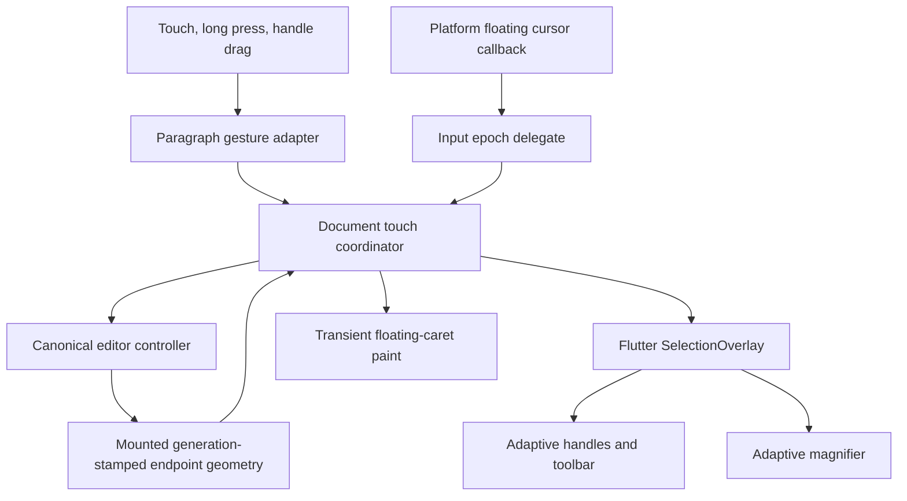

# Touch Selection and Mobile Gestures - Plan

## Goal Capsule

- **Objective:** Homeric provides trustworthy touch-first text selection and editing on iOS and Android, including long press, platform-adaptive selection handles, magnifier, floating cursor, cancellation, and mobile focus lifecycle, without forking canonical editor state or weakening virtualization.
- **Means:** Extend the current document-owned gesture and geometry capabilities with Flutter's public `SelectionOverlay`, then route long-press, handle-drag, magnifier, and floating-cursor events through the existing controller and epoch-bound input session. (KTD1-KTD9)
- **Authority:** Linear HOM-20 and the Product Contract below govern the touch scope. The HOM-18, HOM-19, and HOM-6 plans continue to govern canonical input, history, clipboard, geometry, virtualization, and one-controller ownership.
- **Execution profile:** Work locally on `feature/hom-20` after integrating the current HOM-6 editing foundation. Local commits, tests, device builds, and manual device acceptance are allowed. Do not push, publish, deploy, or run GitHub Actions.
- **Stop conditions:** Stop and re-plan if touch parity requires a hidden `EditableText`, a second selection or input owner, a `RenderEditable` dependency in Homeric, eager mounting of off-screen endpoint rows, a Flutter SDK floor above 3.24, copied third-party editor source, or treating widget simulation as real-device certification.
- **Tail ownership:** HOM-21 retains language/IME certification beyond the touch gestures named here. HOM-7 consumes completed platform evidence before changing Nexus defaults or removing AppFlowy. Apple Pencil Scribble remains deferred.

---

## Product Contract

### Summary

HOM-20 makes the existing canonical multi-block editor usable by touch. Writers can place and extend selections with long press, drag platform-native handles across wrapped and recycled blocks, use the magnifier while dragging, reposition the iOS floating cursor, retain safe focus through mobile lifecycle changes, and use touch toolbars without creating a second editor state.

### Problem Frame

Homeric already owns directional global selection, grapheme- and projection-aware geometry, cross-block pointer drag with autoscroll, one epoch-bound platform input client, an adaptive desktop context menu, and a virtualized document host. Its `TextSelectionGestureDetector` currently wires tap, multi-click, mouse drag, pointer cancellation, and secondary click only. It does not wire the detector's long-press callbacks, it creates no selection handles or magnifier, and `_EpochTextInputClient.updateFloatingCursor` discards every platform callback.

Using Flutter's `TextSelectionOverlay` would appear convenient but would couple Homeric to `RenderEditable`, which it deliberately does not use. Flutter's lower-level public `SelectionOverlay` already accepts selection endpoints, independent layer links, handle callbacks, platform controls, and magnifier information. Homeric can reuse that chrome while supplying its own current canonical geometry and mutation policy.

The repository roadmap currently calls iOS a v1 non-goal even though the newer HOM-20 contract explicitly requires on-device iOS and Android verification and HOM-7 treats HOM-20 as a retirement gate. This plan follows the newer tracked contract for the editor package while keeping Nexus rollout independently gated; documentation is corrected so the two sources no longer contradict each other.

### Key Decisions

- **Build iOS and Android touch behavior in one package contract, but certify them independently.** One platform's green result never authorizes the other. Governs R1-R4, R25-R28.
- **Reuse Flutter platform chrome without adopting `RenderEditable`.** Homeric supplies canonical endpoints and lifecycle to `SelectionOverlay`; it does not hide an `EditableText` or copy Flutter internals. Governs R5-R17.
- **Keep touch state transient.** Handles, magnifier, long-press anchors, and floating cursor are revocable capabilities derived from controller state and current geometry; none enter document, decorations, or history. Governs R5-R24.
- **Defer Scribble.** Apple Pencil handwriting recognition and Scribble-specific platform contracts are not required to complete HOM-20. Governs R29.
- **Do not broaden Nexus defaults in this issue.** HOM-20 emits platform evidence that HOM-7 consumes; Compatibility remains available until the full platform matrix is green. Governs R25-R29.

### Requirements

#### Ownership and public configuration

- R1. One `HomericEditorController` remains the sole owner of document, decorations, directional global selection, composition, preferred x, undo, and redo. Touch overlays and gesture recognizers own no canonical copy.
- R2. One shared `HomericTextInputSession` remains the sole platform input owner. Every long-press, handle, toolbar, and floating-cursor callback is bound to the active attachment epoch and block capability.
- R3. `HomericEditableDocument` owns document-global touch coordination, endpoint visibility, cross-block autoscroll, and overlay lifetime. Paragraph hosts expose only current, generation-stamped geometry and layer targets.
- R4. The package exposes injectable selection controls and magnifier configuration with platform-adaptive defaults on iOS and Android and no touch overlay on desktop unless a consumer opts in.

#### Long press and selection handles

- R5. Android long press selects the current visible word in canonical document space, provides platform feedback, focuses the row, shows selection handles and the touch toolbar, and never selects hidden projection bytes alone.
- R6. iOS long press on an unfocused or read-only paragraph selects the current visible word. On a focused editable paragraph it begins the native floating-cursor flow rather than inventing a parallel drag selection.
- R7. Long-press movement on Android extends by visible word boundaries and may cross blocks through the existing document drag owner. Long-press movement on iOS follows the active floating cursor unless the gesture began as word selection.
- R8. Expanded selections show two platform-adaptive handles; a collapsed touch selection may show the single platform caret handle. Mouse and keyboard selection do not implicitly expose mobile handles.
- R9. Each handle is anchored to a current caret rectangle and line height. Directional selection remains exact; when a dragged endpoint crosses the stationary endpoint, the physical handle continues moving and the logical direction changes without a jump or accidental collapse.
- R10. Handle drag operates in global document positions, crosses wrapped lines and blocks, and uses the existing selection autoscroll owner. The platform input connection does not churn through intermediate rows; release retargets once to the final head.
- R11. Off-screen endpoints do not pin arbitrary rows. A handle is visible only while its endpoint has current mounted geometry; it reappears when that stable endpoint remounts. The actively dragged endpoint stays governed by normal selection-autoscroll mounting.
- R12. Touch down outside the active handles or toolbar dismisses transient chrome according to platform convention without discarding logical selection. Tap-region behavior prevents toolbar/handle interaction from blurring the current editor accidentally.

#### Magnifier and toolbar

- R13. Long-press and handle drag show Flutter's adaptive magnifier only on platforms/configurations that provide one. Its focal point and caret rectangle come from current Homeric geometry.
- R14. Magnifier updates are discarded and the magnifier hides when document revision, layout generation, host epoch, focus ownership, read-only policy, or endpoint geometry changes incompatibly.
- R15. Magnifier teardown occurs on pointer end/cancel, focus loss, platform connection closure, app lifecycle suspension, host recycle/replacement, dependency change, and disposal.
- R16. Touch toolbar actions converge with the existing standard Intent and clipboard paths. Copy remains available in read-only mode; Cut, Paste, spelling replacement, Undo, and Redo share current controller enablement and stale-menu witnesses.
- R17. Toolbar and handles remain overlay chrome rather than paragraph paint layers, controller decorations, or semantics text fields. Flutter's handle widgets remain excluded from duplicate semantics; the document text-field semantics continue to expose selection and editing actions, and toolbar buttons expose their action labels and enablement.

#### Floating cursor and lifecycle

- R18. The input session forwards `RawFloatingCursorPoint` callbacks only to the delegate registered for that exact attachment epoch. Superseded, blurred, disposed, or account/host-replaced clients are inert.
- R19. Floating-cursor start captures the current collapsed selection, current caret center, document revision, layout generation, and host epoch. An expanded selection, active composition, missing geometry, or read-only editor fails closed.
- R20. Floating-cursor updates move one transient visible caret within current document geometry without committing canonical selection or history. Bounds, grapheme stops, folds, slots, bidi, and block edges use existing geometry queries.
- R21. Floating-cursor end settles to the nearest valid canonical caret and changes selection once only when every witness remains current and the controller selection is still collapsed. The visual caret animates back over a bounded reduced-motion-aware interval; stale end callbacks clear transient paint without mutation.
- R22. Platform selection updates received during a two-finger floating-cursor selection remain authoritative and are not overwritten by a collapsed-selection commit at cursor end.
- R23. App pause/inactive, route/host replacement, connection closure, and focus leaving the document cancel gesture generations, hide overlays and magnifier, stop autoscroll, and make retained callbacks inert. Canonical selection remains readable.
- R24. Resume does not reopen the keyboard or restore touch chrome unless the same host, focus policy, controller state, and input epoch still authorize it. A fresh user focus action creates one fresh platform epoch.

#### Verification and rollout

- R25. Widget tests cover both `TargetPlatform.iOS` and `TargetPlatform.android` using real touch pointer sequences, framework accessibility messages, current geometry, and platform-channel callbacks; mouse regressions remain green.
- R26. A real iOS device run covers long press, handles, magnifier, floating cursor, selection crossing, clipboard toolbar, keyboard dismissal, background/resume, rotation, and rapid focus switching with no stale mutation.
- R27. A real Android device run covers long press, word drag, handles, magnifier, selection crossing, clipboard toolbar, Back gesture/keyboard dismissal, background/resume, rotation, and rapid focus switching with no stale mutation.
- R28. Device evidence records hardware/OS, Flutter revision, build mode, flow outcomes, observed limitations, and a screen recording or screenshots where visual behavior is material. Simulator/emulator results may support debugging but do not replace the two real-device gates.
- R29. Nexus remains on its per-platform certified-host policy. HOM-7 may consume HOM-20 evidence only after the corresponding platform's touch and HOM-21 IME gates are both green.

### Success Criteria

- Touch selection behaves like a native Flutter text field while canonical document identity, selection direction, composition safety, and history remain Homeric-owned.
- Long press, handle drag, and floating cursor remain correct across wrapping, projection folds/slots, recycled rows, and cross-block autoscroll.
- No transient touch object can mutate after its document, geometry, host, focus, or input epoch becomes stale.
- Real iOS and Android evidence is explicit; automated or emulator evidence is never relabeled as device certification.

### Key Flows

- F1. **Android long-press selection**
  - **Trigger:** The writer holds a finger on a visible word and drags.
  - **Steps:** Current geometry resolves the word, the controller stores one directional global selection, the document drag owner extends by word boundaries and autoscrolls, and the overlay updates current endpoint links plus magnifier.
  - **Outcome:** Word selection crosses lines and blocks without a second selection owner or input churn.
  - **Covered by:** R1-R5, R7-R17, R23
- F2. **Handle drag across recycled blocks**
  - **Trigger:** The writer drags either endpoint beyond the viewport edge.
  - **Steps:** The document host retains the stable global stationary endpoint, extends the moving endpoint through current mounted geometry, autoscrolls, hides an unavailable off-screen handle, and retargets input once on release.
  - **Outcome:** Direction and selected content remain exact while mounted work stays bounded.
  - **Covered by:** R1-R4, R8-R12, R14-R17, R23
- F3. **iOS floating cursor**
  - **Trigger:** A focused editable paragraph receives the platform floating-cursor sequence.
  - **Steps:** The epoch delegate captures current caret geometry, moves transient paint through bounded visual stops, honors any platform selection updates, then commits at most one current collapsed caret on end.
  - **Outcome:** The cursor feels native without changing text or history during the visual drag.
  - **Covered by:** R1-R4, R6, R13-R15, R18-R24
- F4. **Mobile lifecycle interruption**
  - **Trigger:** The app backgrounds, rotates, loses focus, replaces the host, or closes its input connection during a touch interaction.
  - **Steps:** Gesture, magnifier, overlay, autoscroll, and floating-cursor capabilities invalidate synchronously; later callbacks fail their witnesses; resume requires a fresh authorized focus action.
  - **Outcome:** No stale touch or platform event mutates current state or resurrects the keyboard.
  - **Covered by:** R2-R4, R11-R15, R18-R24

### Acceptance Examples

- AE1. **Android wrapped word drag:** Given a word wraps and includes hidden Markdown delimiters, when the writer long-presses its visible glyphs and drags into the next word, then the canonical selection includes the correct delimiters, handles sit on visible caret edges, the magnifier follows the moving endpoint, and no mid-grapheme offset is produced.
- AE2. **Handle reversal:** Given a reverse selection from block C to block A, when the start-position handle is dragged beyond the other endpoint into block D, then the same physical handle remains under the finger, direction flips exactly once, selection stays contiguous, and release retargets input once to the final head.
- AE3. **Off-screen endpoint:** Given a selection spans 100 blocks, when its stationary endpoint recycles, then that handle hides without pinning the row, the moving handle and autoscroll continue, and scrolling the stationary endpoint back into view restores its handle from current geometry.
- AE4. **Stale magnifier:** Given a handle drag is active, when font scale or document content changes before the next pointer update, then old geometry cannot reposition selection or magnifier, transient chrome closes, and content/history remain unchanged.
- AE5. **One-finger floating cursor:** Given a focused collapsed iOS caret, when floating-cursor start/update/end arrives, then only transient caret paint moves during updates and exactly one collapsed canonical selection is committed at the current nearest caret on end.
- AE6. **Two-finger floating selection:** Given the platform expands selection while a floating cursor is active, when end arrives, then Homeric preserves the expanded directional selection and does not collapse it to the transient cursor.
- AE7. **Epoch replacement:** Given an old paragraph client retains handle and floating-cursor callbacks, when another block becomes active or the host is replaced, then every old callback is inert while the new host can complete the same gesture.
- AE8. **Read-only touch:** Given an expanded selection when editing becomes read-only, then composition closes once, handles remain usable for selection, Copy remains available, mutation actions are disabled, and no stale toolbar or handle action changes history.
- AE9. **Lifecycle cancellation:** Given selection autoscroll and magnifier are active, when the app backgrounds and later resumes, then both stop before suspension completes, delayed callbacks do nothing, logical selection survives, and the keyboard remains closed until the writer focuses again.

### Scope Boundaries

#### Deferred to Follow-Up Work

- Apple Pencil Scribble, handwriting recognition, and stylus-specific selection affordances.
- HOM-21 language/IME certification: autocorrect, dead keys, CJK candidate interaction, composing recovery, and platform-specific input failures beyond the floating-cursor callback.
- Nexus platform-default expansion and AppFlowy retirement, owned by HOM-7 after both touch and IME evidence are green.
- Consumer-specific touch styling beyond injected platform controls, colors, magnifier configuration, and existing toolbar customization.

#### Outside This Plan

- A hidden `EditableText`, `RenderEditable`, AppFlowy, Super Editor, or copied Flutter editor implementation.
- Multi-range or discontiguous selection.
- Eagerly mounting endpoint blocks or disabling virtualization to keep handles alive.
- GitHub Actions, publication, deployment, package release, or a Nexus dependency-pin change.
- Claiming simulator/emulator or widget-test results as real-device acceptance.

### Dependencies

- HOM-18 supplies canonical controller/input ownership, geometry, composing state, and epoch-bound platform clients.
- HOM-19 supplies `TextSelectionGestureDetector`, adaptive toolbar actions, stale-safe clipboard, and pointer cancellation.
- HOM-6 supplies document-global selection, row geometry registration, autoscroll, focus transfer, and virtualization.
- HOM-21 remains the separate platform language/IME acceptance gate.
- Flutter 3.24 public `TextSelectionGestureDetector`, `SelectionOverlay`, `TextSelectionControls`, `TextMagnifierConfiguration`, and `TextInputClient.updateFloatingCursor` contracts.

### Sources

- Linear HOM-20 defines long press, handles, magnifier, floating cursor, pointer cancellation, mobile focus lifecycle, and real iOS/Android verification.
- `STRATEGY.md`, `docs/ROADMAP.md`, and `README.md` define one-library ownership and the current mobile rollout boundary.
- `docs/plans/2026-08-19-0108-feat-desktop-single-paragraph-editing-foundation-plan.md`, `docs/plans/2026-08-19-0855-feat-desktop-editing-parity-plan.md`, and `docs/plans/2026-08-19-1932-feat-multi-block-virtualized-editor-plan.md` define the prerequisite controller, input, gesture, toolbar, and viewport contracts.
- `LEARNINGS.md` defines document-owned drag generations, stale geometry rejection, one shared input epoch, and revocable consumer capabilities.
- [Flutter `SelectionOverlay` API](https://api.flutter.dev/flutter/widgets/SelectionOverlay-class.html) establishes the public independent handle, toolbar, and magnifier coordinator.
- [Flutter `TextInputClient.updateFloatingCursor` API](https://api.flutter.dev/flutter/services/TextInputClient/updateFloatingCursor.html) establishes the platform callback Homeric currently drops.
- [Flutter 3.24 text-selection source](https://github.com/flutter/flutter/blob/3.24.0/packages/flutter/lib/src/widgets/text_selection.dart) establishes the minimum-version long-press callbacks, platform gesture split, overlay links, handle updates, and magnifier lifecycle.
- [Flutter 3.24 editable-text source](https://github.com/flutter/flutter/blob/3.24.0/packages/flutter/lib/src/widgets/editable_text.dart) establishes one-finger floating-cursor settlement and two-finger selection preservation behavior.

---

## Planning Contract

### Key Technical Decisions

- KTD1. **The document host owns one touch overlay coordinator.** `HomericEditableDocument` creates, updates, and disposes the `SelectionOverlay` because selection endpoints can live in different paragraphs and paragraph rows recycle. A standalone `HomericEditableParagraph` may use a paragraph-local coordinator with the same contract, but neither owns canonical selection.
- KTD2. **Endpoint hosts expose revocable geometry and layer targets.** Extend the existing registered selection-host capability with current endpoint caret rectangles, line heights, visibility, and composited layer links. The document coordinator consumes flat values stamped by document revision, layout generation, and owner identity; it never retains `ParagraphGeometry`.
- KTD3. **Use Flutter's public adaptive controls without a text delegate.** Select Cupertino controls for iOS and Material controls for Android, permit consumer injection, and pass Flutter's adaptive magnifier configuration. Construct `SelectionOverlay` with no deprecated `TextSelectionDelegate` state bridge and show the existing intent-backed adaptive context-menu builder, so toolbar actions cannot become a second editing route. Do not use `TextSelectionOverlay`, whose required `RenderEditable` would violate Homeric's rendering architecture.
- KTD4. **Long press follows Flutter's platform split.** Android selects and extends visible words with feedback. iOS selects a word when unfocused/read-only, but a focused editable long press enters floating-cursor behavior. This preserves user muscle memory without copying Flutter's render implementation.
- KTD5. **One document drag engine serves mouse, long press, and handles.** Add mode and endpoint witnesses to the current global drag owner instead of another autoscroller. Each surface can choose character or word boundary behavior, but cancellation, generation, focus, revision, mount/recycle, and final input retargeting stay shared.
- KTD6. **Handle roles derive from normalized endpoints while direction remains canonical.** The overlay presents start/end handles; controller state retains anchor/head. A handle-drag witness identifies which normalized endpoint moves, and crossing swaps the normalized role while updating anchor/head so the same physical gesture remains continuous.
- KTD7. **Floating cursor is an epoch-bound transient paint capability.** The input client forwards callbacks through its current command delegate. The active host owns visual offset and reset animation; canonical selection changes only at a current end event, and only if the selection is still collapsed. Platform-expanded selection wins.
- KTD8. **Mobile lifecycle invalidates before awaiting or rebuilding.** App lifecycle, focus, host dependency, and connection-close paths increment gesture/overlay/floating generations and tear down chrome synchronously. Resume never replays old focus or input state.
- KTD9. **Certification is platform-specific and evidence-labeled.** Shared tests prove invariants, but real iOS and Android results are separate artifacts. HOM-7 consumes each platform only after HOM-20 and HOM-21 both pass; no aggregate “mobile green” shortcut exists.

### Assumptions

- The autonomous planning continuation accepts the full Linear HOM-20 scope for both iOS and Android, with Scribble deferred.
- The newer HOM-20 and HOM-7 tracked contracts supersede the older broad statement that iOS is entirely outside v1; Nexus rollout remains independently gated.
- Flutter 3.24's public selection and magnifier APIs remain the compatibility floor; implementation must compile against that minimum rather than only the locally installed newer SDK.
- Physical selection handles may hide when an endpoint row is unmounted. Exact logical selection remains authoritative and scrolling the endpoint into view restores current chrome.
- A standalone editable paragraph remains supported, but the multi-block document host is the primary mobile acceptance surface.

### High-Level Technical Design

The controller remains the only persistent state. Gesture and platform events carry owner, epoch, document-revision, and layout-generation witnesses into the document coordinator. The coordinator resolves current global positions through mounted geometry, updates controller selection when the gesture contract calls for it, and updates or closes Flutter overlay chrome. Any failed witness tears down transient state without mutation.

### Sequencing

1. Land the geometry/configuration contract and selection-overlay lifecycle before gesture behavior.
2. Add long press and handle dragging on the shared document drag owner before magnifier polish.
3. Add the input-session floating-cursor delegate after endpoint geometry is stable.
4. Add mobile lifecycle cancellation before mounting the playground acceptance surface.
5. Run platform tests and documentation only after automated invariants and Flutter 3.24 compatibility are green.

### System-Wide Impact

- **Editor consumers:** Gain optional touch chrome without changing controller or document ownership. Desktop defaults remain unchanged.
- **Rendering:** Adds composited endpoint targets and transient cursor paint but no new shaping or canonical decoration state.
- **Input:** Fills the existing floating-cursor callback gap and tightens connection/focus cancellation; text delta behavior remains owned by HOM-21.
- **Virtualization:** Endpoint chrome follows mounted geometry; it does not pin arbitrarily distant rows.
- **Nexus:** Receives evidence and mirrored architecture learnings, not an automatic platform-default change.

### Risks and Mitigations

| Risk | Consequence | Mitigation |
|---|---|---|
| `SelectionOverlay` API differs at Flutter 3.24 | Code works locally but violates package floor | Compile and test against an actual 3.24 SDK before acceptance; avoid newer-only convenience APIs |
| Endpoint layer links go stale during recycle | Handles jump or mutate the wrong block | Owner and generation witnesses; hide unavailable endpoints; tests replace rows mid-drag |
| Handle crossing corrupts direction | Selection jumps or collapses | Separate physical moving-end witness from canonical anchor/head and test both crossing directions |
| Magnifier retains old geometry | Visual lies or stale pointer mutates state | Update only from current flat geometry; synchronous teardown on every invalidation path |
| Floating cursor overwrites two-finger selection | Expanded selection collapses on end | Commit only if current selection remains collapsed; channel-level regression |
| Touch work degrades desktop gestures | Mouse selection/menu regressions | Platform-gated chrome plus full existing editing/input suite |
| Widget tests overstate mobile parity | Nexus defaults change prematurely | Real-device artifacts are mandatory and labeled separately from simulator/widget evidence |

---

## Implementation Units

### U1. Define touch configuration and endpoint geometry

- **Goal:** Establish the public, renderer-independent contract the document overlay needs.
- **Requirements:** R1-R4, R8-R11, R17.
- **Dependencies:** HOM-18, HOM-19, HOM-6.
- **Files:** `packages/homeric/lib/src/editing/editable_paragraph.dart`, `packages/homeric/lib/src/editing/editable_document.dart`, `packages/homeric/lib/homeric.dart`, `packages/homeric/test/editing/editable_paragraph_test.dart`, `packages/homeric/test/editing/editable_document_test.dart`.
- **Approach:** Add injectable adaptive controls/magnifier configuration and extend registered selection-host capabilities with current endpoint rects, line heights, visibility, and composited targets. Keep flat geometry generation-stamped and keep desktop defaults unchanged.
- **Execution note:** Start with compile-red public-contract and stale-geometry tests; verify the package still builds against Flutter 3.24 before relying on locally newer APIs.
- **Patterns to follow:** `HomericEditableBlockGeometry`, `registerSelectionHost`, `activeCaretGeometry`, and existing host owner/generation checks.
- **Test scenarios:**
  - iOS resolves Cupertino controls and adaptive magnifier; Android resolves Material controls; macOS, Windows, Linux, and web do not show touch handles by default.
  - A consumer override replaces controls or disables magnifier without changing controller identity.
  - Endpoint geometry reports correct caret rect, line height, affinity, and link for forward and reverse selections.
  - A retained endpoint capability returns no result after document mutation, layout-generation change, row recycle, block removal, host replacement, or disposal.
  - A 100-block selection does not increase pinned-row count beyond the existing virtualization contract.
- **Verification:** The public contract is renderer-independent, desktop behavior is unchanged, current endpoints are sufficient to construct one overlay, and all stale probes fail closed.

### U2. Add the document-owned selection overlay

- **Goal:** Show, update, and remove platform-adaptive handles and touch toolbar from canonical controller state.
- **Requirements:** R1-R4, R8-R12, R16-R17, R23-R24.
- **Dependencies:** U1.
- **Files:** `packages/homeric/lib/src/editing/editable_document.dart`, `packages/homeric/lib/src/editing/editable_paragraph.dart`, `packages/homeric/test/editing/editable_document_test.dart`, `packages/homeric/test/editing/editable_paragraph_test.dart`.
- **Approach:** Create one `SelectionOverlay` at the document boundary, update endpoints/types/heights from current controller state, and route its toolbar through existing standard Intents. Provide an equivalent paragraph-local fallback only when no document host exists. Hide rather than pin off-screen endpoints.
- **Patterns to follow:** Existing `ContextMenuController` witness, `TapRegion` behavior, controller read-only checks, and `_MountedSelectionHost` ownership.
- **Test scenarios:**
  - Expanded forward/reverse selection shows two correctly typed handles and a collapsed touch caret shows one handle according to platform convention.
  - Mouse selection does not surface handles; a touch selection does.
  - Off-screen/recycled endpoints hide and reappear from current geometry without mounting the full selected span.
  - Copy remains enabled in read-only mode while Cut, Paste, spelling replacement, Undo, and Redo match controller enablement.
  - Overlay construction uses the context-menu builder path with no `TextSelectionDelegate`; document semantics retain one text field and toolbar buttons expose localized action labels while Flutter's excluded handle chrome creates no duplicate semantic nodes.
  - Touching handle or toolbar chrome does not blur or create another input epoch.
  - Tap outside dismisses transient chrome without changing logical selection; host replacement/disposal removes every overlay entry.
- **Verification:** One overlay follows the one canonical selection across rows and exposes no second text field or mutation route.

### U3. Implement long press, handle drag, and magnifier

- **Goal:** Deliver platform-correct touch selection over single and multiple blocks.
- **Requirements:** R5-R17, R23, R25.
- **Dependencies:** U1-U2.
- **Files:** `packages/homeric/lib/src/editing/editable_paragraph.dart`, `packages/homeric/lib/src/editing/editable_document.dart`, `packages/homeric/test/editing/editable_paragraph_test.dart`, `packages/homeric/test/editing/editable_document_test.dart`, `packages/homeric/test/render/geometry_test.dart`.
- **Approach:** Wire the existing gesture detector's public long-press callbacks, extend the document drag owner with touch mode and moving-end identity, and update `SelectionOverlay` magnifier information only from current geometry. Reuse word/grapheme/visibility mapping already supplied by `ParagraphGeometry`.
- **Execution note:** Implement gesture behavior test-first with real touch pointer kinds and deliberate cancellation/recycle races.
- **Patterns to follow:** `_startWordSelection`, `beginPointerSelectionDrag`, selection autoscroll generations, `_canUsePointer`, and current geometry round-trips.
- **Test scenarios:**
  - Covers AE1. Android long press selects a wrapped visible word with hidden delimiters and drag extends by words without mid-grapheme positions.
  - iOS unfocused/read-only long press selects a word; focused editable long press chooses the floating-cursor route.
  - Covers AE2. Both handles cross the stationary endpoint in both directions without jumping, losing affinity, or duplicating input retarget.
  - Covers AE3. Handle drag autoscrolls across recycled rows while stationary off-screen chrome hides and logical selection remains exact.
  - Magnifier focal point tracks character, word, bidi, fold, slot, empty-block, and document-edge positions.
  - Covers AE4. Document/layout/host mutation during magnifier or handle drag closes transient state with zero additional selection mutation.
  - Pointer cancel, focus loss, scroll boundary, reversal, app lifecycle cancellation, and disposal stop autoscroll and magnifier timers immediately.
  - Existing mouse single/double/triple click, word drag, secondary click, and pointer-cancel tests remain green.
- **Verification:** Touch gestures produce native-shaped canonical selection, reuse one drag/autoscroll owner, and leave no stale overlay or timer.

### U4. Implement epoch-bound floating cursor

- **Goal:** Replace the input client's floating-cursor no-op with safe iOS behavior and transient paint.
- **Requirements:** R2-R3, R6, R13-R15, R18-R24, R25.
- **Dependencies:** U1-U3.
- **Files:** `packages/homeric/lib/src/input/text_input_session.dart`, `packages/homeric/lib/src/editing/editable_paragraph.dart`, `packages/homeric/lib/src/editing/editable_document.dart`, `packages/homeric/test/input/text_input_session_test.dart`, `packages/homeric/test/editing/editable_paragraph_test.dart`, `packages/homeric/test/editing/editable_document_test.dart`.
- **Approach:** Forward ordered raw cursor callbacks through the active epoch delegate, derive a bounded transient caret from current geometry, and settle only a current collapsed selection on end. Keep the visual reset animation out of history and honor reduced-motion state.
- **Patterns to follow:** Epoch-bound selector/toolbar dispatch, caret blink lifecycle, `moveCaret`, `positionForPoint`, and controller state/content revisions.
- **Test scenarios:**
  - Covers AE5. Start/update/end moves transient caret paint while document, selection, history, and notifications remain unchanged until one valid end commit.
  - Covers AE6. A platform-expanded selection during the sequence survives end unchanged.
  - Covers AE7. Superseded epoch, blur, block switch, host replacement, connection close, and dispose make retained callbacks inert.
  - Expanded selection, active composition, read-only state, missing/stale geometry, or malformed callback ordering fails closed.
  - Fold, slot, emoji grapheme, bidi, wrapped-line, first/last block, and empty-block updates settle at valid canonical stops.
  - Reduced motion removes reset animation; ordinary mode uses a bounded reset and resumes caret blink once.
  - Ordered channel callbacks cause at most one final controller notification and never synthesize text input.
- **Verification:** The platform callback is no longer dropped, transient movement is visible, and only a current valid end event can change canonical selection.

### U5. Harden mobile focus and lifecycle cancellation

- **Goal:** Make touch capabilities safe across keyboard dismissal, app lifecycle, rotation, focus transfer, and host recycle.
- **Requirements:** R2-R4, R11-R15, R18-R24, R25.
- **Dependencies:** U2-U4.
- **Files:** `packages/homeric/lib/src/editing/editable_document.dart`, `packages/homeric/lib/src/editing/editable_paragraph.dart`, `packages/homeric/lib/src/input/text_input_session.dart`, `packages/homeric/test/editing/editable_document_test.dart`, `packages/homeric/test/editing/editable_paragraph_test.dart`, `packages/homeric/test/input/text_input_session_test.dart`.
- **Approach:** Centralize synchronous touch-capability invalidation across focus, lifecycle, dependency, connection, and disposal paths. Preserve logical selection but require a new authorized focus epoch before reopening keyboard or touch chrome.
- **Patterns to follow:** `schedulePointerDragFocusLossCheck`, `_platformClosed`, input-session epoch replacement, and caret/context-menu teardown.
- **Test scenarios:**
  - Covers AE9. App pause/inactive stops active handle drag, magnifier, autoscroll, floating cursor, and caret timer before retained callbacks run.
  - Resume preserves readable selection but does not reopen keyboard, handles, toolbar, or magnifier until a fresh focus action.
  - Rotation/text-scale/viewport changes invalidate old geometry and rebuild current overlay once without remounting the controller/session.
  - Back gesture or keyboard dismissal closes input connection once and leaves selection/copy semantics available.
  - Rapid A-to-B-to-A block focus switching leaves only the final epoch active; old touch and platform callbacks cannot alter A after return.
  - Read-only transition during composition commits/closes composition once, disables mutation actions, and retains selection handles for Copy.
- **Verification:** Every mobile lifecycle edge has one explicit owner, no leaked timers/overlays/connections, and no stale mutation.

### U6. Mount the touch surface in the playground

- **Goal:** Exercise HOM-20 through the real virtualized multi-block consumer rather than a synthetic paragraph only.
- **Requirements:** R4-R17, R20-R24, R25.
- **Dependencies:** U1-U5.
- **Files:** `packages/homeric/examples/playground/lib/views/editor_page.dart`, `packages/homeric/examples/playground/lib/view_models/document_view_model.dart`, `packages/homeric/examples/playground/test/document_view_model_test.dart`, `packages/homeric/examples/playground/test/editor_page_test.dart`.
- **Approach:** Enable adaptive touch configuration on the existing shared controller/input session, retain desktop behavior, and add a deterministic demo fixture with wrapping, bidi, emoji, folds/slots, empty blocks, and enough rows for recycling/autoscroll.
- **Patterns to follow:** The current one-controller playground migration, shared session ownership, presentation rebuild stability, and HOM-6 benchmark fixture boundaries.
- **Test scenarios:**
  - One document host and one input session serve every mounted touch row.
  - Long press, handle crossing, cross-block autoscroll, toolbar actions, and floating-cursor channel input operate on the shared controller.
  - Theme, text scale, width, orientation, and scroll recycling retain controller identity and invalidate only transient geometry.
  - Undo/redo after touch-selected Cut/Paste restores exact document, decorations, directional selection, and focus target.
  - Desktop mouse/keyboard/reorder behavior remains identical when touch configuration is present but inactive.
- **Verification:** The runnable playground exposes the full touch flow on one real virtualized editor and introduces no shadow state.

### U7. Add real-device certification and align documentation

- **Goal:** Produce auditable iOS and Android evidence and remove contradictory scope documentation.
- **Requirements:** R25-R29.
- **Dependencies:** U1-U6; HOM-21 for any combined rollout claim.
- **Files:** `packages/homeric/examples/playground/pubspec.yaml`, `packages/homeric/examples/playground/integration_test/touch_editing_test.dart`, `docs/testing/mobile-touch-acceptance.md`, `README.md`, `docs/ROADMAP.md`, `STRATEGY.md`, `LEARNINGS.md`.
- **Approach:** Add an integration-test driver for repeatable touch setup and invariant checks, then execute and record the manual visual/gesture matrix on one real iOS and one real Android device. Correct the stale iOS non-goal wording to distinguish editor capability from Nexus rollout. Mirror the editor-architecture learning into Nexus under the repository compounding rule.
- **Execution note:** Automated integration tests are setup and invariant support only. Do not mark a platform certified until the real-device checklist and visual evidence are recorded.
- **Patterns to follow:** `docs/testing` evidence boundaries, benchmark machine metadata, ROADMAP issue links, and mirrored learning format.
- **Test scenarios:**
  - Covers R26. Real iOS: long press, collapsed/expanded handles, crossing, magnifier, one- and two-finger floating cursor, toolbar, keyboard dismissal, background/resume, rotation, recycle, and rapid focus switch.
  - Covers R27. Real Android: word long press/drag, collapsed/expanded handles, crossing, magnifier, toolbar, Back/keyboard dismissal, background/resume, rotation, recycle, and rapid focus switch.
  - Both devices cover wrapped text, emoji/combining graphemes, bidi, hidden folds/slots, empty blocks, cross-block selection, read-only, and stale callback races.
  - The acceptance artifact distinguishes pass, fail, not run, simulator-only, and device-only evidence and records hardware/OS/Flutter/build identity.
  - Documentation never claims Nexus default expansion, cross-platform IME certification, Scribble, publication, or release.
- **Verification:** Both real-device records are complete and green for HOM-20, Flutter 3.24 compatibility and the full local suite pass, and repository scope statements agree with Linear.

---

## Verification Contract

| Gate | Evidence | Applies |
|---|---|---|
| Focused editing | Paragraph/document gesture, overlay, geometry, cancellation, and lifecycle tests | U1-U5 |
| Input channel | Epoch, callback ordering, floating cursor, connection close, and stale-client tests | U4-U5 |
| Full Homeric | `melos run analyze`, `melos run test`, and `melos run format-check` | Every production unit and final validation |
| Minimum SDK | Analyze and test with Flutter 3.24, not only the locally installed newer SDK | U1-U7 |
| Playground | Widget and integration-test suites over the real shared controller/session/document host | U6-U7 |
| Performance | Existing HOM-6 mounted-row, cache, layout, autoscroll, and profile budgets show no touch-idle regression | U2-U7 |
| iOS device | Recorded real-device visual and gesture matrix | U7 |
| Android device | Recorded real-device visual and gesture matrix | U7 |
| Nexus handoff | Mirrored learning and platform evidence explicitly consumed by HOM-7; no default flip in this plan | U7 |

Failure on one device blocks that platform's certification only, but blocks any aggregate HOM-20 completion claim. Missing HOM-21 evidence continues to block the corresponding Nexus rollout even after HOM-20 passes.

---

## Definition of Done

- Every R1-R29 requirement and AE1-AE9 example has direct current evidence.
- Long press, handle drag, magnifier, touch toolbar, floating cursor, cancellation, and lifecycle behavior use one canonical controller and one epoch-bound input session.
- Selection direction, grapheme boundaries, projection mapping, cross-block autoscroll, focus, composition, undo/redo, and virtualization remain exact.
- Stale document, geometry, row, focus, connection, lifecycle, and input-epoch callbacks are proven inert.
- Existing desktop pointer, keyboard, context-menu, spell, semantics, structural-edit, and performance suites remain green.
- Flutter 3.24 compatibility is proven rather than inferred from the locally installed SDK.
- Real iOS and Android acceptance artifacts are complete and green; simulator/widget evidence is labeled accurately.
- README, ROADMAP, STRATEGY, Linear scope, Homeric learning, and the mirrored Nexus learning no longer contradict one another.
- No hidden editable renderer, second selection owner, eager endpoint mounting, copied editor source, abandoned experiment, or dead touch scaffolding remains.
- No GitHub Actions, push, publication, deploy, release, Nexus default expansion, or AppFlowy removal is claimed or performed by this plan.
